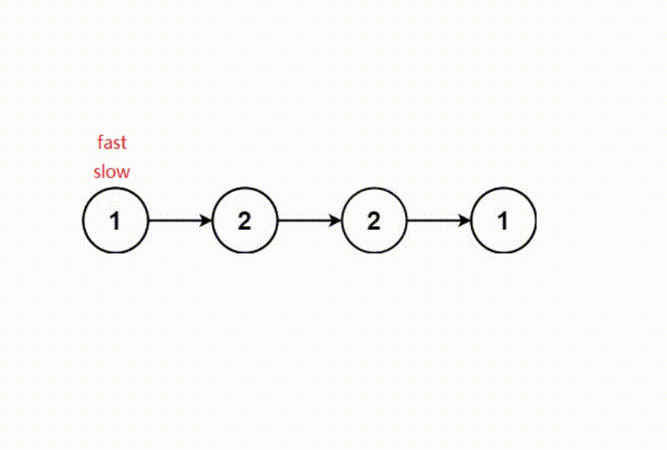
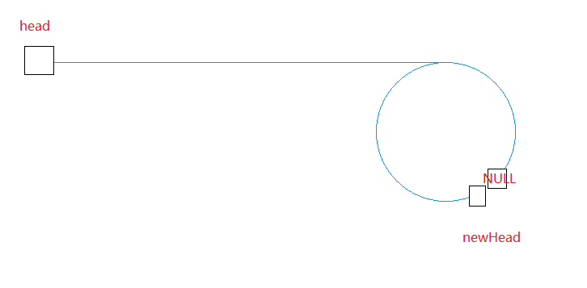

# LeetCode136. 只出现一次的数字Ⅰ

- **题目**: 
> 给你一个 非空 整数数组 `nums` ，除了某个元素只出现一次以外，其余每个元素均出现两次。找出那个只出现了一次的元素。[OJ链接](https://leetcode.cn/problems/single-number/)

- **要求**
> 你必须设计并实现线性时间复杂度的算法来解决此问题，且该算法只使用常量额外空间。

- **思路**
<font color='red'>位运算:异或运算</font>
    - `a ^ 0 = a`
    - `a ^ a = 0`
    - `a ^ b ^ a = b`
> 定义一个变量`x = 0`,将数组所有的元素进行异或运算,结果即是单独的数字

- **实例**
> 输入：nums = [2,2,1]
输出：1

`2 ^ 2 ^ 1 = 1`

- **代码实现**
```c
int singleNumber(int* nums, int numsSize)
{
    int x = 0;
    int i = 0;

    for (i = 0; i < numsSize; i++)
    {
        x ^= nums[i];
    }

    return x;
}
```
# LeetCode137. 只出现一次的数字 II

- **题目**
> 给你一个整数数组 nums ，除某个元素仅出现 **一次** 外，其余每个元素都恰出现 三次 。请你找出并返回那个只出现了一次的元素。[OJ链接](https://leetcode.cn/problems/single-number-ii/description/)

- **要求**
> 你必须设计并实现线性时间复杂度的算法且不使用额外空间来解决此问题。

- **思路**
<font color='red'>位运算:与运算</font>
    - `(a >> 0) & 1`得到最后一位
    - `(a >> 1) & 1`得到倒数第二位
    - `(a >> 2) & 1`得到倒数第三位
    - ...
> `int`类型有 32 位,将数组所有元素按位相加,得到的结果模 3 即 单个元素在该位的数

> 注意: 在c语言中, `int`类型被规定左移位数 (`i >= 0 && i < 31`).而`unsigned int`类型被规定左移数 (`i >=0 && i <= 31`).因此需要使用无符号数`1u`

- **实例**
> 输入：nums = [2,2,3,2]
输出：3


- **代码实现**
```c
int singleNumber(int* nums, int numsSize)
{
    int x = 0;
    int i = 0;
    int j = 0;
    
    for (i = 0; i < 32; i++)
    {
        int sum_bit = 0;    //记录数组所有第i位的和

        for (j = 0; j < numsSize; j++)
        {
            sum_bit += (nums[j] >> i) & 1;
        }

        if (sum_bit % 3)    //如果不能整除3,单个元素在第 i 位有 1
        {
            x |= 1u << i;
        }
    }

    return x;
}
```

# LeetCode260. 只出现一次的数字 III

- **题目**
> 给你一个整数数组 `nums`，其中恰好有两个元素只出现一次，其余所有元素均出现两次。 找出只出现一次的那两个元素。你可以按 **任意顺序** 返回答案。[OJ链接](https://leetcode.cn/problems/single-number-iii/description/)

- **要求**
> 你必须设计并实现线性时间复杂度的算法且仅使用常量额外空间来解决此问题。

- **思路**
<font color='red'>位运算: 异或运算 和 与运算</font>
> 1. 得到两个数的异或结果 `xornum`
> 2. 取到 `xornum` 第 `xorbit` 为 1 的数, 只要一个即可
> 3. 数组所有元素分成两组, 第 `xorbit` 位为 1 分成一组, 第 `xorbit` 位为 0 分成一组
> 4. 每组元素全部异或,两组的两个异或结果即为两个单独元素

- **实例**
> 输入：nums = [1,2,1,3,2,5]
输出：[3,5]
解释：[5, 3] 也是有效的答案。


- **代码实现**
```c
int* singleNumber(int* nums, int numsSize, int* returnSize)
{
    int *ret = (int*)calloc(sizeof(int), 2);    //存放两个数的数组
    int xornum = 0;          //存放两个数的异或结果
    int i = 0;
    int xorbit = 0;

    //先得到两个数的异或结果
    for (i = 0; i < numsSize; i++)
    {
        xornum ^= nums[i];
    }

    //找到异或结果中是 1 的一位,说明这两个数在这一位一个是 1, 一个是0
    for (i = 0; i < 31; i++)    //int类型最多左移30位
    {
        if ((xornum >> i) & 1 == 1)
        {
            xorbit = i;
            break;
        }
    }

    //随后将数组元素进行分组: 元素在该位是 1 分一组;元素在该位是 0 分一组
    //同时将每组元素进行异或, 得到结果

    for (i = 0; i < numsSize; i++)
    {
        if ((nums[i] >> xorbit) & 1 == 1)
        {
            ret[0] ^= nums[i];
        }
        else
        {
            ret[1] ^= nums[i];
        }
    }
    
    *returnSize = 2;
    return ret;
}
```
# LeetCode268. 丢失的数字
- **题目**
> 给定一个包含 `[0, n]` 中 `n` 个数的数组 `nums` ，找出 `[0, n]` 这个范围内没有出现在数组中的那个数。[OJ链接](https://leetcode.cn/problems/missing-number/)

- **思路**
<font color='red'>位运算: 异或运算</font>
> 数组所有元素 和 `[0, n]` 一起异或, 异或结果为丢失的数字
> 实际也是单身狗思路
- **实例**
> 输入：nums = [3,0,1]
输出：2
解释：n = 3，因为有 3 个数字，所以所有的数字都在范围 [0,3] 内。2 是丢失的数字，因为它没有出现在 nums 中。

> `[3,0,1]` 和 `[0, 3]` 所有元素异或, 可以理解为找出 `[0,0,1,1,2,3,3]` 中仅出现一次的数字

- **代码实现**
```c
int missingNumber(int* nums, int numsSize)
{
    int i = 0;
    int xornum = 0;

    //先得到 [0, n] 的异或结果
    for (i = 0; i <= numsSize; i++)
    {
        xornum ^= i;
    }

    //再将异或结果与数组所有元素异或
    for (i = 0; i < numsSize; i++)
    {
        xornum ^= nums[i];
    }

    return xornum;
}
```
# LeetCode27. 移除元素
- **题目**
> 给你一个数组 `nums` 和一个值 `val`，你需要 **原地** 移除所有数值等于 `val` 的元素，并返回移除后数组的新长度。[OJ链接](https://leetcode.cn/problems/remove-element/)

- **要求**
> 不要使用额外的数组空间，你必须仅使用 $O(1)$ 额外空间并 **原地** 修改输入数组。

> 元素的顺序可以改变。你不需要考虑数组中超出新长度后面的元素。

- **思路**
<font color='red'>双指针</font>
> 1. 定义两个指针 `dest` 和 `src`
> 2. `src` 遍历数组, 如果有不为 `val` 的元素, 放置 `dest` 指向的空间, 同时 `dest++`
> 3. 数组的长度即为 `dest - nums`

- **实例**
> 输入：nums = [3,2,2,3], val = 3
输出：2, nums = [2,2]
解释：函数应该返回新的长度 2, 并且 nums 中的前两个元素均为 2。你不需要考虑数组中超出新长度后面的元素。例如，函数返回的新长度为 2 ，而 nums = [2,2,3,3] 或 nums = [2,2,0,0]，也会被视作正确答案。


- **代码实现**
```c
int removeElement(int* nums, int numsSize, int val)
{
    int* src = nums;    //用于遍历数组
    int* dest = nums;   //用于存储不等于 val 的元素

    while (src < nums + numsSize)   //循环条件: src 未到数组末尾
    {
        if (*src != val)    //如果该元素不等于 val
        {
            *dest++ = *src; //存储到 dest 指向的空间, 同时 dest 指向下一空间
        }
        src++;
    }
    
    return dest - nums; //返回数组长度
}
```

# LeetCode283. 移动零

- **题目**
> 给定一个数组 `nums`，编写一个函数将所有 `0` 移动到数组的末尾，同时保持非零元素的相对顺序。[OJ链接](https://leetcode.cn/problems/move-zeroes/description/)

- **要求**
> **请注意**，必须在不复制数组的情况下原地对数组进行操作

- **思路**
<font color='red'>双指针</font>
> 1. 定义两个指针 `dest` 和 `src`
> 2. `src` 遍历数组, 如果有不为 `val` 的元素, 放置 `dest` 指向的空间, 同时 `dest++`
> 3. 将 `dest`指向的剩余数组元素都置为 0
- **实例**
> 输入: nums = [0,1,0,3,12]
输出: [1,3,12,0,0]


- **代码实现**
```c
void moveZeroes(int* nums, int numsSize)
{
    int* src = nums;    //用于遍历数组
    int* dest = nums;   //用于存储不等于 0 的元素

    //将不为 0 的元素顺序存储到数组前部分
    while (src < nums + numsSize)   //循环条件: src 未到数组末尾
    {
        if (*src != 0)    //如果该元素不等于 0
        {
            *dest++ = *src; //存储到 dest 指向的空间, 同时 dest 指向下一空间
        }
        src++;
    }

    //将 0 全放置数组后部分
    while (dest < nums + numsSize)
    {
        *dest++ = 0;
    }
}
```

# LeetCode26. 删除有序数组中的重复项 Ⅰ

- **题目**
> 给你一个 升序排列 的数组 `nums` ，请你 **原地** 删除重复出现的元素，使每个元素 **只出现一次** ，返回删除后数组的新长度。元素的 **相对顺序** 应该保持 **一致** 。然后返回 `nums `中唯一元素的个数。[OJ链接](https://leetcode-cn.com/problems/remove-duplicates-from-sorted-array/)
- **要求**
>考虑 `nums` 的唯一元素的数量为 `k` ，你需要做以下事情确保你的题解可以被通过：
> 更改数组 `nums` ，使 `nums` 的前 `k` 个元素包含唯一元素，并按照它们最初在 `nums` 中出现的顺序排列。`nums` 的其余元素与 `nums` 的大小不重要。
返回 `k` 。
- **思路**
<font color='red'>双指针</font>
> 1. 定义两个指针 `dest` 和 `src`
> 2. `src` 遍历数组, 如果 `src` 和 `dest` 指向的元素不相等, `++dest`, 并把该元素存到 `dest` 指向的空间内
> 3. 数组长度是 `dest - nums + 1`

- **实例**
> 输入：nums = [1,1,2]
输出：2, nums = [1,2,_]
解释：函数应该返回新的长度 2 ，并且原数组 nums 的前两个元素被修改为 1, 2 。不需要考虑数组中超出新长度后面的元素。


- **代码实现**
```c
int removeDuplicates(int* nums, int numsSize)
{
    int* src = nums;    //用于遍历数组
    int* dest = nums;   //用于存储元素

    //将没有重复的元素放到数组前部分
    while (src < nums + numsSize)   //循环条件: src 未到数组末尾
    {
        if (*src != *dest)  //如果有不一致的数字
        {
            *(++dest) = *src;
        }
        src++;
    }

    return dest - nums + 1;
}
```
# LeetCode80. 删除有序数组中的重复项 II

- **题目**
> 给你一个有序数组 `nums` ，请你 **原地** 删除重复出现的元素，使得出现次数超过两次的元素只出现两次 ，返回删除后数组的新长度。[OJ链接](https://leetcode.cn/problems/remove-duplicates-from-sorted-array-ii/description/)
- **要求**
> 不要使用额外的数组空间，你必须在 **原地** **修改输入数组** 并在使用 $O(1)$ 额外空间的条件下完成。
- **思路**
<font color='red'>双指针</font>

> 1. 定义三个指针 `dest` , `src` 和 `same`
> 2. `src` 遍历数组, `dest`存储数据, `same`记录每次不相等的元素的位置
> 3. 如果 `src` 和 `same` 指向的空间相等, 且记录数小于 2, `*dest++ = *src++`
> 4. 如果 `src` 和 `same` 指向的空间不相等, 更新 `same`, 同时`*dest++ = *src++`, `count` 记为 1
> 5. 如果都不满足, 只有 `src++`
- **实例**
> 输入：nums = [1,1,1,2,2,3]
输出：5, nums = [1,1,2,2,3]
解释：函数应返回新长度 length = 5, 并且原数组的前五个元素被修改为 1, 1, 2, 2, 3 。 不需要考虑数组中超出新长度后面的元素。


- **代码实现**
```c
int removeDuplicates(int* nums, int numsSize)
{
    int* src = nums;    //用于遍历数组
    int* dest = nums;   //用于存储元素
    int count = 0;

    //将没有重复的元素放到数组前部分
    while (src < nums + numsSize)   //循环条件: src 未到数组末尾
    {
        if (count < 2 && *src == *(same)) //如果连续相同个数小于2 并且 两元素相等
        {
            *dest++ = *src++;
            count++;
        }
        else if (*src != *same ) //如果两元素不相等
        {
            same = src;
            *dest++ = *src++;
            count = 1;
        }
        else
        {
            src++;
        }
    }

    return dest - nums;
}
```
# LeetCode88. 合并两个有序数组

- **题目**
> 给你两个按 **非递减顺序** 排列的整数数组 `nums1` 和 `nums2`，另有两个整数 `m` 和 `n` ，分别表示 `nums1` 和 `nums2` 中的元素数目。[OJ链接](https://leetcode-cn.com/problems/merge-sorted-array/)  

请你 **合并** `nums2` 到 `nums1` 中，使合并后的数组同样按 **非递减顺序** 排列。
- **要求**
> **注意**：最终，合并后数组不应由函数返回，而是存储在数组 `nums1` 中。为了应对这种情况，`nums1` 的初始长度为` m + n`，其中前 `m` 个元素表示应合并的元素，后 `n` 个元素为` 0` ，应忽略。`nums2` 的长度为 `n` 。
- **思路**
<font color='red'>逆向双指针</font>

> 1. 定义 `end1` 指向数组 1 有效元素的末尾, `end2` 指向数组 2 的末尾, `end`指向数组 1 的末尾
> 2. 从大至小,从后至前存放到数组 1 中
> 3. 如果是数组 2 没有遍历完, 直接从大至小存放到剩余空间

- **实例**
> 输入：nums1 = [1,2,3,0,0,0], m = 3, nums2 = [2,5,6], n = 3
输出：[1,2,2,3,5,6]


- **代码实现**
```c
void merge(int* nums1, int nums1Size, int m, int* nums2, int nums2Size, int n)
{
   int end1 = m - 1;    //指向数组1的最后元素
   int end2 = n - 1;    //指向数组2的最后元素
   int end = m + n - 1; //指向新数组的最后元素

   //从大到小存储到数组中
   while (end1 != -1 && end2 != -1)
   {
        if (nums1[end1] > nums2[end2])
        {
            nums1[end--] = nums1[end1--];
        }
        else
        {
            nums1[end--] = nums2[end2--];
        }
   }

   //如果nums2没有遍历完,将nums2剩余的元素拷贝到nums1
   while (end2 != -1)
   {
       nums1[end--] = nums2[end2--];
   }
}
```

# LeetCode203. 移除链表元素

- **题目**
> 给你一个链表的头节点 `head` 和一个整数 `val` ，请你删除链表中所有满足 `Node.val == val` 的节点，并返回 **新的头节点** 。[OJ链接](https://leetcode.cn/problems/remove-linked-list-elements/)

- **思路**
<font color='red'>双指针</font>

> 1. 定义指针 
> `newHead` : 返回链表的头结点
> `tail` : 返回链表的尾结点
> `cur` : 用于顺序遍历链表
> 2. 如果有结点的值等于 `val` , 直接 `free`
> 如果有结点的值不等于 `val`, 将该结点尾插至返回链表\
> 3. 注意不带哨兵位的链表尾插有两种情况: 插入时链表为空 和 插入时链表不为空

- **实例**
> 输入：head = [1,2,6,3,4,5,6], val = 6
输出：[1,2,3,4,5]


- **代码实现**
```c
struct ListNode* removeElements(struct ListNode* head, int val)
{
    struct ListNode* newHead;   //newHead 指向返回链表的头部
    struct ListNode* cur;       //cur 用于访问原链表
    struct ListNode* tail;      //tail 指向返回链表的尾部
    cur = head; 
    newHead = tail = NULL;

    while (cur)
    {
        if (cur->val == val)    //如果结点的值等于val, 直接free
        {
            struct ListNode* del = cur;
            cur = cur->next;
            free(del);
        }
        else
        {
            if (tail == NULL)
            {
                newHead = tail = cur;      
            }
            else
            {
                tail->next = cur;
                tail = tail->next;
            }
            cur = cur->next;
        }
    }
    
    if (tail)
        tail->next = NULL;
    
    return newHead;
}
```
# LeetCode237. 删除链表中的节点

- **题目**
> 有一个单链表的 `head`，我们想删除它其中的一个节点 `node`。

> 给你一个需要删除的节点 `node` 。你将 **无法访问** 第一个节点  `head`。

> 链表的所有值都是 **唯一的**，并且保证给定的节点 `node` 不是链表中的最后一个节点。

> 删除给定的节点。注意，删除节点并不是指从内存中删除它。这里的意思是：

> 给定节点的值不应该存在于链表中。
链表中的节点数应该减少 1。
node 前面的所有值顺序相同。
node 后面的所有值顺序相同。
[OJ链接](https://leetcode.cn/problems/delete-node-in-a-linked-list/)

- **思路**
> 将应删除结点的后一个结点的 `val` 赋值给应删除节点后, 直接删除后面一个节点
- **实例**

> 把 `5`结点的 `val` 修改为 `5` 下一结点 `1` 的值, 删除 后一个 `1` 结点
- **代码实现**
```c
void deleteNode(struct ListNode* node) 
{
    struct ListNode* nodeNext = node->next; //得到后面的结点

    //将后面结点的值赋值到前面一个结点上
    node->val = nodeNext->val;

    //删除后面的结点
    node->next = nodeNext->next;
    free(nodeNext);
}
```

# LeetCode206. 反转链表Ⅰ

- **题目**
> 给你单链表的头节点 head ，请你反转链表，并返回反转后的链表。[OJ链接](https://leetcode.cn/problems/reverse-linked-list/description/)

- **思路**
> 定义一个链表指针 `newHead = NULL`, 遍历每个链表结点头插
- **实例**

> 输入：head = [1,2,3,4,5]
输出：[5,4,3,2,1]


- **代码实现**
```c
struct ListNode* reverseList(struct ListNode* head)
{
    struct ListNode* newHead;
    struct ListNode* cur;

    newHead = NULL;
    cur = head;

    while (cur)
    {
        //头插
        struct ListNode* curNext = cur->next;
        cur->next = newHead;
        newHead = cur;
        cur = curNext;
    }

    return newHead;
}
```

# LeetCode92. 反转链表 II

- **题目**
> 给你单链表的头指针 `head` 和两个整数 `left` 和 `right` ，其中 `left <= right` 。请你反转从位置 `left` 到位置 `right` 的链表节点，返回 **反转后的链表** 。[OJ链接](https://leetcode.cn/problems/reverse-linked-list-ii/)

## 思路 1
- **思路**
> 1. 如果 `left == 1`, 会改变头结点, 定义哨兵结点 `dammyNode` 找到头结点
> 2. 找到 `prev` `leftNode` `rightNode` `succ` 四个位置
> 3. 截断出 `leftNode` 和 `rightNode` 之间的链表
> 4. 反转该链表, 并通过 `prev` `succ` 链接
> 5. 返回 `dammyNode->next`
- **实例**
> 输入：head = [1,2,3,4,5], left = 2, right = 4
输出：[1,4,3,2,5]


- **代码实现**
```c
//反转链表
struct ListNode* reverseList(struct ListNode* head)
{
    struct ListNode* newHead;
    struct ListNode* cur;

    newHead = NULL;
    cur = head;

    while (cur)
    {
        //头插
        struct ListNode* curNext = cur->next;
        cur->next = newHead;
        newHead = cur;
        cur = curNext;
    }

    return newHead;
}

struct ListNode* reverseBetween(struct ListNode* head, int left, int right)
{
    struct ListNode* prev, *leftNode;
    struct ListNode* succ, *rightNode;
    struct ListNode* cur = head;
    int i = 0;
    //使用哨兵结点, 因为头结点可能发生改变
    struct ListNode* dummyNode = (struct ListNode*)malloc(sizeof(struct ListNode));
    dummyNode->val = -1;
    dummyNode->next = head;

    //先找到四个位置
    prev = dummyNode;
    for (i = 0; i < left - 1; i++)  //找到prev的位置
    {
        prev = prev->next;
    }

    leftNode = prev->next;  //找到leftNode的位置

    rightNode = dummyNode;
    for (i = 0; i < right; i++)  //找到leftNode的位置
    {
        rightNode = rightNode->next;
    }

    succ = rightNode->next;  //找到succ的位置

    //反转leftNode 和 rightNode 之间的位置
    rightNode->next = NULL;
    prev->next = NULL;
    reverseList(leftNode);

    //链接
    prev->next = rightNode;
    leftNode->next = succ;

    return dummyNode->next;
}
```

## 思路 2
- **思路**
> 1. 如果 `left == 1`, 会改变头结点, 定义哨兵结点 `dammyNode` 找到头结点
> 2. 找到 `prev` `leftNode` `rightNode` `succ` 四个位置
> 3. 依次将 `leftNode->next` 移动至 `prev->next` 直至 `leftNode->next == succ`
> 4. 返回 `dummyNode->next`
- **实例**
> 输入：head = [1,2,3,4,5], left = 2, right = 4
输出：[1,4,3,2,5]


- **代码实现**
```c
struct ListNode* reverseBetween(struct ListNode* head, int left, int right)
{
    struct ListNode* prev, *leftNode;
    struct ListNode* succ, *rightNode;
    struct ListNode* cur = head;
    int i = 0;
    //使用哨兵结点, 因为头结点可能发生改变
    struct ListNode* dummyNode = (struct ListNode*)malloc(sizeof(struct ListNode));
    dummyNode->val = -1;
    dummyNode->next = head;

    //先找到四个位置
    prev = dummyNode;
    for (i = 0; i < left - 1; i++)  //找到prev的位置
    {
        prev = prev->next;
    }

    leftNode = prev->next;  //找到leftNode的位置

    rightNode = dummyNode;
    for (i = 0; i < right; i++)  //找到leftNode的位置
    {
        rightNode = rightNode->next;
    }

    succ = rightNode->next;  //找到succ的位置

    while (leftNode->next != succ)  //注意顺序
    {
        struct ListNode* prevNext = prev->next;
        struct ListNode* leftNodeNext = leftNode->next;
        prev->next = leftNodeNext;
        leftNode->next = leftNodeNext->next;
        leftNodeNext->next = prevNext;
    }
    

    return dummyNode->next;
}
```

# LeetCode876. 链表的中间结点
- **题目**
> 给你单链表的头结点 head ，请你找出并返回链表的中间结点。[OJ链接](https://leetcode.cn/problems/middle-of-the-linked-list/submissions/)

- **要求**
> 如果有两个中间结点，则返回第二个中间结点。
- **思路**
<font color='red'>快慢指针</font>

> 1. 两个指针 `slow` 和 `fast`. `slow` 每次走一步, `fast` 每次走两步
> 2. 若结点个数是奇数个, `slow`处在中间结点的时候, `fast->next` 指向 `NULL`
> 若结点个数是偶数个, `slow`处在中间结点的时候, `fast` 指向 `NULL`

- **实例**
> 输入：head = [1,2,3,4,5]
输出：[3,4,5]
解释：链表只有一个中间结点，值为 3 。


- **代码实现**
```c
struct ListNode* middleNode(struct ListNode* head)
{
    struct ListNode* slow;
    struct ListNode* fast;

    slow = fast = head;

    while (fast && fast->next)
    {
        slow = slow->next;
        fast = fast->next->next;
    }

    return slow;
}
```
# 剑指 Offer 22. 链表中倒数第k个节点
- **题目**
> 输入一个链表，输出该链表中倒数第k个节点。为了符合大多数人的习惯，本题从1开始计数，即链表的尾节点是倒数第1个节点。[OJ链接](https://leetcode.cn/problems/lian-biao-zhong-dao-shu-di-kge-jie-dian-lcof/)

- **思路**
<font color='red'>快慢指针</font>

> 1. `slow` 和 `fast` 指向头结点
> 2. 先将 `fast` 向后移动 `k` 步
> 3. `slow` 和 `fast` 同时向后直至 `fast` 指向 `NULL`
> 4. 注意 `k` 比链表长度还大的处理

- **实例**
> 给定一个链表: 1->2->3->4->5, 和 k = 2.
返回链表 4->5.


- **代码实现**
```c
struct ListNode* getKthFromEnd(struct ListNode* head, int k)
{
    struct ListNode* slow = head, *fast = head;

    while (k && fast)
    {
        fast = fast->next;
        k--;
    }

    if (k)
    {
        return NULL;
    }

    while(fast)
    {
        slow = slow->next;
        fast = fast->next;
    }

    return slow;
}
```

# LeetCode21. 合并两个有序链表

- **题目**
> 将两个升序链表合并为一个新的 升序 链表并返回。新链表是通过拼接给定的两个链表的所有节点组成的。 [OJ链接](https://leetcode.cn/problems/merge-two-sorted-lists/)
- **思路**
<font color='red'>双指针</font>

> 1. 创建虚拟结点 `dummyNode` 和 返回链表的尾结点 `tail`
> 2. 遍历两个链表, 值小的结点尾插至返回链表
> 3. 如果有链表还没有遍历完,直接尾插
> 4. 返回 `dummyNode->next`


- **实例**
> 输入：l1 = [1,2,4], l2 = [1,3,4]
输出：[1,1,2,3,4,4]


- **代码实现**
```c
struct ListNode* mergeTwoLists(struct ListNode* list1, struct ListNode* list2)
{
    if (list1 == NULL)
        return list2;
    if (list2 == NULL)
        return list1;

    struct ListNode *dummyNode, *tail;  //创建虚拟结点 和 链表尾结点
    dummyNode = (struct ListNode*)malloc(sizeof(struct ListNode));  
    tail = dummyNode;

    while (list1 && list2)
    {
        if (list1->val < list2->val)
        {
            //尾插
            tail->next = list1;
            list1 = list1->next;
            tail = tail->next;
        }
        else
        {
            //尾插
            tail->next = list2;
            list2 = list2->next;
            tail = tail->next;
        }
    }

    //如果链表还没有遍历完,直接尾插
    if (list1)
        tail->next = list1;
    if (list2)
        tail->next = list2;

    struct ListNode* newHead = dummyNode->next;
    free(dummyNode);

    return newHead; 
}
```
# LeetCode86. 分隔链表

- **题目**
> 给你一个链表的头节点 head 和一个特定值 x ，请你对链表进行分隔，使得所有 小于 x 的节点都出现在 大于或等于 x 的节点之前。[OJ链接](https://leetcode.cn/problems/partition-list/description/)

- **要求**
> 你不需要 保留 每个分区中各节点的初始相对位置。
- **思路**
<font color='red'>双指针</font>

> 1. 遍历链表, 值小于 `val` 的结点, 放入 `smallHead` 指向的链表;值大于等于 `val`的结点, 放入 `largeHead` 指向的链表
> 2. `smallHead` 指向的链表尾插 `largeHead` 指向的链表
> 3. 注意最后的 NULL
> 4. 会更改头结点, 使用虚拟结点

- **实例**
> 输入：head = [1,4,3,2,5,2], x = 3
输出：[1,2,2,4,3,5]


- **代码实现**
```c
struct ListNode* partition(struct ListNode* head, int x)
{
    if (!head)
        return NULL;

    struct ListNode* cur = head;    //cur 用于遍历链表
    struct ListNode* large = (struct ListNode*)malloc(sizeof(struct ListNode)); 
    struct ListNode* small = (struct ListNode*)malloc(sizeof(struct ListNode)); 
    struct ListNode* largeHead = large; //虚拟结点指向large
    struct ListNode* smallHead = small; //虚拟结点指向small


    //分组
    while (cur)
    {
        if (cur->val < x)   //小于 x 尾插到 small
        {
            //尾插
            small->next = cur;
            small = small->next;
        }
        else                //大于等于 x 尾插到 large
        {
            //尾插
            large->next = cur;
            large = large->next;
        }

        cur = cur->next;
    }

    //两链表链接
    large->next = NULL;
    small->next = largeHead->next;

    return smallHead->next;
}
```
# LeetCode234. 回文链表

- **题目**
> 给你一个单链表的头节点 `head` ，请你判断该链表是否为回文链表。如果是，返回 `true` ；否则，返回 `false` 。[OJ链接](https://leetcode.cn/problems/palindrome-linked-list/description/)

- **思路**
<font color='red'>快慢指针, 反转链表</font>

> 1. 使用快慢指针找到链表的中间结点
> 2. 反转中间结点之后的链表
> 3. 从两边向中间遍历,判断是否全部相等

- **实例**
> 输入：head = [1,2,2,1]
输出：true


- **代码实现**
```c
bool isPalindrome(struct ListNode* head)
{   
    //找到中间结点
    struct ListNode* slow = head, *fast = head;

    while (fast && fast->next)
    {
        slow = slow->next;
        fast = fast->next->next;
    }

    //反转中间结点后半部分链表
    struct ListNode* end = NULL;

    while(slow)
    {
        struct ListNode* slowNext = slow->next;
        slow->next = end;
        end = slow;
        slow = slowNext;
    }

    //从头和从尾同时向中间遍历
    struct ListNode* first = head;

    while (end)
    {
        if (end->val != first->val)
        {
            return false;
        }
        end = end->next;
        first = first->next;
    }

    return true;
}
```

# LeetCode160. 相交链表

- **题目**
> 给你两个单链表的头节点 `headA` 和 `headB` ，请你找出并返回两个单链表相交的起始节点。如果两个链表不存在相交节点，返回 `null` 。[OJ链接](https://leetcode.cn/problems/intersection-of-two-linked-lists/description/)

>图示两个链表在节点 `c1` 开始相交：


- **要求**
> 题目数据 **保证** 整个链式结构中不存在环。
**注意**，函数返回结果后，链表必须**保持其原始结构** 。
- **思路**
> 1. 分别遍历两个链表, 记录两个链表的长度, 最后判断尾结点是否一致.不一致直接返回 `false`.
> 2. 长链表先走长度差的步数, 随后同时遍历两个链表, 遇到的第一个相同的结点即为相交点


- **实例**
> 


- **代码实现**
```c
struct ListNode *getIntersectionNode(struct ListNode *headA, struct ListNode *headB) 
{
    struct ListNode* curA = headA, *curB = headB;
    int lenA = 0;
    int lenB = 0;

    //遍历A
    while (curA->next)
    {
        lenA++;
        curA = curA->next;
    }

    //遍历B
    while (curB->next)
    {
        lenB++;
        curB = curB->next;
    }

    if (curA != curB)
    {
        return NULL;
    }

    //计算差值步, 找出长度长的链表
    int step = abs(lenA-lenB);
    struct ListNode* longNode = headA, *shortNode = headB;

    if (lenB > lenA)
    {
        longNode = headB;
        shortNode = headA;
    }

    //长度长的先走差值步
    while (step)
    {
        longNode = longNode->next;
        step--;
    }

    //同时遍历两链表
    while (longNode)
    {
        if (longNode == shortNode)
        {
            break;
        }
        longNode = longNode->next;
        shortNode = shortNode->next;
    }

    return longNode;
}
```
# LeetCode141. 环形链表

- **题目**
> 给你一个链表的头节点 head ，判断链表中是否有环。
> 如果链表中存在环 ，则返回 true 。 否则，返回 false 。[OJ链接](https://leetcode.cn/problems/linked-list-cycle/description/)

- **思路**
<font color='red'>快慢指针</font>

> 1. `slow` 每次走一步, `fast` 每次走两步
> 2. 如果 `slow == fast` 有环
> 3. 如果无环, `fast`会直接出链表


- **实例**
>输入：head = [3,2,0,-4], pos = 1
输出：true
解释：链表中有一个环，其尾部连接到第二个节点。


- **代码实现**
```c
bool hasCycle(struct ListNode *head) 
{
    struct ListNode* slow = head, *fast = head;

    while (fast && fast->next)
    {
        slow = slow->next;
        fast = fast->next->next;

        if (slow == fast)
        {
            return true;
        }       
    }

    return false;
}
```

# 142. 环形链表 II

- **题目**
> 给定一个链表的头节点  `head` ，返回链表开始入环的第一个节点。 如果链表无环，则返回 `null`。 [OJ链接](https://leetcode.cn/problems/linked-list-cycle-ii/description/)
- **要求**
> 如果链表中有某个节点，可以通过连续跟踪 `next` 指针再次到达，则链表中存在环。 为了表示给定链表中的环，评测系统内部使用整数 `pos` 来表示链表尾连接到链表中的位置（索引从 `0` 开始）。如果 `pos` 是 -1，则在该链表中没有环。注意：`pos` 不作为参数进行传递，仅仅是为了标识链表的实际情况。

> 不允许修改 链表。
- **思路**
<font color='red'>快慢指针</font>

> 1. 通过快慢指针找到相遇点
> 2. 两个指针同时从相遇点出发, 速度一致, 相遇点为入环第一个结点


- **实例**
> 输入：head = [3,2,0,-4], pos = 1
输出：返回索引为 1 的链表节点
解释：链表中有一个环，其尾部连接到第二个节点。


- **代码实现**
```c
struct ListNode *detectCycle(struct ListNode *head) 
{
    struct ListNode* slow, *fast;
    struct ListNode* meet;

    slow = fast = head;

    //通过快慢指针, 判断是否有环, 并且找到相遇结点
    while (fast && fast->next)
    {
        slow = slow->next;
        fast = fast->next->next;

        if (slow == fast)
        {
            meet = slow;
            break;
        }
    }

    //如果fast 或者 fast->next 是NULL, 说明没有环
    if (!fast || !fast->next)
        return NULL;

    // 两相同速度的指针, 分别从头结点 和 相遇结点出发, 第一次相遇点为 入口结点
    slow = head;
    fast = meet;
    while (slow != fast)
    {
        slow = slow->next;
        fast = fast->next;
    }

    return fast;
}
```

*** 
其实还有一个稍微复杂一点的思路, 找到相遇结点后, 直接 
```c
newHead = slow->next;
slow->next = NULL;
```
又回到求两链表交点的问题, 两链表的头结点分别为`head` 和 `newHead` 



# LeetCode138. 复制带随机指针的链表

- **题目**
> 给你一个长度为 n 的链表，每个节点包含一个额外增加的随机指针 random ，该指针可以指向链表中的任何节点或空节点。

> 构造这个链表的 深拷贝。 深拷贝应该正好由 n 个 全新 节点组成，其中每个新节点的值都设为其对应的原节点的值。新节点的 next 指针和 random 指针也都应指向复制链表中的新节点，并使原链表和复制链表中的这些指针能够表示相同的链表状态。复制链表中的指针都不应指向原链表中的节点 。[OJ链接](https://leetcode.cn/problems/copy-list-with-random-pointer/description/)
- **要求**
> 时间复杂度 $O(N)$, 空间复杂度 $O(1)$
- **思路**

> 1. 先将每个结点的复制链接到该节点的 `next`
> 2. 接着将复制结点的 `random` 指向 它前一个结点的 `random` 的 `next`
> 3. 最后将复制结点尾插入新链表, 恢复原链表链接关系

- **实例**
> 


- **代码实现**
```c
struct Node* copyRandomList(struct Node* head) 
{
	//1. 先将每个结点的复制链接到该节点的 `next`
    struct Node* cur = head;
    
    while (cur != NULL)
    {
        struct Node* curNext = cur->next;
        //拷贝结点
        struct Node* copy = (struct Node*)malloc(sizeof(struct Node));
        copy->val = cur->val;

        //链接结点
        cur->next = copy;
        copy->next = curNext;

        cur = curNext;
    }

    //2. 接着将复制结点的 `random` 指向 它前一个结点的 `random` 的 `next`
    cur = head;

    while (cur != NULL)
    {
        struct Node* copy = cur->next;

        //修改复制结点的 random
        if (cur->random == NULL)
        {
            copy->random = NULL;
        }
        else
        {
            copy->random = cur->random->next;
        }

        cur = cur->next->next;
    }

    //3. 最后将复制结点尾插入新链表, 恢复原链表链接关系
    struct Node* newHead = (struct Node*)malloc(sizeof(struct Node));
    struct Node* tail = newHead;
    
    //尾插并恢复原链表链接
    cur = head;

    while (cur != NULL)
    {
        struct Node* copy = cur->next;
        struct Node* curNext = copy->next;

        //尾插
        tail->next = copy;
        tail = tail->next;

        //恢复原链表链接
        cur->next = curNext;
        cur = curNext;
    }

    tail->next = NULL;

    return newHead->next;
}
```

# LeetCode20. 有效的括号
**题目**
> 给定一个只包括 `'('`，`')'`，`'{'`，`'}'`，`'['`，`']'` 的字符串 s ，判断字符串是否有效。

**要求**
>有效字符串需满足：

> 左括号必须用相同类型的右括号闭合。
左括号必须以正确的顺序闭合。
每个右括号都有一个对应的相同类型的左括号。
 
**思路**
<font color='red'>用栈实现</font>

> 1. 如果是左括号, 直接将左括号入栈
> 2. 如果是右括号, 如果此时栈为空, 返回 `false`; 将栈顶元素弹出栈, 如果栈顶元素不是对应的左括号, 返回 `false`; 如果栈顶元素是对应左括号, 出栈
> 3. 遍历完字符串, 判断此时栈是否为空. 为空返回 `true`; 不为空返回 `false`

**代码实现**
```c
#define N 10000
bool isValid(char * s)
{
    char stack[N] = {0,};   //创建栈数组
    int top = 0;            //top指向栈顶元素的后一个空间
    char topVal = 0;        //用来存放栈顶元素

    while (*s)
    {
        //如果是左括号
        if (*s == '{' || *s == '(' || *s == '[')
        {
            //入栈
            stack[top] = *s;
            top++;
        }
        //如果是右括号
        else
        {
            //如果此时栈为空, 直接返回false
            if (top == 0)
            {
                return false;
            }

            topVal = stack[top - 1];    //得到栈顶元素
            top--;  //栈顶元素出栈

            //如果右括号不是其对应的左括号, 直接返回false
            if ((*s == ']' && topVal != '[')
            || (*s == ')' && topVal != '(')
            || (*s == '}' && topVal != '{'))
            {
                return false;
            }
        }
        s++;
    }

    //如果遍历完字符串, 栈仍为空, 则返回true
    if (top == 0)
        return true;
    else
        return false;
}
```

# LeetCode225. 用队列实现栈
**题目**
> 请你仅使用两个队列实现一个后入先出（LIFO）的栈，并支持普通栈的全部四种操作（push、top、pop 和 empty）。

[OJ链接](https://leetcode.cn/problems/implement-stack-using-queues/description/)

**要求**
> 实现 `MyStack` 类：

> `void push(int x)` 将元素 x 压入栈顶。
`int pop()` 移除并返回栈顶元素。
`int top()` 返回栈顶元素。
`boolean empty()` 如果栈是空的，返回` true` ；否则，返回 `false` 。

**思路**
> 1. 使用两个队列,一个队列`no_empty_que`存放已经存放的元素,另一个队列`empty_que`常空
> 2. 当要压栈的时候,将元素压入`no_empty_que`
> 3. 当要出栈的时候,将`no_empty_que`中除队尾元素全部存入`empty_que`,将队尾元素移出
> 
**实例**


**代码实现**
```c
typedef int QDataType;

// 链式结构表示队列
typedef struct QListNode
{
  struct QListNode* next;
  QDataType data;
}QNode;

// 队列的结构
typedef struct Queue
{
  QNode* front;    //指向队列头
  QNode* rear;     //指向队列尾
  int size;        //记录队列的元素个数
}Queue;

// 初始化队列
void QueueInit(Queue* q)
{
  assert(q);  //确保q合法

  q->front = q->rear = NULL;  //将头和为置为 NULL 
  q->size = 0;
}

// 判断队列是否为空, 如果为空返回非0, 非空返回0
int QueueEmpty(Queue* q)
{
  assert(q);  //确保q合法

  if (q->size == 0)
  {
    return 1;
  }
  else 
  {
    return 0;
  }
}

// 队尾入队列
void QueuePush(Queue* q, QDataType x)
{
  assert(q);  //确保q合法

  //创建新结点
  QNode* newNode = (QNode*)malloc(sizeof(QNode));
  newNode->data = x;
  newNode->next = NULL;

  //入队列
  if (QueueEmpty(q))
  {
    //如果队列为空,直接赋值
    q->front = q->rear = newNode;
  }
  else 
  {
    //如果队列不为空,直接尾插
    q->rear->next = newNode;
    q->rear = newNode;
  }

  q->size++;
}

// 队头出队列
void QueuePop(Queue* q)
{
  assert(q);  //确保q合法
  assert(!QueueEmpty(q)); //确保队列不为空

  if (q->size == 1)
  {
    //如果只有一个元素,头删的同时还要将尾指针置空
    free(q->front);
    q->front = q->rear = NULL;
  }
  else 
  {
    //如果不止一个元素,则只头删
    QNode* nextNode = q->front->next;
    free(q->front);
    q->front = nextNode;
  }

  q->size--;
}

// 获取头部元素
QDataType QueueFront(Queue* q)
{
  assert(q);  //确保q合法
  assert(!QueueEmpty(q)); //确保队列不为空

  return q->front->data;
}

// 获取尾部元素
QDataType QueueBack(Queue* q)
{
  assert(q);  //确保q合法
  assert(!QueueEmpty(q)); //确保队列不为空

  return q->rear->data;
}

// 获取队列元素个数
int QueueSize(Queue* q)
{
  assert(q);  //确保q合法

  return q->size;
}


// 销毁队列
void QueueDestroy(Queue* q)
{
  assert(q);

  while(!QueueEmpty(q))
  {
    QNode* nextNode = q->front->next;
    free(q->front);
    q->front = nextNode;
  }

  q->front = q->rear = NULL;
  q->size = 0;
}

//用两个队列构成一个栈
typedef struct 
{
    Queue queue1;
    Queue queue2;
} MyStack;


MyStack* myStackCreate() 
{
    MyStack* pst = (MyStack*)malloc(sizeof(MyStack));
    QueueInit(&pst->queue1);
    QueueInit(&pst->queue2);

    return pst;
}

void myStackPush(MyStack* obj, int x) 
{
    if (!QueueEmpty(&obj->queue1))
    {
        QueuePush(&obj->queue1, x);
    }
    else
    {
        QueuePush(&obj->queue2, x);
    }
}


int myStackPop(MyStack* obj) 
{
    Queue* no_empty_que = &obj->queue1;
    Queue* empty_que = &obj->queue2;

    if (!QueueEmpty(&obj->queue2))
    {
        no_empty_que = &obj->queue2;
        empty_que = &obj->queue1;
    }

    //弹出有元素的队列直至只剩一个元素
    while (QueueSize(no_empty_que) > 1)
    {
        QueuePush(empty_que, QueueFront(no_empty_que));
        QueuePop(no_empty_que);
    }

    int pop = QueueFront(no_empty_que);
    QueuePop(no_empty_que);
    return pop;
}

int myStackTop(MyStack* obj) 
{
    if (!QueueEmpty(&obj->queue1))
    {
      return QueueBack(&obj->queue1);
    }
    else
    {
      return QueueBack(&obj->queue2);
    }
}

bool myStackEmpty(MyStack* obj) 
{
    return QueueEmpty(&obj->queue1) && QueueEmpty(&obj->queue2);
}

void myStackFree(MyStack* obj) 
{
    QueueInit(&obj->queue1);
    QueueInit(&obj->queue2);
    free(obj);
}

```

# LeetCode232. 用栈实现队列
**题目**
> 你仅使用两个栈实现先入先出队列。队列应当支持一般队列支持的所有操作（push、pop、peek、empty）：[OJ链接](https://leetcode.cn/problems/implement-queue-using-stacks/)

**要求**
> 实现 `MyQueue` 类：

> `void push(int x)` 将元素 x 推到队列的末尾
`int pop()` 从队列的开头移除并返回元素
`int peek()` 返回队列开头的元素
`boolean empty() `如果队列为空，返回 true ；否则，返回 false

**思路**
> 1. 使用两个栈,一个专门负责压入数据`push_stack`,另一个专门负责弹出数据`pop_stack`
> 2. 当push数据,直接将数据压入`push_stack`
> 3. 当pop数据,如果`pop_stack`为空,先将`push_stack`中的数据压入,`pop_stack`,再接将`pop_stack`的栈顶弹出

**实例**


**代码实现**
```c
typedef int STDataType;

typedef struct Stack
{
  STDataType* a;  //指向栈空间
  int top;        //栈顶
  int capacity;   //容量
}Stack;

// 初始化栈
void StackInit(Stack* ps)
{
  assert(ps);
  
  ps->a = NULL;     
  ps->top = 0;
  ps->capacity = 0;
}

//入栈
void StackPush(Stack* ps, STDataType data)
{
  assert(ps);       //确保ps合法

  //如果容量不够则扩容
  if (ps->capacity == ps->top)
  {
    int newCapacity = ps->capacity == 0 ? 4 : 2 * ps->capacity;   //定义新的容量
    STDataType* tmp = (STDataType*)realloc(ps->a, sizeof(STDataType) * newCapacity);  //开辟新的空间
    if (tmp == NULL)
    {
      perror("malloc error");
      exit(-1);
    }
    else 
    {
      ps->a = tmp;
      ps->capacity = newCapacity;
    }
  }

  //将数据入栈
  ps->a[ps->top] = data;
  ps->top++;
}

// 出栈
void StackPop(Stack* ps)
{
  assert(ps); //确保ps合法

  assert(!StackEmpty(ps));  //确保栈不为空
  ps->top--;

}

// 检测栈是否为空, 如果为空返回非零结果, 如果不为空返回 0
int StackEmpty(Stack* ps)
{
  assert(ps); //确保ps合法
  
  if (ps->top > 0)
  {
    return 0;
  }
  else 
  {
    return 1;
  }
}

// 获取栈顶元素
STDataType StackTop(Stack* ps)
{
  assert(ps);   //确保ps合法
  assert(!StackEmpty(ps));  //确保栈不为空

  return ps->a[ps->top - 1];
}

// 获取栈中有效元素个数
int StackSize(Stack* ps)
{
  assert(ps);   //确保ps合法
  return ps->top;
}

// 销毁栈
void StackDestroy(Stack* ps)
{
  assert(ps); //确保ps合法

  free(ps->a);
  ps->a = NULL;
  ps->capacity = 0;
  ps->top = 0;
}

typedef struct 
{
    Stack push_stack;
    Stack pop_stack;
} MyQueue;


MyQueue* myQueueCreate() 
{
    MyQueue* que = (MyQueue*)malloc(sizeof(MyQueue));
    StackInit(&que->push_stack);
    StackInit(&que->pop_stack);

    return que;
}

void myQueuePush(MyQueue* obj, int x) 
{
    StackPush(&obj->push_stack, x);
}

int myQueuePop(MyQueue* obj) 
{
    int pop = myQueuePeek(obj);
    StackPop(&obj->pop_stack);

    return pop;
}

int myQueuePeek(MyQueue* obj) 
{
    //如果pop_stack是空的话,将push_stack的所有元素入pop_stack
    if (StackEmpty(&obj->pop_stack))
    {
        while (!StackEmpty(&obj->push_stack))
        {
          StackPush(&obj->pop_stack, StackTop(&obj->push_stack));
          StackPop(&obj->push_stack);
        }
    }
    //如果pop_stack不是空,直接取栈顶元素
    int peek = StackTop(&obj->pop_stack);

    return peek;
}

bool myQueueEmpty(MyQueue* obj) 
{
    return StackEmpty(&obj->push_stack) && StackEmpty(&obj->pop_stack);
}

void myQueueFree(MyQueue* obj) 
{
    StackDestroy(&obj->push_stack);
    StackDestroy(&obj->pop_stack);
    free(obj);
}

```

# LeetCode622. 设计循环队列

**题目**
> 设计你的循环队列实现。 循环队列是一种线性数据结构，其操作表现基于 FIFO（先进先出）原则并且队尾被连接在队首之后以形成一个循环。它也被称为“环形缓冲器”。

> 循环队列的一个好处是我们可以利用这个队列之前用过的空间。在一个普通队列里，一旦一个队列满了，我们就不能插入下一个元素，即使在队列前面仍有空间。但是使用循环队列，我们能使用这些空间去存储新的值。[OJ链接](https://leetcode.cn/problems/design-circular-queue/description/)

**要求**
> 你的实现应该支持如下操作：

> `MyCircularQueue(k)`: 构造器，设置队列长度为 k 。
`Front`: 从队首获取元素。如果队列为空，返回 -1 。
`Rear`: 获取队尾元素。如果队列为空，返回 -1 。
`enQueue(value)`: 向循环队列插入一个元素。如果成功插入则返回真。
`deQueue()`: 从循环队列中删除一个元素。如果成功删除则返回真。
`isEmpty()`: 检查循环队列是否为空。
`isFull()`: 检查循环队列是否已满。

**思路**
> 1. 为了确保方便判断空和满情况,将循环队列的空间比设定长度加1
> 2. 入队列和出队列相关`front`和`rear`不是简单的加一或减一
> 3. `rear`指向队尾下一个空间,`front`指向队头元素

**代码实现**
```c
typedef struct 
{
    int* a;     //存放队列元素
    int front;  //指向队头元素
    int rear;   //指向队尾下一个元素
    int k;      //循环队列的大小
} MyCircularQueue;


MyCircularQueue* myCircularQueueCreate(int k) 
{
    MyCircularQueue* cq = (MyCircularQueue*)malloc(sizeof(MyCircularQueue));
    cq->a = (int*)malloc(sizeof(int) * (k + 1));
    cq->front = cq->rear = 0;
    cq->k = k;
    
    return cq;
}

bool myCircularQueueIsEmpty(MyCircularQueue* obj) 
{
    return obj->front == obj->rear;
}

bool myCircularQueueIsFull(MyCircularQueue* obj) 
{
    return (obj->rear + 1) % (obj->k + 1) == obj->front;
}

bool myCircularQueueEnQueue(MyCircularQueue* obj, int value) 
{
    //如果满了,插入失败
    if (myCircularQueueIsFull(obj))
    {
        return false;
    }

    //如果不满,进行插入,注意rear的大小
    obj->a[obj->rear] = value;
    obj->rear = (obj->rear + 1) % (obj->k + 1);

    return true;
}

bool myCircularQueueDeQueue(MyCircularQueue* obj) 
{
    //如果没有元素,删除失败
    if (myCircularQueueIsEmpty(obj))
    {
        return false;
    }

    //直接修改front的值即可
    obj->front = (obj->front + 1) % (obj->k + 1);

    return true;
}

int myCircularQueueFront(MyCircularQueue* obj) 
{
    if (myCircularQueueIsEmpty(obj))
    {
        return -1;
    }
    return obj->a[obj->front];
}

int myCircularQueueRear(MyCircularQueue* obj) 
{
    if (myCircularQueueIsEmpty(obj))
    {
        return -1;
    }
    return obj->a[(obj->rear + obj->k) % (obj->k + 1)];
}

void myCircularQueueFree(MyCircularQueue* obj) 
{
    free(obj->a);
    free(obj);
}

```


# LeetCode965. 单值二叉树
**题目**

[Oj链接](https://leetcode-cn.com/problems/univalued-binary-tree/)

**思路**
> 一棵树的所有值都是一个值, 那么就可以认为每个结点的左右孩子都和该结点的值相等
> 将一棵树分为根 左子树 右子树, 如果值不相等直接返回 false

> 先判断根结点的左右孩子是否和根结点的值一样
> - 如果一样,先判断左子树,再判断右子树,最后返回两结果的逻辑与结果
> - 如果不一样,直接返回false,

**代码实现**
```c
bool isUnivalTree(struct TreeNode* root)
{
    if (root == NULL)   
        return true;
    
    if (root->left && root->val != root->left->val)     //如果左子树存在并且值不等, 返回false
        return false;
    
    if (root->right && root->val != root->right->val)   //如果右子树存在并且值不等, 返回false
        return false;
    
    return isUnivalTree(root->left) && isUnivalTree(root->right);   //左子树为单值 && 右子树为单值
}
```


# LeetCode100. 相同的树
**题目**

[Oj链接](https://leetcode-cn.com/problems/same-tree/)

**思路**
> - 如果两个树都为空, 则两树相等; 
> - 如果两个树中只有一个是空, 那么两数必然不相等.
> - 如果两个数都不为空, 则先判断两树的根结点是否值一样. 
>   - 若一样, 继续递归调用判断左子树和右子树是否都对应相等;
>   - 若不一样,直接向上一层返回false

**代码实现**
```c
bool isSameTree(struct TreeNode* p, struct TreeNode* q)
{
    if (p == NULL && q == NULL) //如果两个结点都是空, 返回true
    {
        return true;
    }

    if (p == NULL || q == NULL) //在两个结点不同时为空的情况下, 有一个为空直接返回false
    {
        return false;
    }

    //剩余就只有两结点都不为空的情况了
    if (p->val != q->val)
    {
        return false;
    }

    return isSameTree(p->left, q->left) && isSameTree(p->right, q->right);
}
```

# LeetCode101. 对称二叉树
**题目**

[Oj链接](https://leetcode-cn.com/problems/symmetric-tree/)

**思路**
和判断两树是否一样的思路差不多
> 一个树是对称二叉树的条件就是: 
> 1. 根结点的左右孩子一样
> 2. 左子树的左子树 和 右子树的右子树 一样
> 3. 左子树的右子树 和 右子树的左子树 一样

> 由此对于左右子树的判断我们可以创建一个递归函数, 类似于判断两树是否一样, 函数参数是两个树
> - 如果两个树都是空, 则两树对称
> - 如果两个树中只有一个是空, 则两树不对称
> - 如果两个数都不为空, 则判断 左左和右右是否相等, 左右和右左是否相同

**代码实现**
```c
bool isSymmetricTree(struct TreeNode* q, struct TreeNode* p)
{
    if (q == NULL && p == NULL)
        return true;
    
    if (q == NULL || p == NULL)
        return false;
    
    if (q->val != p->val)
        return false;
    
    return isSymmetricTree(q->left, p->right) 
        && isSymmetricTree(q->right, p->left);
}

bool isSymmetric(struct TreeNode* root)
{
    if (root == NULL)
        return true;
    return isSymmetricTree(root->left, root->right);
}
```

# LeetCode144. 二叉树的前序遍历
# LeetCode94. 二叉树的中序遍历
# LeetCode145. 二叉树的后序遍历

三题类似,这里直接一起贴上来
**题目**
二叉树的前序遍历。 [Oj链接](https://leetcode-cn.com/problems/binary-tree-preorder-traversal/)

二叉树中序遍历 。[Oj链接](https://leetcode-cn.com/problems/binary-tree-inorder-traversal/)

二叉树的后序遍历 。[Oj链接](https://leetcode-cn.com/problems/binary-tree-postorder-traversal/)

**思路**
就拿前序遍历来说, 对于普通打印的前序遍历就不多说了, 相关可以看我的文章:[链式二叉树](https://blog.csdn.net/Kuzuba/article/details/133382229)

在这里, 主要是理解题目意思, 首先我们来看题目给的接口函数描述
```c
int* preorderTraversal(struct TreeNode* root, int* returnSize);
```
> 函数需要我们将前序遍历的结果存到一个数组当中, 并且将数组返回, 这就需要我们动态开辟一段空间.
> `int* returnSize`表示我们同时要返回二叉树的结点个数, 通过传址调用返回.

> 1. 获得二叉数结点个数, 并开辟同样元素个数空间的数组空间
> 2. 前序遍历二叉树, 自己创建一个递归函数, 为了方便递归调用来存放数据到数组, 将数组下标传址调用

**代码实现**
- 前序遍历
```c
// 二叉树结点个数
int binaryTreeSize(struct TreeNode* root)
{
    if (root == NULL)
    {
        return 0;
    }

    return 1 + binaryTreeSize(root->left) + binaryTreeSize(root->right);
}

void preOrder(struct TreeNode* root, int* a, int* i)
{
    if (root == NULL)
    {
        return;
    }

    a[(*i)++] = root->val;
    preOrder(root->left, a, i);
    preOrder(root->right, a, i);
}
//首先得到二叉树结点个数, 根据个数开辟数组空间
//接着前序遍历二叉树， 将结点的值按序存入数组中， 注意函数参数传址调用
int* preorderTraversal(struct TreeNode* root, int* returnSize)
{
    *returnSize = binaryTreeSize(root);
    int* a = (int*)malloc(sizeof(int) * (*returnSize));

    int index = 0;
    preOrder(root, a, &index);

    return a;
}
```

- 中序遍历
```c
int TreeSize(struct TreeNode* root)
{
    return root == NULL ? 0 : 1 + TreeSize(root->left) + TreeSize(root->right);
}

void inOrder(struct TreeNode* root, int* a, int* pi)
{
    if (root == NULL)
    {
        return ;
    }

    inOrder(root->left, a, pi);
    a[(*pi)++] = root->val;
    inOrder(root->right, a, pi);
}
int* inorderTraversal(struct TreeNode* root, int* returnSize)
{
    *returnSize = TreeSize(root);
    int* a = (int*)malloc(sizeof(int) * (*returnSize));

    int index = 0;
    inOrder(root, a, &index);

    return a;
}
```

- 后序遍历
```c
int TreeSize(struct TreeNode* root)
{
    return root == NULL ? 0 : 1 + TreeSize(root->left) + TreeSize(root->right);
}

void postOrder(struct TreeNode* root, int* a, int* pi)
{
    if (root == NULL)
    {
        return;
    }    

    postOrder(root->left, a, pi);
    postOrder(root->right, a, pi);
    a[(*pi)++] = root->val;
}
int* postorderTraversal(struct TreeNode* root, int* returnSize)
{
    *returnSize = TreeSize(root);
    int* a = (int*)malloc(sizeof(int) * (*returnSize));

    int index = 0;
    postOrder(root, a, &index);
    return a;
}
```

# LeetCode572. 另一棵树的子树
**题目**

[Oj链接](https://leetcode-cn.com/problems/subtree-of-another-tree/)

**思路**
> 深度搜索每一个结点, 如果结点与`subRoot`的根结点相同, 则进行判断以这两个结点为根结点的树是否相同

> 这里需要用到前面用到的判断两个树是否一样的函数代码.

> 1. 如果 `root` 和 `subRoot` 都为空, 则直接返回 `true`
> 2. 如果 `root` 和 `subRoot` 两个只有有一个为空, 则直接返回 `false`
> 3. 此时只剩下两者都不为空的情况, 深度搜索判断 `root` 每个结点是否和 `subRoot` 的根结点一样
> - 如果一样, 则使用 `isSameTree`进行判断
> - 如果不一样, 继续深度搜索
> 4. 最后将左右子树的两个结果经过逻辑或得到结果

```c
bool isSameTree(struct TreeNode* p, struct TreeNode* q)
{
    if (p == NULL && q == NULL) //如果两个结点都是空, 返回true
    {
        return true;
    }

    if (p == NULL || q == NULL) //在两个结点不同时为空的情况下, 有一个为空直接返回false
    {
        return false;
    }

    //剩余就只有两结点都不为空的情况了
    if (p->val != q->val)
    {
        return false;
    }

    return isSameTree(p->left, q->left) && isSameTree(p->right, q->right);
}

// 如果根结点对应的树是subRoot, 则返回true
// 如果不是 寻找左子树有没有
//          寻找右子树有没有
bool isSubtree(struct TreeNode* root, struct TreeNode* subRoot)
{
    if (root == NULL && subRoot == NULL)
    {
        return true;
    }

    if (root == NULL || subRoot == NULL)
    {
        return false;
    }
    
    if (root->val == subRoot->val)
    {
        if (isSameTree(root, subRoot))
        {
            return true;
        }
    }
    

    return isSubtree(root->left, subRoot) 
    || isSubtree(root->right, subRoot);
}
```