# 1. 二叉树的定义
如果我们猜一个100以内的数字,该怎么猜才能理论最快呢?
第一种方式:从1,2一直猜到100, 反正数字都是100以内,总能猜到的
第二种方式:先猜50,如果比结果小,猜75;如果比结果大,猜25.最后也能猜到对应的值

很显然,第二种方式明显优于第一种方式.第一种方式的时间复杂度是$O(N)$,而第二种方式的时间复杂度是$O(logN)$.

> 对于这种在某个阶段都是两种结果的情形,比如开和关,0和1,真和假等等,都适合用树状结构来建模,而这种树就是之前说的很优秀的树状结构,叫做二叉树.

***
> 二叉树(Binary Tree)是n(n>=0)个结点的有限集合.

> - 该集合或者为空集(称为空二叉树).
> - 或者由一个根节点和两棵互不相交,分别称为根节点的左子树和右子树的二叉树组成.

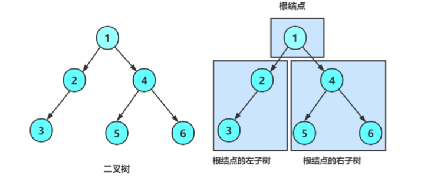

## 1.1 二叉树的特点
根据上面的二叉树的图片,我们可以得到二叉树的以下特点

- 二叉树不存在度大于 2 的结点
    二叉树每个结点最多度为2,即最多有左右两个子树,不存在或者只有一颗子树是可以的.
- 二叉树的子树有左右之分,次序不能随意颠倒,因此二叉树是有序树
    正如人的左脚和右脚不能随意颠倒,二叉树也分为左子树和右子树的;
    即使某个结点只有一棵子树,也是要分清楚是左子树还是右子树的

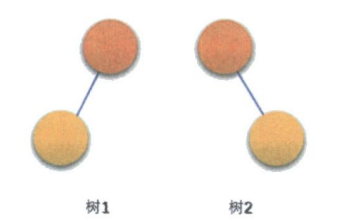
上图的两棵树虽然是同一棵树,但是不是同一棵二叉树

***
二叉树具有以下五种基本形态,任意的二叉树都是由下面的情况复合而成的
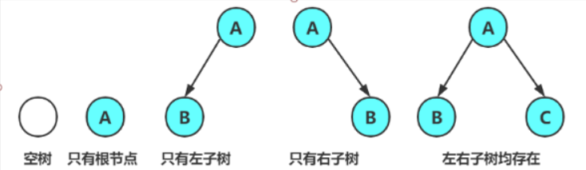
- 空二叉树
- 只有一个根结点
- 根节点只有左子树
- 根节点只有右子树
- 根节点既有左子树又有右子树

***
如果只从形态上考虑,三个结点的树只有两种情况,就是下图的树1和后面四个中的任意一种.
但是对于二叉树这个有序树而言,左右子树是由区别的,所以下面五种情况都表示不同的二叉树.
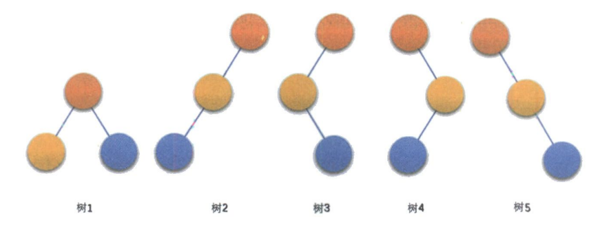
***
现实中的二叉树很漂亮,正如在数据结构中,二叉树这个树形结构也占据很重要的地位一样,有时候数学的美和大自然的美都是相通的.
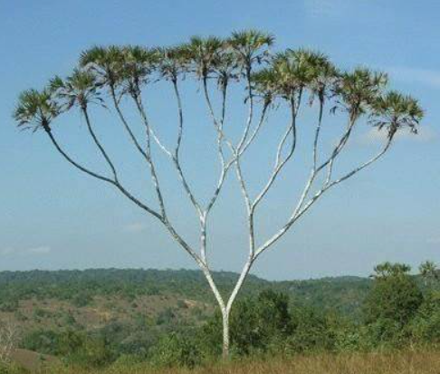

## 1.2 特殊二叉树
### 斜树
> 所有的结点都只有左子树的叫左斜树,所有的结点都只有右子树的叫右斜树.
> 这两者统称为**斜树**.

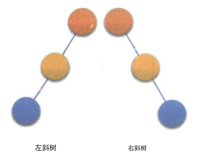
其实,线性表就是一种特殊的斜树,但是两者的逻辑结构还是不一样的,线性表是一对一线性结构的,而斜树是一对多树形结构的
***
### 满二叉树
> 在一棵二叉树中,如果所有**分支结点**都存在左子树和右子树,并且所有的叶子都在同一层上,这样的二叉树称为**满二叉树**

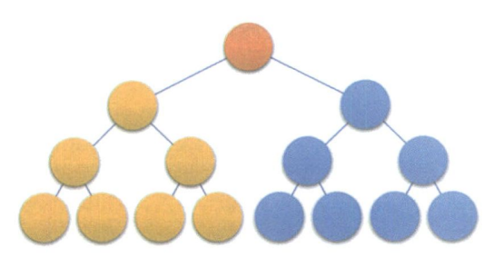

满二叉树有以下特点
- 叶子结点只能出现在最下一层
- 非叶子结点的度一定是 2 
- 满二叉树的结点个数最多,叶子数最多.如果一个满二叉树有 K 层, 那么一共有 $2^k-1$个结点

***
### 完全二叉树
> 对一个具有 n 个节点的二叉树按层序编号, 如果编号为 i($1\leqslant i \leqslant n$)的结点与同样深度的满二叉树中编号为 i 的结点在二叉树中的位置完全相同, 则这颗二叉树称为完全二叉树.

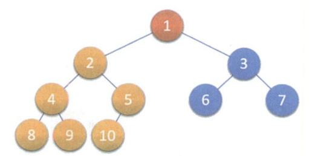

最重要的是**按层序编号**
例如下面的三个二叉树,就不是完全二叉树.它们对应满二叉树的结点编号缺少了.
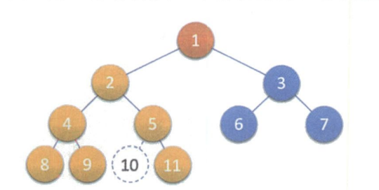
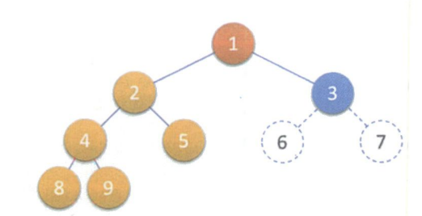
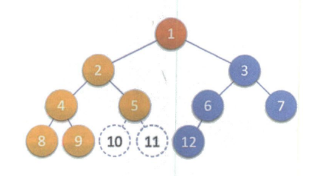

总而言之就是,除了最后一层的不满并且最后一层的从第一个结点开始是连续的,这就是完全二叉树.

完全二叉树有以下特点:
- 叶子结点只能出现在最下两层
- 最下层的叶子一定集中在左部连续位置
- 倒数两层,若有叶子结点,一定都在右部连续位置
- 如果结点度为1, 则该结点只有左孩子
- 同样节点数的二叉树,完全二叉树的深度最小

如果有h层, 那么完全二叉树的结点数为 $[2^{h-1}, 2^h - 1]$