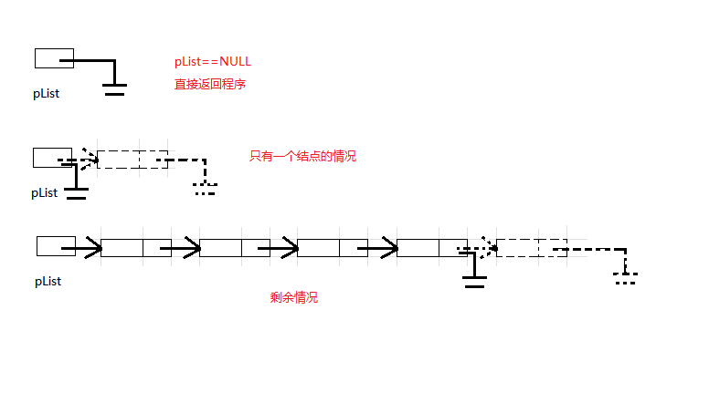

# 1. 线性表的链式表示: 链表
## 1.1 顺序表的优缺点
在介绍链表之前, 先回顾一下顺序表的优缺点

- **顺序表的优点**:
> 存储密度高: 无需为表示表中元素之间的逻辑关系而增加额外的存储空间.
> 随机访问: 通过首地址和元素序号可以在时间 $O(1)$ 内找到指定的元素.

- **顺序表的缺点**:
> 顺序表逻辑上相邻的元素物理上也相邻, 插入和删除操作需要移动大量元素,时间复杂度为 $O(N)$.
> 当线性表长度变化较大时, 难以确定存储空间的容量
> 造成存储空间的"碎片"

## 1.2 链表的概念
为了避免顺序表插入和删除的线性开销, 我们允许表可以不连续存储, 否则表的部分或全部需要整体移动. 

> 链表由一系列不必在内存中相连的结构组成. 

> 每个结构均含有表元素和指向包含该元素后继元的结构的指针.我们称为 `next` 指针.最后一个单元的 `next` 指针指向 `NULL` ;该值由C定义并且不能与其他指针混淆.ANSI C 规定 `NULL` 为 0

如果 `P` 被声明为一个指向一个结构的指针, 那么存储在 `P`中的值就被解释为主存中的一个位置, 在该位置能够找到一个结构.

该结构的一个域可以通过 `P->FieldName` 访问, 其中 `FieldName` 是我们想要考察的域的名字.

***

以下是表的具体表示, 即物理存储结构. 这个表含有 5 个结构, 内存分给它们的位置分别是 1000, 800, 712, 992 和 692.

第一个结构的指针含有值 800, 它提供了第二个结构所在的位置. 其余每个结构也都有一个指针用于类似的目的. 通过指针值, 可以访问到下一结构体的位置. 为了访问该表, 需要知道该表的第一个单元.


## 1.3 链表的优缺点
由此可以分析出单链表的优缺点:
- **链表的优点**
> 更加合理使用空间: 按需申请空间, 不用则释放空间
> 元素的插入和删除效率更高, 只需要 $O(1)$ 的时间
> 不存在空间浪费

- **链表的缺点**
> 访问速度慢: 查找某一元素需要从头开始依次查找, 消耗 $O(N)$ 的时间
> 存储密度低: 每个元素还需要额外空间存放指针空间, 用于将表中数据链接起来

## 1.4 链表的结构
```c
typedef int SLTDateType;

typedef struct SListNode
{
	SLTDateType data;
	struct SListNode* next;
}SListNode;
```

- **逻辑结构**: 便于理解想象出来的, 实际不存在, 一般用箭头表示, 实际箭头不存在


- **物理结构**: 主存中实际的存储方式, 不一定是处在连续存储的空间


# 2. 单链表的定义
## 2.1 单链表的结构体

```c
typedef int SLTDateType;

typedef struct SListNode
{
	SLTDateType data;
	struct SListNode* next;
}SListNode;
```

> 1. 为了后续代码便于复用, 使用 `typedef` 将数据类型和结构体类型重命名

> 2. 每一个单链表结点包含两个域: 数据域`data` 和指针域`next`
> `struct SListNode* next`实现结构体指向结构体

## 2.2 接口函数
```c
// 动态申请一个结点
SListNode* BuySListNode(SLTDataType x);
// 单链表打印
void SListPrint(SListNode* pHead);
// 单链表尾插
void SListPushBack(SListNode** ppHead, SLTDataType x);
// 单链表头插
void SListPushFront(SListNode** ppHead, SLTDataType x);
// 单链表尾删
void SListPopBack(SListNode** pHead);
// 单链表头删
void SListPopFront(SListNode** pHead);
// 单链表查找
SListNode* SListFind(SListNode* pHead, SLTDataType x);
// 单链表在 pos 位置之前插入
void SListInsert(SListNode** ppHead, SListNode* pos, SLTDataType x);
// 单链表在 pos 位置上删除
void SListErase(SListNode** ppHead, SListNode* pos);
// 单链表在 pos 位置之后插入
void SListInsertAfter(SListNode* pos, SLTDataType x);
// 单链表在 pos 位置之后删除
void SListEraseAfter(SListNode* pos);
// 单链表的销毁
void SListDestroy(SListNode** ppHead);
```

# 3. 接口函数的实现
## 3.1 动态申请一个结点 (BuySListNode)
单链表插入元素必然要新向内存动态申请一个结点的空间, 这个操作可以直接封装成一个函数, 便于后续创建结点使用.

- `SList.h`
```c
SListNode* BuySListNode(SLTDataType x);
```

- `SList.c`
```c
// 动态申请一个结点
SListNode* BuySListNode(SLTDataType x)
{
    SListNode* newNode = (SListNode*)malloc(sizeof(SListNode));

    if (newNode == NULL)
    {
        perror("BuySListNode:");
        exit(-1);
    }

    newNode->data = x;
    newNode->next = NULL;

    return newNode;
}
```

- `test.c`
```c
void SListTest1()
{
    SListNode* newNode = BuySListNode(3);
    free(newNode);
}

int main(void)
{
    SListTest1();

    return 0;
}
```

> 通过调试,创建结点成功:  
> 

## 3.2 单链表打印 (SListPrint)

通过`plist`的地址访问到第一个结点, 打印该结点的数据值, 同时访问下一结点直至该结点是空指针.

在访问链表的时候, 最好使用一个临时指针来访问, 避免后续增删元素的时候对链表首地址进行修改

- `SList.h`
```c
void SListPrint(SListNode* pHead);
```

- `SList.c`
```c
// 单链表打印
void SListPrint(SListNode* pHead)
{
   SListNode* cur = pHead;  //定义一个局部变量指针用来访问链表

   //从头依次访问链表, cur不为空进入循环
   while(cur != NULL)
   {
        printf("%d -> ", cur->data);    //打印结构的数据域
        cur = cur->next;    //使cur指向下一结点
   }

   printf("NULL\n");
}
```

- `test.c`
后续其他功能测试都会用到, 这里就先不测试了

## 3.3 单链表尾插 (SListPushBack)

创建一个新结点, 让原最后一个结点指向新结点, 同时新结点指向空指针.

- `SList.h`
```c
void SListPushBack(SListNode** ppHead, SLTDateType x);
```
> 涉及对结构体指针的修改, 需要用到二级指针.虽然是尾插,但如果该链表没有一个元素, 就需要将新结点的地址赋值给实参`pList`;想要函数修改指针的值,就需要形参是二级指针,也就是函数需要传址调用.


- `SList.c`
```c
// 单链表尾插
void SListPushBack(SListNode** ppHead, SLTDateType x);
{
    SListNode* newNode = BuySListNode(x);   //创建一个新结点

    if(*ppHead == NULL)    //没有结点, 直接将新结点的地址赋值
    {
        *ppHead = newNode;  //修改结构体指针, 需要用到二级指针
    }
    else    //有结点, 依次访问直到最后一个元素
    {
        SListNode* tail = *ppHead;  //tail 用于访问链表
        while (tail->next != NULL)
        {
            tail = tail->next;  
        }

        tail->next = newNode;   //修改结构体, 只要用到一级指针
    }
}
```
> 1. 首先创建一个新结点`newNode`

> 2. 接着判断链表是否为空,若为空,则直接使用二级指针将新结点的地址赋值给实参`pList`

> 3. 若链表不为空,则只需要修改结构体的内容,用到一级指针即可.当访问到该结点的`next`为空时,进行尾插操作.

- `test.c`
```c
void SListTest1()
{
    SListNode* pList = NULL;

    SListPushBack(&pList, 1);
    SListPushBack(&pList, 2);
    SListPushBack(&pList, 3);
    SListPushBack(&pList, 4);
    SListPushBack(&pList, 5);
    SListPushBack(&pList, 6);

    SListPrint(pList);
    SListDestroy(&pList);
}

int main(void)
{
    SListTest1();

    return 0;
}
```
> 测试运行结果如下:  
> 

## 3.4 单链表头插 (SListPushFront)

修改`pList`,让`pList`指向新结点,同时新结点的`next`指向原链表第一个结点

- `SList.h`
```c
void SListPushFront(SListNode** ppHead, SLTDateType x);
```
> 同样这里需要修改实参`pList`的值,函数的形参需要传入二级指针.

- `SList.c`
```c
// 单链表的头插
void SListPushFront(SListNode** ppHead, SLTDateType x)
{
    SListNode* newNode = BuySListNode(x);   //创建新结点

    newNode->next = *ppHead;    //新结点指向原链表第一个结点
    *ppHead = newNode;          //更新头结点
}
```
> 1. 首先创建新结点`newNode`

> 2. 随后先将新结点指向原头结点, 再更头结点的值.
> 注意这两步不可颠倒,否则头结点的地址就丢失了

- `test.c`
```c
void SListTest1()
{
    SListNode* pList = NULL;

    SListPushBack(&pList, 1);
    SListPushBack(&pList, 2);
    SListPushBack(&pList, 3);
    SListPushBack(&pList, 4);
    SListPushBack(&pList, 5);
    SListPushBack(&pList, 6);

    SListPrint(pList);

    SListPushFront(&pList, -1);
    SListPushFront(&pList, -2);
    SListPushFront(&pList, -3);
    SListPushFront(&pList, -4);
    SListPushFront(&pList, -5);
    SListPushFront(&pList, -6);

    SListPrint(pList);
    SListDestroy(&pList);
}

int main(void)
{
    SListTest1();

    return 0;
}
```
> 测试结果如下:  
> 

## 3.5 单链表尾删 (SListPopBack)

注意分三种情况
- `SList.h`
```c
void SListPopBack(SListNode** ppHead);
```
> 同样有修改结构体指针的情况,需要用到二级指针

- `SList.c`
```c
// 单链表的尾删
void SListPopBack(SListNode** ppHead)
{
    assert(*ppHead);    //没有结点的情况

    if ((*ppHead)->next == NULL)  //只有一个结点的情况
    {
        free(*ppHead);
        *ppHead = NULL; //修改实参的值需要用到二级指针
    }
    else    //有两个结点以上的情况
    {
        SListNode* tail = *ppHead;   //tail用来访问结构体成员

        while (tail->next->next != NULL) //需要修改倒数第二个结点的值, 则访问到倒数第二个结点即停止
        {
            tail = tail->next;
        }

        free(tail->next);  //先释放最后一个结点的空间
        tail->next = NULL;  //倒数第二个结点指向NULL
    }
}
```
> 1. 若链表为空,没有结点,程序直接结束

> 2. 若只有一个结点,则需要用到二级指针来修改实参`pList`的值为`NULL`,同时释放头结点空间

> 3. 若有两个及以上结点,只用修改结构体.若要修改倒数第二个结点的值,则只要访问到倒数第二个结点就可以了.这是单向链表,不可返回访问

- `test.c`
```c
void SListTest2()
{
    SListNode* pList = NULL;

    SListPushBack(&pList, 1);
    SListPushBack(&pList, 2);
    SListPushBack(&pList, 3);
    SListPushBack(&pList, 4);
    SListPushBack(&pList, 5);
    SListPushBack(&pList, 6);

    SListPrint(pList);

    SListPopBack(&pList);
    SListPopBack(&pList);

    SListPrint(pList);

    SListPopBack(&pList);
    SListPopBack(&pList);
    SListPopBack(&pList);

    SListPrint(pList);  

    SListPopBack(&pList);       //一个结点

    SListPrint(pList);

    SListPopBack(&pList);       //没有结点

    SListPrint(pList);
    SListDestroy(&pList);
}

int main(void)
{
    SListTest2();

    return 0;
}
```
> 测试运行结果如下:  
> 

## 3.6 单链表头删 (SListPopFront)

单链表头删则只有两种情况,若链表为空直接终止程序.链表不为空,使`pList`指向头结点指向的空间.

- `SList.h`
```c
void SListPopFront(SListNode** ppHead);
```
> 同样有修改结构体指针的情况,需要用到二级指针
 
- `SList.c`
```c
// 单链表头删
void SListPopFront(SListNode** ppHead)
{
    assert(*ppHead);    //链表为空

    //链表非空
    SListNode* newNode = (*ppHead)->next;   //记录新的头结点
    free(*ppHead);      //释放原头结点空间
    *ppHead = newNode;  //更新头结点
}
```
> 1. 首先判断链表是否为空,若链表为空程序直接结束

> 2. 接着先记录新的头结点,释放原头结点空间后,更新头结点.
> 同样两个操作不可颠倒,否则原头结点失去位置,造成内存泄漏

- `test.c`
```c
void SListTest3()
{
    SListNode* pList = NULL;

    SListPushBack(&pList, 1);
    SListPushBack(&pList, 2);
    SListPushBack(&pList, 3);
    SListPushBack(&pList, 4);
    SListPushBack(&pList, 5);
    SListPushBack(&pList, 6);

    SListPrint(pList);

    SListPopFront(&pList);
    SListPopFront(&pList);

    SListPrint(pList);

    SListPopFront(&pList);
    SListPopFront(&pList);
    SListPopFront(&pList);

    SListPrint(pList);  

    SListPopFront(&pList);      

    SListPrint(pList);

    SListPopFront(&pList);       //没有结点

    SListPrint(pList);
    SListDestroy(&pList);
}

int main(void)
{
    SListTest3();

    return 0;
}
```
> 测试运行结果如下:  
> 

## 3.7 单链表查找 (SListFind)

从头依次访问每一个结点,并与要查找的值进行比较,若找到则直接返回该结点的地址,若找不到则返回空指针.

- `SList.h`
```c
SListNode* SListFind(SListNode* pHead, SLTDateType x);
```

- `SList.c`
```c
// 单链表查找
SListNode* SListFind(SListNode* pHead, SLTDateType x)
{
    SListNode* cur = pHead; //cur访问每个结点

    while (cur != NULL)
    {
        if (cur->data == x)
        {
            return cur;
        }
        cur = cur->next;
    }

    return NULL;
}
```

- `test.c`
```c
void SListTest4()
{
    SListNode* pList = NULL;

    SListPushBack(&pList, 1);
    SListPushBack(&pList, 2);
    SListPushBack(&pList, 3);
    SListPushBack(&pList, 4);
    SListPushBack(&pList, 5);
    SListPushBack(&pList, 6);

    SListPrint(pList);

    SListNode* pos;
    pos = SListFind(pList, 3);
    SListPrint(pos);

    pos = SListFind(pList, 6);
    SListPrint(pos);

    pos = SListFind(pList, 8);
    SListPrint(pos);
    SListDestroy(&pList);
}

int main(void)
{
    SListTest4();

    return 0;
}
```
> 测试运行结果如下:  
> 

## 3.8 单链表在 pos 位置之前插入 (SListInsert)
将`pos`位置的之前插入分为两种情况: `pos` 指向头结点 和 其他情况


- `SList.h`
```c
void SListInsert(SListNode** ppHead, SListNode* pos, SLTDataType x);
```
> 涉及对实参 `pList` 的修改需要用到二级指针
- `SList.c`
```c
// 单链表在 pos 位置之前插入
void SListInsert(SListNode** ppHead, SListNode* pos, SLTDataType x)
{
	assert(ppHead);
	assert(pos);
	
	SListNode* newNode = BuySListNode(x);	//创建新结点
	
	if (*ppHead == pos)	//如果pos指向第一个结点
	{
		//头插
		newNode->next = *ppHead;
		*ppHead = newNode;
	}
	else
	{
		SListNode* prev = *ppHead;	//prev用于访问到pos前一个结点的位置
		
		while (prev->next != pos)
		{
			prev = prev->next;
		}
		
		//插入
		newNode->next = pos;
		prev->next = newNode;
	}
}
```
> 1. 首先确保 `ppHead` 和 `pos` 值合法

> 2. 创建新结点后, 判断 `pos` 是否指向头结点, 若指向头结点, 直接头插操作就可以了, 注意要使用二级指针以修改实参 `pList` 的值

> 3. 若 `pos` 不指向头结点, 因为要涉及对 `pos` 指向结点的前一个结点进行修改, 所以定义 `prev` 顺序访问单链表直至访问到 `pos` 指向结点的前一个结点. 这时进行插入操作, 直接修改 `newNode` 和 `prev` 的 `next` 即可

- `test.c`
```c
void SListTest5()
{
	SListNode* pList = NULL;
	
	SListPushBack(&pList, 1);
    SListPushBack(&pList, 2);
    SListPushBack(&pList, 3);
    SListPushBack(&pList, 4);
    SListPushBack(&pList, 5);
    SListPushBack(&pList, 6);

    SListPrint(pList);
	
	SListNode* pos;
	pos = SListFind(pList, 1);
	if (pos != NULL)
	{
		SListInsert(&pList, pos, -1);
	}
	SListPrint(pList);

	pos = SListFind(pList, 5);
	if (pos != NULL)
	{
		SListInsert(&pList, pos, -5);
	}
	SListPrint(pList);

	pos = SListFind(pList, 10);
	if (pos != NULL)
	{
		SListInsert(&pList, pos, -10);
	}
	SListPrint(pList);
	SListDestroy(&pList);
	
}

int main(void)
{
    SListTest5();

    return 0;
}
```
> 测试运行结果如下:  
> 

## 3.9 单链表在 pos 位置上删除 (SListErase)
单链表在 `pos` 位置上删除, 也是有两种情况: 删除的是头结点 和 删除的不是头结点


- `SList.h`
```c
void SListErase(SListNode** ppHead, SListNode* pos);
```
> 涉及对实参 `pList` 的修改需要用到二级指针

- `SList.c`
```c
// 单链表在 pos 位置上删除
void SListErase(SListNode** ppHead, SListNode* pos)
{	
	assert(ppHead);
	assert(pos);

	if (*ppHead == pos)	//如果 pos 指向第一个结点
	{				
		*ppHead = pos->next;
		free(pos);		//释放空间
	}
	else	//有两个及以上结点
	{
		SListNode* prev = *ppHead;	//prev 访问到pos之前的一个结点
		
		while (prev->next != pos)
		{	
			prev = prev->next;
		}
		
		//删除
		prev->next = pos->next;
		free(pos);
	}
}
```
> 1. 首先确保 `ppHead` 和 `pos` 的值合法

> 2. 接着判断 `pos` 是否指向头结点, 如果指向头结点, 则按照头删的方式进行删除结点

> 3. 如果 `pos` 不指向头结点, 因为需要修改 `pos` 前面的结点的数据, 所以定义了变量 `prev`, 顺序访问单链表直至访问到 `pos` 位置结点的前一个结点, 直接 `prev->next = pos->next`

- `test.c`
```c
void SListTest6()
{
	SListNode* pList = NULL;
	
	SListPushBack(&pList, 1);
	SListPushBack(&pList, 2);
	SListPushBack(&pList, 3);
	SListPushBack(&pList, 4);
	SListPushBack(&pList, 5);
	SListPushBack(&pList, 6);
	SListPrint(pList);

	SListNode* pos;
	pos = SListFind(pList, 1);
	if (pos != NULL)
	{
		SListErase(&pList, pos);
	}
	SListPrint(pList);

	pos = SListFind(pList, 5);
	if (pos != NULL)
	{
		SListErase(&pList, pos);;
	}
	SListPrint(pList);

	pos = SListFind(pList, 10);
	if (pos != NULL)
	{
		SListErase(&pList, pos);
	}
	SListPrint(pList);
	SListDestroy(&pList);
}

int main(void)
{
    SListTest6();

    return 0;
}
```
> 测试运行结果如下:  
> 

## 3.10 单链表在 pos 位置之后插入 (SListInsertAfter)
直接插入即可, 时间复杂度相比 `SListInsert` 要少很多

- `SList.h`
```c
void SListInsertAfter(SListNode* pos, SLTDataType x);
```

- `SList.c`
```c
// 单链表在 pos 位置后插入
void SListInsertAfter(SListNode* pos, SLTDataType x)
{
	assert(pos);	//确保插入位置合法
	
	SListNode* newNode = BuySListNode(x);
	newNode->next = pos->next;
	pos->next = newNode;
}		 
```
> 1. 确保 `pos` 的值合法

> 2. 注意 `newNode->next = pos->next;` 和 `pos->next = newNode;`的顺序不可以颠倒, 否则会出现 `newNode` 指向自己的情况

- `test.c`
```c
void SListTest7()
{
	SListNode* pList = NULL;
	
	SListPushBack(&pList, 1);	
	SListPushBack(&pList, 2);	
	SListPushBack(&pList, 3);	
	SListPushBack(&pList, 4);	
	SListPushBack(&pList, 5);	
	SListPushBack(&pList, 6);	
	SListPrint(pList);
	
	SListNode* pos;
	pos = SListFind(pList, 1);
	if (pos != NULL)
	{
		SListInsertAfter(pos, -1);
	}
	SListPrint(pList);	
	
	pos = SListFind(pList, 6);
	if (pos != NULL)
	{
 		SListInsertAfter(pos, -6);
	}
	SListPrint(pList);

	pos = SListFind(pList, 10);
	if (pos != NULL)
	{
		SListInsertAfter(pos, -10);
	}
	SListPrint(pList);
    SListDestroy(&pList);
}

int main(void)
{
    SListTest7();

    return 0;
}
```
> 测试运行结果如下: 
> 

## 3.11 单链表在 pos 位置之后删除 (SListEraseAfter)
直接改变 `pos` 位置结点的指向即可, `pos` 不可指向链表结尾


- `SList.h`
```c
void SListEraseAfter(SListNode* pos);
```

- `SList.c`
```c
// 单链表在 pos 位置之后删除
void SListEraseAfter(SListNode* pos)
{
	assert(pos);	//确保删除位置合法
	assert(pos->next);
	
	SListNode* deleteNode = pos->next;
	pos->next = deleteNode->next;
	free(deleteNode);
}
```
> 1. 确保 `pos` 和 `pos->next` 合法

> 2. 将要删除的结点命名为 `deleteNode`, 随后直接修改 `pos` 位置的 `next`, 并释放空间即可

- `test.c`
```c
void SListTest7()
{
	SListNode* pList = NULL;
	
	SListPushBack(&pList, 1);	
	SListPushBack(&pList, 2);	
	SListPushBack(&pList, 3);	
	SListPushBack(&pList, 4);	
	SListPushBack(&pList, 5);	
	SListPushBack(&pList, 6);	
	SListPrint(pList);
	
	SListNode* pos;
    pos = SListFind(pList, 1);
	if (pos != NULL)
	{
		SListEraseAfter(pos);
	}
	SListPrint(pList);

	pos = SListFind(pList, 4);
	if (pos != NULL)
	{
		SListEraseAfter(pos);
	}
	SListPrint(pList);

	pos = SListFind(pList, 6);
	if (pos != NULL)
	{
		SListEraseAfter(pos);
	}
	SListPrint(pList); 
    SListDestroy(&pList);
}

int main(void)
{
    SListTest7();

    return 0;
}
```
> 测试运行结果如下: 
>  

## 3.12 单链表销毁 (SListDestroy)
- `SList.h`
```c
void SListDestroy(SListNode** ppHead);
```
> 涉及对实参 `pList` 的修改需要用到二级指针

- `SList.c`
```c
// 单链表销毁
void SListDestroy(SListNode** ppHead)
{
	assert(ppHead);
	
	SListNode* cur = *ppHead;
	
	while (cur != NULL)
	{
		SListNode* next = cur->next;
		free(cur);
		cur = next;
	}
	
	*ppHead = NULL;
}
```
> 顺序访问链表并依次释放结点空间

*** 
由此可以看出: 单链表更多的还是头插和头删是最便利的, 在后面的复杂数据结构中会用到单链表, 算法相关笔试题也是单链表居多(单链表的坑比较多!)

# 4. 完整代码
- `SList.h`
```c
#pragma once

#include <stdio.h>
#include <stdlib.h>
#include <assert.h>

typedef int SLTDataType;
//单链表结点结构体
typedef struct SListNode
{
	SLTDataType data;
	struct SListNode* next;
}SListNode;

//动态申请一个结点
SListNode* BuySListNode(SLTDataType x);
//单链表打印
void SListPrint(SListNode* pHead);
//单链表尾插
void SListPushBack(SListNode** ppHead, SLTDataType x);
//单链表头插
void SListPushFront(SListNode** ppHead, SLTDataType x);
//单链表尾删
void SListPopBack(SListNode** pHead);
//单链表头删
void SListPopFront(SListNode** pHead);
//单链表查找
SListNode* SListFind(SListNode* pHead, SLTDataType x);
//单链表在 pos 位置之前插入
void SListInsert(SListNode** ppHead, SListNode* pos, SLTDataType x);
//单链表在 pos 位置上删除
void SListErase(SListNode** ppHead, SListNode* pos);
//单链表在 pos 位置之后插入
void SListInsertAfter(SListNode* pos, SLTDataType x);
//单链表在 pos 位置之后删除
void SListEraseAfter(SListNode* pos);
//单链表的销毁
void SListDestroy(SListNode** ppHead);

```

- `SList.c`
```c
#include "SList.h"

// 动态申请一个结点
SListNode* BuySListNode(SLTDataType x)
{
    SListNode* newNode = (SListNode*)malloc(sizeof(SListNode));

    if (newNode == NULL)
    {
        perror("BuySListNode:");
        exit(-1);
    }

    newNode->data = x;
    newNode->next = NULL;

	return newNode;
}

// 单链表打印
void SListPrint(SListNode* pHead)
{
   SListNode* cur = pHead;  //定义一个局部变量指针用来访问链表

   //从头依次访问链表, cur不为空进入循环
   while(cur != NULL)
   {
        printf("%d -> ", cur->data);    //打印结构的数据域
        cur = cur->next;    //使cur指向下一结点
   }

   printf("NULL\n");
}

// 单链表尾插
void SListPushBack(SListNode** ppHead, SLTDataType x)
{
	assert(ppHead);

    SListNode* newNode = BuySListNode(x);   //创建一个新结点

    if(*ppHead == NULL)    //没有结点, 直接将新结点的地址赋值
    {
        *ppHead = newNode;  //修改结构体指针, 需要用到二级指针
    }
    else    //有结点, 依次访问直到最后一个元素
    {
        SListNode* tail = *ppHead;  //tail 用于访问链表
        while (tail->next != NULL)
        {
            tail = tail->next;  
        }

        tail->next = newNode;   //修改结构体, 只要用到一级指针
    }
}

// 单链表的头插
void SListPushFront(SListNode** ppHead, SLTDataType x)
{
    SListNode* newNode = BuySListNode(x);   //创建新结点

    newNode->next = *ppHead;    //新结点指向原链表第一个结点
    *ppHead = newNode;          //更新头结点
}

// 单链表的尾删
void SListPopBack(SListNode** ppHead)
{
	assert(ppHead);
    assert(*ppHead);    //没有结点的情况

    if ((*ppHead)->next == NULL)  //只有一个结点的情况
    {
        free(*ppHead);
        *ppHead = NULL; //修改实参的值需要用到二级指针
    }
    else    //有两个结点以上的情况
    {
        SListNode* tail = *ppHead;   //tail用来访问结构体成员

        while (tail->next->next != NULL) //需要修改倒数第二个结点的值, 则访问到倒数第二个结点即停止
        {
            tail = tail->next;
        }

        free(tail->next);  //先释放最后一个结点的空间
        tail->next = NULL;  //倒数第二个结点指向NULL
    }
}

// 单链表头删
void SListPopFront(SListNode** ppHead)
{	
	assert(ppHead);
    assert(*ppHead);    //链表为空

    //链表非空
    SListNode* newNode = (*ppHead)->next;   //记录新的头结点
    free(*ppHead);      //释放原头结点空间
    *ppHead = newNode;  //更新头结点
}

// 单链表查找
SListNode* SListFind(SListNode* pHead, SLTDataType x) 
{
    SListNode* cur = pHead; //cur访问每个结点

    while (cur != NULL)
    {
        if (cur->data == x)
        {
            return cur;
        }
        cur = cur->next;
    }

    return NULL;
}

// 指定位置前插
void SListInsert(SListNode** ppHead, SListNode* pos, SLTDataType x)
{
	assert(ppHead);
	assert(pos);
	
	SListNode* newNode = BuySListNode(x);	//创建新结点
	
	if (*ppHead == pos)	//如果pos指向第一个结点
	{
		//头插
		newNode->next = *ppHead;
		*ppHead = newNode;
	}
	else
	{
		SListNode* prev = *ppHead;	//prev用于访问到pos前一个结点的位置
		
		while (prev->next != pos)
		{
			prev = prev->next;
		}
		
		//插入
		newNode->next = pos;
		prev->next = newNode;
	}
}

// 单链表在 pos 位置上删除
void SListErase(SListNode** ppHead, SListNode* pos)
{	
	assert(ppHead);
	assert(pos);

	if (*ppHead == pos)	//如果 pos 指向第一个结点
	{				
		*ppHead = pos->next;
		free(pos);		//释放空间
	}
	else	//有两个及以上结点
	{
		SListNode* prev = *ppHead;	//prev 访问到pos之前的一个结点
		
		while (prev->next != pos)
		{	
			prev = prev->next;
		}
		
		//删除
		prev->next = pos->next;
		free(pos);
	}
}

// 单链表销毁
void SListDestroy(SListNode** ppHead)
{
	assert(ppHead);
	
	SListNode* cur = *ppHead;
	
	while (cur != NULL)
	{
		SListNode* next = cur->next;
		free(cur);
		cur = next;
	}
	
	*ppHead = NULL;
}

// 单链表在 pos 位置后插入
void SListInsertAfter(SListNode* pos, SLTDataType x)
{
	assert(pos);	//确保插入位置合法
	
	SListNode* newNode = BuySListNode(x);
	newNode->next = pos->next;
	pos->next = newNode;
}		 

// 单链表在 pos 位置之后删除
void SListEraseAfter(SListNode* pos)
{
	assert(pos);	//确保删除位置合法
	assert(pos->next);
	
	SListNode* deleteNode = pos->next;
	pos->next = deleteNode->next;
	free(deleteNode);
}	

```

- `test.c`
```c
#include "SList.h"

void SListTest1()
{
	SListNode* pList = NULL;
	
	SListPushBack(&pList, 1);
	SListPushBack(&pList, 2);
	SListPushBack(&pList, 3);
	SListPushBack(&pList, 4);
	SListPushBack(&pList, 5);
	SListPushBack(&pList, 6);
	
	SListPrint(pList);
	
	SListPushFront(&pList, -1);
	SListPushFront(&pList, -2);
	SListPushFront(&pList, -3);
	SListPushFront(&pList, -4);
	SListPushFront(&pList, -5);
	SListPushFront(&pList, -6);
	
	SListPrint(pList);

	SListDestroy(&pList);
}

void SListTest2()
{
    SListNode* pList = NULL;

    SListPushBack(&pList, 1);
    SListPushBack(&pList, 2);
    SListPushBack(&pList, 3);
    SListPushBack(&pList, 4);
    SListPushBack(&pList, 5);
    SListPushBack(&pList, 6);

    SListPrint(pList);

    SListPopBack(&pList);
    SListPopBack(&pList);

    SListPrint(pList);

    SListPopBack(&pList);
    SListPopBack(&pList);
    SListPopBack(&pList);

    SListPrint(pList);

    SListPopBack(&pList);

    SListPrint(pList);
	
	SListPopBack(&pList);
	
	SListPrint(pList);
	SListDestroy(&pList);
}

void SListTest3()
{
    SListNode* pList = NULL;

    SListPushBack(&pList, 1);
    SListPushBack(&pList, 2);
    SListPushBack(&pList, 3);
    SListPushBack(&pList, 4);
    SListPushBack(&pList, 5);
    SListPushBack(&pList, 6);

    SListPrint(pList);

    SListPopFront(&pList);
    SListPopFront(&pList);

    SListPrint(pList);

    SListPopFront(&pList);
    SListPopFront(&pList);
    SListPopFront(&pList);

    SListPrint(pList);  

    SListPopFront(&pList);      

    SListPrint(pList);

    SListPopFront(&pList);       //没有结点

    SListPrint(pList);
	SListDestroy(&pList);
}

void SListTest4()
{
    SListNode* pList = NULL;

    SListPushBack(&pList, 1);
    SListPushBack(&pList, 2);
    SListPushBack(&pList, 3);
    SListPushBack(&pList, 4);
    SListPushBack(&pList, 5);
    SListPushBack(&pList, 6);

    SListPrint(pList);

    SListNode* pos;
    pos = SListFind(pList, 3);
    SListPrint(pos);

    pos = SListFind(pList, 6);
    SListPrint(pos);

    pos = SListFind(pList, 8);
    SListPrint(pos);
	SListDestroy(&pList);
}

void SListTest5()
{
	SListNode* pList = NULL;
	
	SListPushBack(&pList, 1);
    SListPushBack(&pList, 2);
    SListPushBack(&pList, 3);
    SListPushBack(&pList, 4);
    SListPushBack(&pList, 5);
    SListPushBack(&pList, 6);

    SListPrint(pList);
	
	SListNode* pos;
	pos = SListFind(pList, 1);
	if (pos != NULL)
	{
		SListInsert(&pList, pos, -1);
	}
	SListPrint(pList);

	pos = SListFind(pList, 5);
	if (pos != NULL)
	{
		SListInsert(&pList, pos, -5);
	}
	SListPrint(pList);

	pos = SListFind(pList, 10);
	if (pos != NULL)
	{
		SListInsert(&pList, pos, -10);
	}
	SListPrint(pList);
	SListDestroy(&pList);
	
}

void SListTest6()
{
	SListNode* pList = NULL;
	
	SListPushBack(&pList, 1);
	SListPushBack(&pList, 2);
	SListPushBack(&pList, 3);
	SListPushBack(&pList, 4);
	SListPushBack(&pList, 5);
	SListPushBack(&pList, 6);
	SListPrint(pList);

	SListNode* pos;
	pos = SListFind(pList, 1);
	if (pos != NULL)
	{
		SListErase(&pList, pos);
	}
	SListPrint(pList);

	pos = SListFind(pList, 5);
	if (pos != NULL)
	{
		SListErase(&pList, pos);;
	}
	SListPrint(pList);

	pos = SListFind(pList, 10);
	if (pos != NULL)
	{
		SListErase(&pList, pos);
	}
	SListPrint(pList);
	SListDestroy(&pList);
}

void SListTest7()
{
	SListNode* pList = NULL;
	
	SListPushBack(&pList, 1);	
	SListPushBack(&pList, 2);	
	SListPushBack(&pList, 3);	
	SListPushBack(&pList, 4);	
	SListPushBack(&pList, 5);	
	SListPushBack(&pList, 6);	
	SListPrint(pList);
	
	SListNode* pos;
	pos = SListFind(pList, 1);
	if (pos != NULL)
	{
		SListInsertAfter(pos, -1);
	}
	SListPrint(pList);	
	
	pos = SListFind(pList, 6);
	if (pos != NULL)
	{
 		SListInsertAfter(pos, -6);
	}
	SListPrint(pList);

	pos = SListFind(pList, 10);
	if (pos != NULL)
	{
		SListInsertAfter(pos, -10);
	}
	SListPrint(pList);
	
	pos = SListFind(pList, -1);
	if (pos != NULL)
	{
		SListEraseAfter(pos);
	}
	SListPrint(pList);

	pos = SListFind(pList, 5);
	if (pos != NULL)
	{
		SListEraseAfter(pos);
	}
	SListPrint(pList);

	pos = SListFind(pList, -6);
	if (pos != NULL)
	{
		SListEraseAfter(pos);
	}
	SListPrint(pList); 
	SListDestroy(&pList);
}

int main(void)
{
	//SListTest1();
	//SListTest2();
	//SListTest3();
	//SListTest4();
	//SListTest5();
	//SListTest6();
	SListTest7();


	return 0;
}

```

本章完.