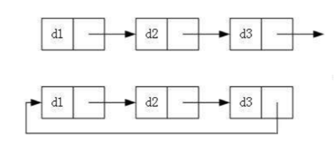

之前一章学习了单链表的相关操作, 但是单链表的限制却很多, 比如不能倒序扫描链表, 解决方法是在数据结构上附加一个域, 使它包含指向前一个单元的指针即可.

那么怎么定义数据结构呢? 首先我们先了解以下链表的分类

# 1. 链表的分类
> 链表的结构非常多样, 以下情况组合起来就有 8 中链表结构

- 单向或者双向


- 带头或者不带头


- 循环或者非循环


***
虽然有这么多的链表的结构, 但是我们实际上最常用的还是两种结构:


**无头单向非循环链表**
> **结构简单**,一般不会单独用来存放数据.实际上更多是作为**其他数据结构的子结构**, 如哈希桶, 图的邻接表等等. 另外这种结构在**笔试面试**中出现很多


**带头双向循环链表**
> **结构最复杂**, 一般用于单独存储数据.实际上使用的链表数据结构, 都是带头双向循环链表. 虽然结构复杂, 但是实现相关功能比较简单.

> 严格来说只用实现 `Insert` 和 `Erase` 两个功能, 就可以实现 "二十分钟" 写完一个链表的任务.

# 2. 带头双向循环链表
## 2.1 带头双向循环链表的定义
```c
typedef int LTDataType;     //LTDataType = int
typedef struct ListNode
{
  LTDataType data;          //数据域
  struct ListNode* prev;    //指向前一个结点
  struct ListNode* next;    //指向后一个结点
}ListNode;  //重命名为 ListNode
```
> 1. 相比较单链表的数据结构, 只需要多一个域用来指向前面一个结点就可以了.
> 2. 这里使用`ListNode`来命名这个数据结构, 方便后续学习 STL 进行知识迁移

## 2.2 接口函数
```c
// 创建并返回链表的头结点
ListNode* ListCreate();
// 双向链表销毁
void ListDestroy(ListNode* phead);
// 双向链表打印
void ListPrint(ListNode* phead);
// 双向链表尾插
void ListPushBack(ListNode* phead, LTDataType x);
// 双向链表尾删
void ListPopBack(ListNode* phead);
// 双向链表头插
void ListPushFront(ListNode* phead, LTDataType x);
// 双向链表头删
void ListPopFront(ListNode* phead);
// 双向链表查找
ListNode* ListFind(ListNode* phead, LTDataType x);
// 双向链表在 pos 的前面进行插入
void ListInsert(ListNode* pos, LTDataType x);
// 双向链表删除 pos 位置的结点
void ListErase(ListNode* pos);
```

# 3. 接口函数的实现
> 因为有虚拟结点的存在, 所以除了创建头结点的函数, 其余接口函数都不会修改结构体指针, 只是修改结构体.

> 为了统一接口形式, 统一使用一级指针作为函数的形参类型. 需要修改头结点的函数接口, 直接用返回值的方法达到修改头结点指针的目的.

## 3.1 创建并返回链表的头结点 (ListCreate)


创建链表即为创建头结点, 它是一个虚拟结点(dummy node), 实际的值没有意义.它的两个指针都指向自己.

- `ListList.h`
```c
#pragma once 

#include <stdio.h>
#include <stdlib.h>
#include <assert.h>

typedef int LTDataType;
typedef struct ListNode
{
  LTDataType data;        //数据域
  struct ListNode* prev;  //指向前一个结点
  struct ListNode* next;  //指向后一个结点
}ListNode;

// 创建并返回链表的头结点
ListNode* ListCreate();
```
> 修改头结点指针, 使用返回值接受头结点的指针
- `ListList.c`
```c
// 创建返回链表的头结点
ListNode* ListCreate()
{
  // 动态开辟空间创建头结点, 如果开辟失败直接结束程序
  ListNode* head = BuyListNode(0);
  
  // 处理链表数据, 数据域随机值, 两个指针指向自己
  head->next = head;
  head->prev = head;

  return head;
}
```
> 1. 这里的 `BuyListNode()` 是一个我自己定义的静态函数, 方便后续复用. 函数的功能是用来从堆中申请空间用来创建一个新结点.
> ```c
> // 创建一个新结点
> static ListNode* BuyListNode(LTDataType x)
> {
>   ListNode* newNode = (ListNode*)malloc(sizeof(struct ListNode));
> 
>   if (newNode == NULL)
>   {
>     perror("malloc fail");
>     exit(-1);
>   }
> 
>   newNode->data = x;
>   newNode->next = NULL;
>   newNode->prev = NULL;
> 
>   return newNode;
> }
> ```

> 2. 创建头结点后, 使头结点指向自己


- `test.c`
```c
void LinkListTest1()
{
  ListNode* head = ListCreate();

  free(head);
}
```
> 测试调试结果如下: 
> 
> 头结点创建成功, 并且头结点两个指针都指向了自己

## 3.2 双向链表打印 (ListPrint)
从第一个结点开始遍历链表每个结点, 并且将结点的数据域打印出来, 直到遇到头结点结束

- `ListList.h`
```c
void ListPrint(ListNode* phead);
```

- `ListList.c`
```c
// 双向链表打印
void ListPrint(ListNode* phead)
{
  assert(phead);  //确保头结点存在

  printf("head <=> ");

  ListNode* cur = phead->next;  //从第一个结点开始遍历, 直到遇到头结点结束
  while (cur != phead)
  {
    printf("%d <=> ", cur->data);
    cur = cur->next;
  }

  printf("\n");
}
```
> 1. 确保头结点存在

> 2. `cur`第一次定位到头结点后面一个结点, 即第一个有效结点

> 3. 顺序遍历并且打印
- `test.c`
> 后续调试其他函数功能都会使用到 `ListPrint` 函数, 这里就先不调试了.

## 3.3 双向链表尾插 (ListPushBack)
先找到链表尾结点的位置, 在尾结点和头结点之间插入一个新结点


- `ListList.h`
```c
void ListPushBack(ListNode* phead, LTDataType x);
```

- `ListList.c`
```c
// 双向链表尾插
void ListPushBack(ListNode* phead, LTDataType x)
{
  assert(phead);  //确保头结点存在

  ListNode* newNode = BuyListNode(x); //创建新结点 
  ListNode* tail = phead->prev;       //找到尾结点
  
  //更改链接关系
  tail->next = newNode;
  newNode->prev = tail;
  phead->prev = newNode;
  newNode->next = phead;

}
```
> 1. 确保头结点存在

> 2. 更改链接关系, 需要修改一共四根指针的指向关系

- `test.c`
```c
void LinkListTest1()
{
  ListNode* head = ListCreate();
  ListPushBack(head, 1);
  ListPushBack(head, 2);
  ListPushBack(head, 3);
  ListPushBack(head, 4);
  ListPushBack(head, 5);
  ListPrint(head);
}
```
> 测试结果如下: 
> 

## 3.4 双向链表尾删 (ListPopBack)
找到新的尾结点位置, 更改链接关系后将原尾结点删除

- `ListList.h`
```c
void ListPopBack(ListNode* phead);
```

- `ListList.c`
```c
// 双向链表尾删
void ListPopBack(ListNode* phead)
{
  assert(phead);                    //确保头结点存在
  assert(phead->next != phead);     //确保有结点可删

  ListNode* tail = phead->prev;     //找到要删除的尾结点
  ListNode* tailPrev = tail->prev;  //找到新的尾结点

  //更改链接关系
  tailPrev->next = phead;
  phead->prev = tailPrev;

  free(tail); //释放空间
}
```

- `test.c`
```c
void LinkListTest1()
{
  ListNode* head = ListCreate();
  ListPushBack(head, 1);
  ListPushBack(head, 2);
  ListPushBack(head, 3);
  ListPushBack(head, 4);
  ListPushBack(head, 5);
  ListPrint(head);

  ListPopBack(head);
  ListPrint(head);

  ListPopBack(head);
  ListPrint(head);
  
  ListPopBack(head);
  ListPopBack(head);
  ListPopBack(head);
  ListPrint(head);
  
  ListPopBack(head);
  ListPrint(head);
  
  ListDestroy(head);
}
```
> 测试结果如下: 
> 

## 3.5 双链表头插 (ListPushFront)
找到原第一个有效节点, 在头结点和这个结点之间插入一个新结点

- `ListList.h`
```c
void ListPushFront(ListNode* phead, LTDataType x);
```

- `ListList.c`
```c
// 双向链表头插
void ListPushFront(ListNode* phead, LTDataType x)
{
  assert(phead);  //确保头结点存在

  ListNode* newNode = BuyListNode(x); //创建新结点
  ListNode* first = phead->next;      //找到原来的第一个结点

  //更新链接关系
  phead->next = newNode;
  newNode->prev = phead;
  newNode->next = first;
  first->prev = newNode;
}
```
> 1. 确保头结点存在

> 2. 在头结点和第一个有效结点之间插入新结点

- `test.c`
```c
void LinkListTest2()
{
  ListNode* head = ListCreate();

  ListPushFront(head, 1);
  ListPushFront(head, 2);
  ListPushFront(head, 3);
  ListPushFront(head, 4);
  ListPushFront(head, 5);
}
```
> 测试运行结果如下:
> 

## 3.6 双链表头删 (ListPopFront)
先找到第一个和第二个有效结点, 更新头结点和第二个有效结点之间的链接关系后, 释放第一个结点的空间.

- `ListList.h`
```c
void ListPopFront(ListNode* phead);
```

- `ListList.c`
```c
// 双向链表头删
void ListPopFront(ListNode* phead)
{
  assert(phead);  //确保哨兵结点存在
  assert(phead->next != phead); //确保链表不为空

  ListNode* first = phead->next;  //找到头结点位置
  ListNode* second = first->next; //找到头结点后一个结点的位置

  //更新链接关系
  phead->next = second;
  second->prev = phead;

  free(first); //释放空间
}
```

- `test.c`
```c
void LinkListTest2()
{
  ListNode* head = ListCreate();

  ListPushFront(head, 1);
  ListPushFront(head, 2);
  ListPushFront(head, 3);
  ListPushFront(head, 4);
  ListPushFront(head, 5);

  ListPrint(head);
  
  ListPopFront(head);
  ListPrint(head);

  ListPopFront(head);
  ListPopFront(head);
  ListPopFront(head);
  ListPopFront(head);
  ListPrint(head);

  ListPopFront(head);
  ListPrint(head);

  ListDestroy(head);
}
```
> 测试结果如下:
> 

## 3.7 双链表查找 (ListFind)
从第一个有效结点开始向后遍历链表, 判断是否有想要查找的数据, 直到遇到头结点. 未查找到返回空指针, 查找到返回该结点的地址

- `ListList.h`
```c
ListNode* ListFind(ListNode* phead, LTDataType x);
```

- `ListList.c`
```c
// 双向链表查找
ListNode* ListFind(ListNode* phead, LTDataType x)
{
  assert(phead);  //确保哨兵结点存在

  ListNode* cur = phead->next;

  while (cur != phead)
  {
    if (cur->data == x)
    {
      return cur;
    }
    cur = cur->next;
  }

  return NULL;
}

```

- `test.c`
```c
void LinkListTest3()
{
  ListNode* head = ListCreate();
  ListPushBack(head, 1);
  ListPushBack(head, 2);
  ListPushBack(head, 3);
  ListPushBack(head, 4);
  ListPushBack(head, 5);
  ListPrint(head);

  ListNode* pos;
  pos = ListFind(head, 2);
  printf("pos <=> ");
  while (pos && pos != head)
  {
    printf("%d <=> ", pos->data);
    pos = pos->next;
  }
  puts("\n");

  pos = ListFind(head, 6);
  printf("pos <=> ");
  while (pos && pos != head)
  {
    printf("%d <=> ", pos->data);
    pos = pos->next;
  }
  puts("\n");
}
```
> 测试运行结果如下: 
> 

## 3.8 双向链表在 pos 的前面进行插入 (LinkInsert)
先找到 `pos` 的前面一个结点的位置, 随后在这个结点和 `pos` 之间插入新结点

- `LinkList.h`
```c 
void ListInsert(ListNode* pos, LTDataType x);
```

- `LinkList.c`
```c 
// 双向链表在 pos 之前插入
void ListInsert(ListNode* pos, LTDataType x)
{
  assert(pos);  //确保pos合法

  ListNode* newNode = BuyListNode(x); //创建新结点
  ListNode* posPrev = pos->prev;      //找到 pos 前一个结点的位置

  //更新链接方式
  posPrev->next = newNode;
  newNode->prev = posPrev;

  newNode->next = pos;
  pos->prev = newNode;
}
```

- `test.c`
```c
void LinkListTest3()
{
  ListNode* head = ListCreate();

  ListPushBack(head, 1);
  ListPushBack(head, 2);
  ListPushBack(head, 3);
  ListPushBack(head, 4);
  ListPushBack(head, 5);
  ListPrint(head);

  ListNode* pos;

  pos = ListFind(head, 1);
  if (pos)
  {
    ListInsert(pos, -1);
    ListPrint(head);
  }

  pos = ListFind(head, 4);
  if (pos)
  {
    ListInsert(pos, -4);
    ListPrint(head);
  }

  pos = ListFind(head, 6);
  if (pos)
  {
    ListInsert(pos, -6);
    ListPrint(head);
  }

  ListDestroy(head);
}
```
> 测试运行结果如下: 
> 

## 3.9 双向链表删除 pos 位置的结点 (ListErase)
先找到 `pos` 的前后两个结点的位置, 随后更新两个结点之间的链接关系, 最后删除 `pos` 结点

- `LinkList.h`
```c 
void ListErase(ListNode* pos);
```

- `LinkList.c`
```c 
// 双向链表删除 pos 位置的结点
void ListErase(ListNode* pos)
{
  assert(pos);  //确保 pos 合法

  ListNode* posPrev = pos->prev;    //找到 pos 前一个结点的位置
  ListNode* posNext = pos->next;    //找到 pos 后一个结点的位置

  //更新链接方式
  posPrev->next = posNext;
  posNext->prev = posPrev;

  free(pos);  //释放空间
}
```

- `test.c`
```c
void LinkListTest3()
{
  ListNode* head = ListCreate();

  ListPushBack(head, 1);
  ListPushBack(head, 2);
  ListPushBack(head, 3);
  ListPushBack(head, 4);
  ListPushBack(head, 5);
  ListPrint(head);

  ListNode* pos;

  pos = ListFind(head, 1);
  if (pos)
  {
    ListErase(pos);
    ListPrint(head);
  }

  pos = ListFind(head, 4);
  if (pos)
  {
    ListErase(pos);
    ListPrint(head);
  }

  pos = ListFind(head, 6);
  if (pos)
  {
    ListErase(pos);
    ListPrint(head);
  }

  ListDestroy(head);
}
```
> 测试运行结果如下:
> 

## 3.10 双向链表销毁 (ListDestroy)

- `LinkList.h`
```c
void ListDestroy(ListNode* phead);
```

- `LinkList.c`
```c
// 双向链表销毁
void ListDestroy(ListNode* phead)
{
  assert(phead);  //确保哨兵结点存在

  ListNode* cur = phead->next;

  while (cur != phead)
  {
    ListNode* nextNode = cur->next;
    free(cur);
    cur = nextNode;
  }
  free(phead);
}
```

# 4. 总结
不同点|顺序表|链表
---|---|---
存储空间上|物理上一定连续|逻辑上连续,但物理上不一定连续
随机访问|支持:$O(1)$|不支持:$O(N)$
任意位置插入或者删除元素|可能需要搬移元素, 效率低 $O(N)$|只需要修改指针指向
插入|动态顺序表, 空间不够时, 需要扩容| 没有容量的概念
应用场景| 元素高效存储 + 频繁访问 | 任意位置插入和删除频繁
缓存利用率|高|低

# 5. 完整代码
- `LinkList.h`
```c
#pragma once 

#include <stdio.h>
#include <stdlib.h>
#include <assert.h>

typedef int LTDataType;
typedef struct ListNode
{
  LTDataType data;        //数据域
  struct ListNode* prev;  //指向前一个结点
  struct ListNode* next;  //指向后一个结点
}ListNode;

// 创建并返回链表的头结点
ListNode* ListCreate();
// 双向链表销毁
void ListDestroy(ListNode* phead);
// 双向链表打印
void ListPrint(ListNode* phead);
// 双向链表尾插
void ListPushBack(ListNode* phead, LTDataType x);
// 双向链表尾删
void ListPopBack(ListNode* phead);
// 双向链表头插
void ListPushFront(ListNode* phead, LTDataType x);
// 双向链表头删
void ListPopFront(ListNode* phead);
// 双向链表查找
ListNode* ListFind(ListNode* phead, LTDataType x);
// 双向链表在 pos 的前面进行插入
void ListInsert(ListNode* pos, LTDataType x);
// 双向链表删除 pos 位置的结点
void ListErase(ListNode* pos);

```

- `LinkList.c`
```c
#include "LinkList.h"

// 创建一个新结点
static ListNode* BuyListNode(LTDataType x)
{
  ListNode* newNode = (ListNode*)malloc(sizeof(struct ListNode));

  if (newNode == NULL)
  {
    perror("malloc fail");
    exit(-1);
  }

  newNode->data = x;
  newNode->next = NULL;
  newNode->prev = NULL;

  return newNode;
}

// 创建返回链表的头结点
ListNode* ListCreate()
{
  // 动态开辟空间创建头结点, 如果开辟失败直接结束程序
  ListNode* head = BuyListNode(0);
  
  // 处理链表数据, 数据域随机值, 两个指针指向自己
  head->next = head;
  head->prev = head;

  return head;
}

// 双向链表打印
void ListPrint(ListNode* phead)
{
  assert(phead);  //确保哨兵结点存在

  printf("head <=> ");

  ListNode* cur = phead->next;  //从头结点开始遍历, 直到遇到哨兵结点结束
  while (cur != phead)
  {
    printf("%d <=> ", cur->data);
    cur = cur->next;
  }

  printf("\n");
}

// 双向链表销毁
void ListDestroy(ListNode* phead)
{
  assert(phead);  //确保哨兵结点存在

  ListNode* cur = phead->next;

  while (cur != phead)
  {
    ListNode* nextNode = cur->next;
    free(cur);
    cur = nextNode;
  }
  free(phead);
}

// 双向链表尾插
void ListPushBack(ListNode* phead, LTDataType x)
{
  assert(phead);  //确保哨兵结点存在

  ListNode* newNode = BuyListNode(x); //创建新结点 
  ListNode* tail = phead->prev;       //找到尾结点
  
  //更改链接关系
  tail->next = newNode;
  newNode->prev = tail;
  phead->prev = newNode;
  newNode->next = phead;

}

// 双向链表尾删
void ListPopBack(ListNode* phead)
{
  assert(phead);                    //确保哨兵结点存在
  assert(phead->next != phead);     //确保有结点可删

  ListNode* tail = phead->prev;     //找到要删除的尾结点
  ListNode* tailPrev = tail->prev;  //找到新的尾结点

  //更改链接关系
  tailPrev->next = phead;
  phead->prev = tailPrev;

  free(tail); //释放空间
}

// 双向链表头插
void ListPushFront(ListNode* phead, LTDataType x)
{
  assert(phead);  //确保哨兵结点存在

  ListNode* newNode = BuyListNode(x); //创建新结点
  ListNode* first = phead->next;      //找到原来的头结点

  //更新链接关系
  phead->next = newNode;
  newNode->prev = phead;
  newNode->next = first;
  first->prev = newNode;

}

// 双向链表头删
void ListPopFront(ListNode* phead)
{
  assert(phead);  //确保哨兵结点存在
  assert(phead->next != phead); //确保链表不为空

  ListNode* first = phead->next;  //找到头结点位置
  ListNode* second = first->next; //找到头结点后一个结点的位置

  //更新链接关系
  phead->next = second;
  second->prev = phead;

  free(first); //释放空间
}

// 双向链表查找
ListNode* ListFind(ListNode* phead, LTDataType x)
{
  assert(phead);  //确保哨兵结点存在

  ListNode* cur = phead->next;

  while (cur != phead)
  {
    if (cur->data == x)
    {
      return cur;
    }
    cur = cur->next;
  }

  return NULL;
}

// 双向链表在 pos 之前插入
void ListInsert(ListNode* pos, LTDataType x)
{
  assert(pos);  //确保pos合法

  ListNode* newNode = BuyListNode(x); //创建新结点
  ListNode* posPrev = pos->prev;      //找到 pos 前一个结点的位置

  //更新链接方式
  posPrev->next = newNode;
  newNode->prev = posPrev;

  newNode->next = pos;
  pos->prev = newNode;
}
// 双向链表删除 pos 位置的结点
void ListErase(ListNode* pos)
{
  assert(pos);  //确保 pos 合法

  ListNode* posPrev = pos->prev;    //找到 pos 前一个结点的位置
  ListNode* posNext = pos->next;    //找到 pos 后一个结点的位置

  //更新链接方式
  posPrev->next = posNext;
  posNext->prev = posPrev;

  free(pos);  //释放空间
}

```

- `test.c`
```c
#include "LinkList.h"

void LinkListTest1()
{
  ListNode* head = ListCreate();
  ListPushBack(head, 1);
  ListPushBack(head, 2);
  ListPushBack(head, 3);
  ListPushBack(head, 4);
  ListPushBack(head, 5);
  ListPrint(head);

  ListPopBack(head);
  ListPrint(head);

  ListPopBack(head);
  ListPrint(head);
  
  ListPopBack(head);
  ListPopBack(head);
  ListPopBack(head);
  ListPrint(head);
  
  ListPopBack(head);
  ListPrint(head);
  
  ListDestroy(head);
}

void LinkListTest2()
{
  ListNode* head = ListCreate();

  ListPushFront(head, 1);
  ListPushFront(head, 2);
  ListPushFront(head, 3);
  ListPushFront(head, 4);
  ListPushFront(head, 5);

  ListPrint(head);
  
  ListPopFront(head);
  ListPrint(head);

  ListPopFront(head);
  ListPopFront(head);
  ListPopFront(head);
  ListPopFront(head);
  ListPrint(head);

  ListPopFront(head);
  ListPrint(head);

  ListDestroy(head);
}

void LinkListTest3()
{
  ListNode* head = ListCreate();

  ListPushBack(head, 1);
  ListPushBack(head, 2);
  ListPushBack(head, 3);
  ListPushBack(head, 4);
  ListPushBack(head, 5);
  ListPrint(head);

  ListNode* pos;

  pos = ListFind(head, 1);
  ListInsert(pos, 0);
  ListErase(pos);
  ListPrint(head);

  pos = ListFind(head, 4);
  ListInsert(pos, 10);
  ListPrint(head);

  pos = ListFind(head, 11);
  ListInsert(pos, 12);
  ListPrint(head);

  ListDestroy(head);
}

void LinkListTest4()
{
  ListNode* head = ListCreate();

  ListPushBack(head, 1);
  ListPushBack(head, 2);
  ListPushBack(head, 3);
  ListPushBack(head, 4);
  ListPushBack(head, 5);

  ListNode* pos;

  pos = ListFind(head, 2);
  printf("pos <=> ");
  while (pos && pos != head)
  {
    printf("%d <=> ", pos->data);
    pos = pos->next;
  }
  puts("\n");

  pos = ListFind(head, 6);
  printf("pos <=> ");
  while (pos && pos != head)
  {
    printf("%d <=> ", pos->data);
    pos = pos->next;
  }
  puts("\n");
}

void LinkListTest5()
{
  ListNode* head = ListCreate();

  ListPushBack(head, 1);
  ListPushBack(head, 2);
  ListPushBack(head, 3);
  ListPushBack(head, 4);
  ListPushBack(head, 5);
  ListPrint(head);

  ListNode* pos;

  pos = ListFind(head, 1);
  if (pos)
  {
    ListInsert(pos, -1);
    ListPrint(head);
  }

  pos = ListFind(head, 4);
  if (pos)
  {
    ListInsert(pos, -4);
    ListPrint(head);
  }

  pos = ListFind(head, 6);
  if (pos)
  {
    ListInsert(pos, -6);
    ListPrint(head);
  }

  ListDestroy(head);
}

void LinkListTest6()
{
  ListNode* head = ListCreate();

  ListPushBack(head, 1);
  ListPushBack(head, 2);
  ListPushBack(head, 3);
  ListPushBack(head, 4);
  ListPushBack(head, 5);
  ListPrint(head);

  ListNode* pos;

  pos = ListFind(head, 1);
  if (pos)
  {
    ListErase(pos);
    ListPrint(head);
  }

  pos = ListFind(head, 4);
  if (pos)
  {
    ListErase(pos);
    ListPrint(head);
  }

  pos = ListFind(head, 6);
  if (pos)
  {
    ListErase(pos);
    ListPrint(head);
  }

  ListDestroy(head);
}

int main(void)
{
  //LinkListTest1();
  //LinkListTest2();
  //LinkListTest3();
  //LinkListTest4();
  //LinkListTest5();
  LinkListTest6();
  return 0;
}
```

本章完. 


