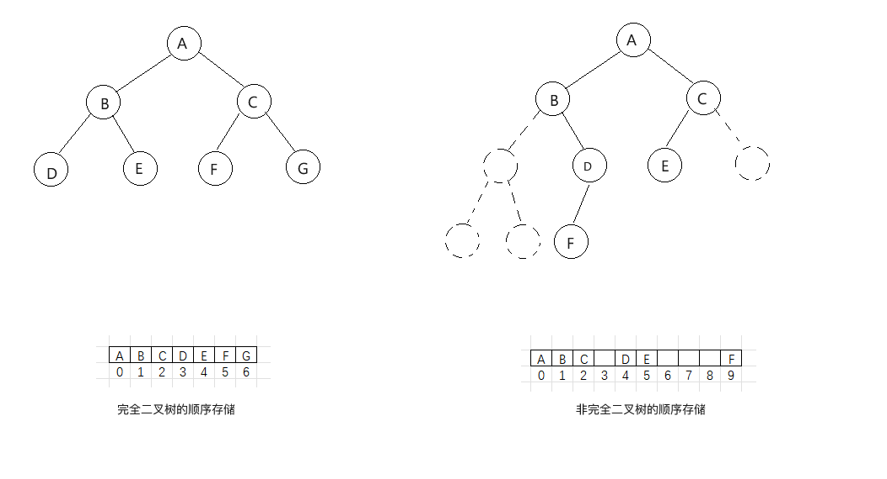
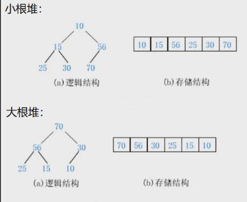
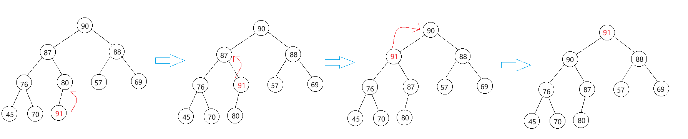
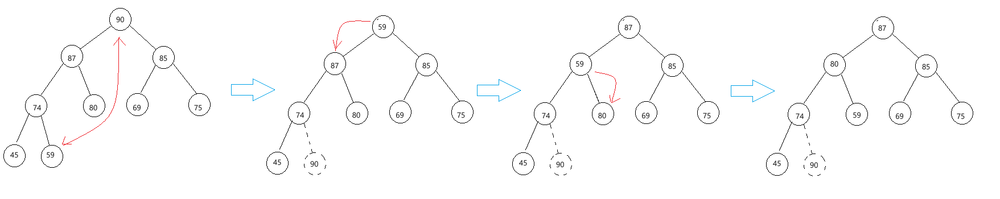

物理结构有顺序结构存储和链式结构存储两种,二叉树理所应当也是可以顺序结构存储和链式结构存储的.

但是普通的二叉树显然不适合使用数组来存储,因为可能会存在大量的空间浪费,而完全二叉树更加适合用顺序结构存储,因为它中间不会有空的元素,从头到尾一直连续.


有一种数据结构就是将完全二叉树以数组存放的,这就是下面介绍的堆.

# 1. 堆的概念和性质
## 1.1 堆的概念
> 堆（Heap）是计算机科学中一类特殊的数据结构的统称.堆通常是一个可以被看做一棵完全二叉树的数组对象.

如果有一个关键码的集合 $K = ${$k_0, k_1, k_2, ..., k_{n-1}$}, 把**它的所有元素按完全二叉树的顺序存储方式存储在一个一维数组中**, 并满足: $$K_i<=K_{2*i+1}且K_i<=K_{2*i+2}(i=0,1,2...),则称为小堆$$

$$或K_i>=K_{2*i+1}且K_i>=K_{2*i+2}(i=0,1,2...),则称为大堆$$将根节点最大的堆叫做最大堆或大根堆,根节点最小的堆叫做最小堆或小根堆.

***
总结为
**小堆**:任意一个父亲都 <= 孩子
**大堆**:任意一个父亲都 >= 孩子
***
## 1.2 堆的性质
> - 堆中某个结点的值总是不大于或不小于其父结点的值;

> - 堆总是一棵完全二叉树



***
## 1.3 堆的作用
- 堆排序:时间复杂度为$O(N*logN)$
- 解决$TopK$问题:在$N$个数中间找出最大的前$k$个或者最小的前$k$个
- 在操作系统中:根据优先级决定若干进程中使用哪个进程

# 2. 堆的声明
> 所有的数组都可以被当作完全二叉树,但不是所有的数组都能被称为堆.

本文实现大堆,若想灵活实现大小堆转换,可以使用函数指针

```c
// 堆的结构
typedef struct Heap
{
  HPDatatype* a;    //堆底层用数组存储
  int size;         //堆的元素个数
  int capacity;     //堆的容量
}Heap;

//向上调整
void AdjustUp(HPDatatype* a, int child);
//向下调整
void AdjustDown(HPDatatype* a, int n , int parent);

//交换值
void Swap(HPDatatype* p1, HPDatatype* p2);
//堆初始化
void HeapInit(Heap* hp);
//堆打印
void HeapPrint(Heap* hp);
//堆使用数组初始化
void HeapArrayInit(Heap* hp, HPDatatype* a, int n); 
//堆销毁
void HeapDestroy(Heap* hp);
//堆插入
void HeapPush(Heap* hp, HPDatatype x);
//删除堆顶元素
void HeapPop(Heap* hp);
//返回堆顶数据
HPDatatype HeapTop(Heap* hp);
//判断堆是否为空,为空返回非0,非空返回0
int HeapEmpty(Heap* hp);
```
可以发现,虽然堆的结构和顺序表是一样的,但是它们的逻辑结构是不同的.堆是特殊的完全二叉树,是**树形层次结构**;顺序表是顺序存储的线性表,是**线性存储结构**.

# 3. 堆的实现
关于堆的初始化,打印,销毁等操作,与顺序表基本一致,这里不过多赘述.

最重要的是堆的插入,删除堆顶元素和堆使用数组初始化,需要保持堆序性质,

## 3.1 堆的插入
先将元素 $X$ 插入到数组最后一个位置,随后将它与它的父亲相比较,如果不满足堆序,则交换两值, 直至 $X$ 到堆顶或者满足堆序结束判断.


上面的行为可以称之为向上调整(AdjustUp), 具体实现如下
```c
void AdjustUp(HPDatatype* a, int child)
{
  int parent = (child - 1) / 2; //计算父亲下标
  while (child > 0)
  {
    //如果不符合堆序,交换两个结点的值
    if (a[child] > a[parent])
    {
      Swap(&a[child], &a[parent]);
      child = parent;
      parent = (child - 1) / 2;
    }
    else
    {
      break;
    }
  }  
}
```

有了向上调整的函数,堆插入就很容易写出来了
```c
void HeapPush(Heap* hp, HPDatatype x)
{
  assert(hp);

  //扩容
  if (hp->size == hp->capacity)
  {
    int newCapacity = hp->capacity == 0 ? 4 : 2 * hp->capacity;
    HPDatatype* tmp = (HPDatatype*)realloc(hp->a, sizeof(HPDatatype) * newCapacity);
    if (tmp != NULL)
    {
      hp->a = tmp;
      hp->capacity = newCapacity;
    }
    else 
    {
      perror("realloc");
    }
  }

  //先将元素插到数组末尾
  hp->a[hp->size] = x;
  
  //向上调整
  AdjustUp(hp->a, hp->size);
  
  //修改大小
  hp->size++;
}
```
***
向上调整逻辑上控制树,物理上控制数组,向上调整只会影响该元素的祖先,不会影响根结点的另外一棵子树.

时间复杂度为$O(logN)$

***
## 3.2 删除堆顶元素
首先交换堆顶和堆底的元素,删除此时位于堆底的元素,随后将此时堆顶的元素和其孩子中的较大(或较小)值比较,如果不满足堆序进行交换,直至满足堆序或者该元素已经没有孩子.



需要注意的是:并不是所有的结点都有两个孩子,所以在寻找结点孩子中的较大(较小)值,需要提前判断是否有右孩子

```c
void AdjustDown(HPDatatype* a, int n, int parent)
{
  int child = parent * 2 + 1;

  while (child < n)
  {
    //找到更大的孩子
    if (child + 1 < n && a[child + 1] > a[child])
    {
      child++;
    }

    //如果孩子比父亲大,交换元素
    if (a[child] > a[parent])
    {
      Swap(&a[child], &a[parent]);
      parent = child;
      child = parent * 2 + 1;
    }
    else 
    {
      break;
    }
  }
}
```
向下调整有个前提,就是该结点的左右子树都是堆.
时间复杂度也是$O(logN)$,最坏情况是从根节点移动到叶子节点.

```c
void HeapPop(Heap* hp)
{
  assert(hp); //确保hp合法
  assert(!HeapEmpty(hp)); //确保堆不为空
 
  //交换最后一个元素和首元素
  Swap(&hp->a[0], &hp->a[hp->size - 1]);
  hp->size--;

  //向下调整
  AdjustDown(hp->a, hp->size, 0);
}
```

## 3.3 利用数组建堆
有两种方法:
一. 从头遍历数组依次将元素 push 进堆, 即每 push 一个元素调用一次向上调整算法
二. 从最后一个不为叶子结点的结点开始向下调整,向前直到根节点, 即使用向下调整算法

- 使用插入建堆
```c
void HeapArrayInit(Heap* hp, HPDatatype* a, int n)
{
  assert(hp); //确保hp合法

  hp->size = hp->capacity = n;
  HPDatatype* tmp = (HPDatatype*)malloc(sizeof(HPDatatype) * n);
  if (tmp == NULL)
  {
     perror("malloc");
  }

  hp->a = tmp;
  memcpy(hp->a, a, sizeof(HPDatatype) * n);
  
  //建堆
  int i = 0;
  for (i = 0; i < n; i++)
  {
    AdjustUp(hp->a,i);
  }
}
```
由于每个向上调整算法是 $O(logN)$的时间复杂度, 一共有 N 个结点, 需要调用 N 次向上调整算法, 所以插入建堆的时间复杂度为 $O(N*logN)$

- 从最后一个分支节点开始向下调整
```c

```
