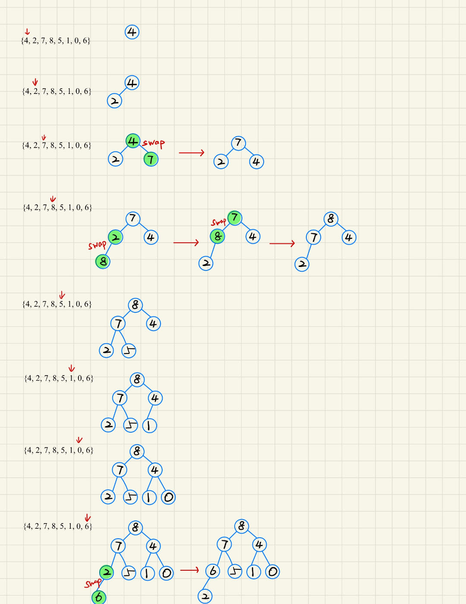
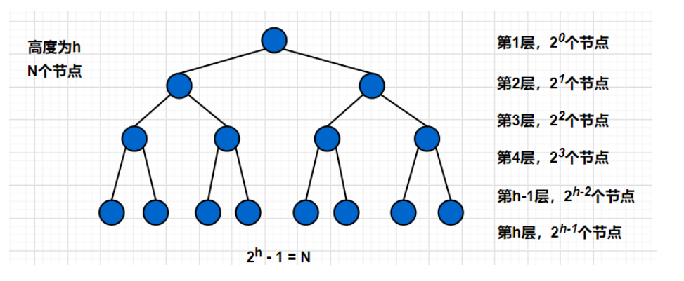
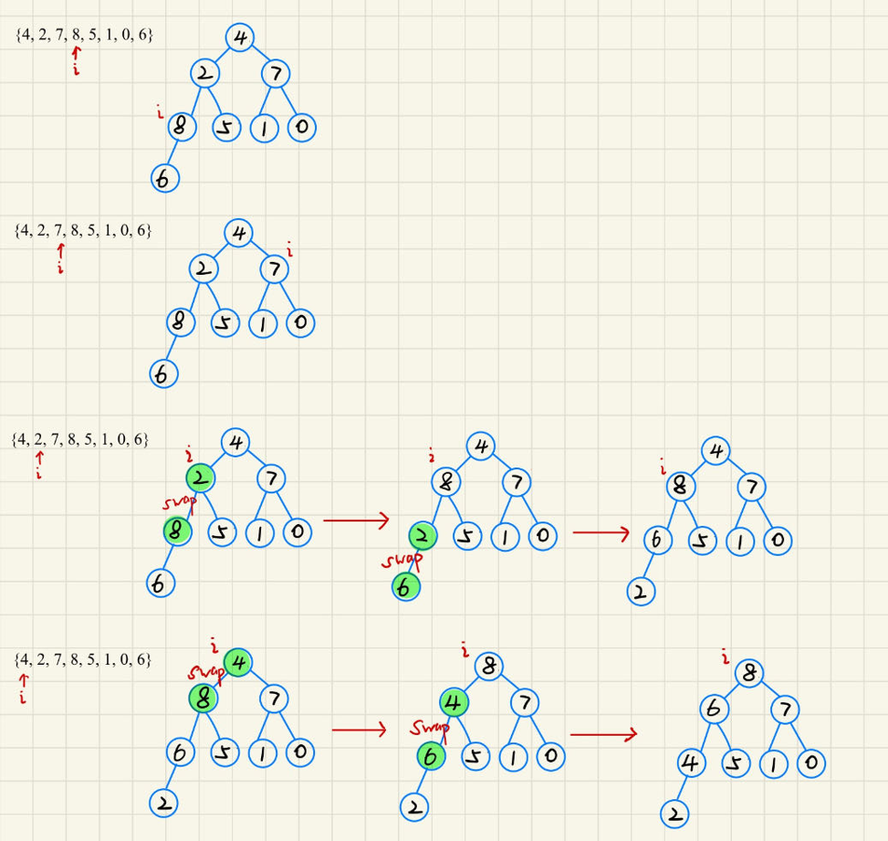
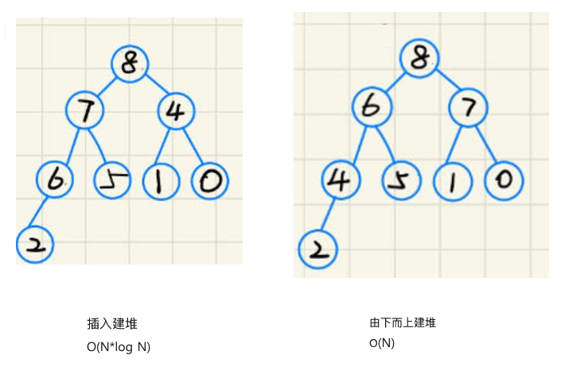
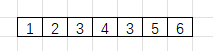
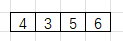

物理结构有顺序结构存储和链式结构存储两种,二叉树理所应当也是可以顺序结构存储和链式结构存储的.

但是普通的二叉树显然不适合使用数组来存储,因为可能会存在大量的空间浪费,而完全二叉树更加适合用顺序结构存储,因为它中间不会有空的元素,从头到尾一直连续.


有一种数据结构就是将完全二叉树以数组存放的,这就是下面介绍的堆.

# 1. 堆的概念和性质
## 1.1 堆的概念
> 堆（Heap）是计算机科学中一类特殊的数据结构的统称.堆通常是一个可以被看做一棵完全二叉树的数组对象.

如果有一个关键码的集合 $K = ${$k_0, k_1, k_2, ..., k_{n-1}$}, 把**它的所有元素按完全二叉树的顺序存储方式存储在一个一维数组中**, 并满足: $$K_i<=K_{2*i+1}且K_i<=K_{2*i+2}(i=0,1,2...),则称为小堆$$

$$或K_i>=K_{2*i+1}且K_i>=K_{2*i+2}(i=0,1,2...),则称为大堆$$将根节点最大的堆叫做最大堆或大根堆,根节点最小的堆叫做最小堆或小根堆.

***
总结为
**小堆**:任意一个父亲都 <= 孩子
**大堆**:任意一个父亲都 >= 孩子
***

## 1.2 堆的性质
> - 堆中某个结点的值总是不大于或不小于其父结点的值;

> - 堆总是一棵完全二叉树


***

## 1.3 堆的作用
- 堆排序:时间复杂度为$O(N*logN)$
- 解决$TopK$问题:在$N$个数中间找出最大的前$k$个或者最小的前$k$个
- 在操作系统中:根据优先级决定若干进程中使用哪个进程


# 2. 堆的声明
> 所有的数组都可以被当作完全二叉树,但不是所有的数组都能被称为堆.

本文实现大堆,若想灵活实现大小堆转换,可以使用函数指针

```c
// 堆的结构
typedef struct Heap
{
  HPDatatype* a;    //堆底层用数组存储
  int size;         //堆的元素个数
  int capacity;     //堆的容量
}Heap;

//向上调整
void AdjustUp(HPDatatype* a, int child);
//向下调整
void AdjustDown(HPDatatype* a, int n , int parent);

//交换值
void Swap(HPDatatype* p1, HPDatatype* p2);
//堆初始化
void HeapInit(Heap* hp);
//堆打印
void HeapPrint(Heap* hp);
//堆使用数组初始化
void HeapArrayInit(Heap* hp, HPDatatype* a, int n); 
//堆销毁
void HeapDestroy(Heap* hp);
//堆插入
void HeapPush(Heap* hp, HPDatatype x);
//删除堆顶元素
void HeapPop(Heap* hp);
//返回堆顶数据
HPDatatype HeapTop(Heap* hp);
//判断堆是否为空,为空返回非0,非空返回0
int HeapEmpty(Heap* hp);
```
可以发现,虽然堆的结构和顺序表是一样的,但是它们的逻辑结构是不同的.堆是特殊的完全二叉树,是**树形层次结构**;顺序表是顺序存储的线性表,是**线性存储结构**.

# 3. 堆的实现
关于堆的初始化,打印,销毁等操作,与顺序表基本一致,这里不过多赘述.

最重要的是堆的插入,删除堆顶元素和堆使用数组初始化,需要保持堆序性质,

## 3.1 堆的插入
先将元素 $X$ 插入到数组最后一个位置,随后将它与它的父亲相比较,如果不满足堆序,则交换两值, 直至 $X$ 到堆顶或者满足堆序结束判断.


上面的行为可以称之为向上调整(AdjustUp), 具体实现如下
```c
void AdjustUp(HPDatatype* a, int child)
{
  int parent = (child - 1) / 2; //计算父亲下标
  while (child > 0)
  {
    //如果不符合堆序,交换两个结点的值
    if (a[child] > a[parent])
    {
      Swap(&a[child], &a[parent]);
      child = parent;
      parent = (child - 1) / 2;
    }
    else
    {
      break;
    }
  }  
}
```

有了向上调整的函数,堆插入就很容易写出来了
```c
void HeapPush(Heap* hp, HPDatatype x)
{
  assert(hp);

  //扩容
  if (hp->size == hp->capacity)
  {
    int newCapacity = hp->capacity == 0 ? 4 : 2 * hp->capacity;
    HPDatatype* tmp = (HPDatatype*)realloc(hp->a, sizeof(HPDatatype) * newCapacity);
    if (tmp != NULL)
    {
      hp->a = tmp;
      hp->capacity = newCapacity;
    }
    else 
    {
      perror("realloc");
    }
  }

  //先将元素插到数组末尾
  hp->a[hp->size] = x;
  
  //向上调整
  AdjustUp(hp->a, hp->size);
  
  //修改大小
  hp->size++;
}
```
***
向上调整逻辑上控制树,物理上控制数组,向上调整只会影响该元素的祖先,不会影响根结点的另外一棵子树.

时间复杂度为$O(logN)$

***
## 3.2 删除堆顶元素
首先交换堆顶和堆底的元素,删除此时位于堆底的元素,随后将此时堆顶的元素和其孩子中的较大(或较小)值比较,如果不满足堆序进行交换,直至满足堆序或者该元素已经没有孩子.


需要注意的是:**并不是所有的结点都有两个孩子,所以在寻找结点孩子中的较大(较小)值,需要提前判断是否有右孩子**

```c
void AdjustDown(HPDatatype* a, int n, int parent)
{
  int child = parent * 2 + 1;

  while (child < n)
  {
    //找到更大的孩子
    if (child + 1 < n && a[child + 1] > a[child])
    {
      child++;
    }

    //如果孩子比父亲大,交换元素
    if (a[child] > a[parent])
    {
      Swap(&a[child], &a[parent]);
      parent = child;
      child = parent * 2 + 1;
    }
    else 
    {
      break;
    }
  }
}
```
向下调整有个前提,就是该结点的左右子树都是堆.
时间复杂度也是$O(logN)$,最坏情况是从根节点移动到叶子节点.

```c
void HeapPop(Heap* hp)
{
  assert(hp); //确保hp合法
  assert(!HeapEmpty(hp)); //确保堆不为空
 
  //交换最后一个元素和首元素
  Swap(&hp->a[0], &hp->a[hp->size - 1]);
  hp->size--;

  //向下调整
  AdjustDown(hp->a, hp->size, 0);
}
```

## 3.3 利用数组建堆
有两种方法:
一. 从头遍历数组依次将元素 push 进堆, 即每 push 一个元素调用一次向上调整算法
二. 从最后一个不为叶子结点的结点开始向下调整,向前直到根节点, 即使用向下调整算法

- 使用插入建堆

```c
void HeapArrayInit(Heap* hp, HPDatatype* a, int n)
{
  assert(hp); //确保hp合法

  hp->size = hp->capacity = n;
  HPDatatype* tmp = (HPDatatype*)malloc(sizeof(HPDatatype) * n);
  if (tmp == NULL)
  {
     perror("malloc");
  }

  hp->a = tmp;
  memcpy(hp->a, a, sizeof(HPDatatype) * n);
  
  //建堆
  int i = 0;
  for (i = 0; i < n; i++)
  {
    AdjustUp(hp->a,i);
  }
}
```
由于每个向上调整算法是 $O(logN)$的时间复杂度, 一共有 N 个结点, 需要调用 N 次向上调整算法, 所以插入建堆的时间复杂度为 $O(N*logN)$

假设堆是满二叉树,方便运算.

***
$
等式1:T(N) = 2^0*0 + 2^1*1 +...+2^{h-1}*(h-1)
$
$
等式2:2T(N) = 2^1*0 + 2^2*1 +...+2^h*(h-1)
$

等式2 - 等式1推出:
$
T(N) = -(2^1 + 2^2 +...+2^{h-1})-2^h*(h-1) 
$

$
= \frac{2*(1-2^{h-1})}{1-2} -2^h*(h-1)
$

$
= 2^{h-1}-1-2^h*(h-1)
$

$
又因为 h = log_2(N+1) 即 2^h = N+1
$

$
最终 T(N) = \frac{N+1}{2} - 1 - (N+1)*[log_2(N+1) - 1] = O(N*logN)
$
***

- 从最后一个分支节点开始 由下向上 向下调整

```c
void HeapArrayInit(Heap* hp, HPDatatype* a, int n)
{
  assert(hp); //确保hp合法

  hp->size = hp->capacity = n;
  HPDatatype* tmp = (HPDatatype*)malloc(sizeof(HPDatatype) * n);
  if (tmp == NULL)
  {
     perror("malloc");
  }

  hp->a = tmp;
  memcpy(hp->a, a, sizeof(HPDatatype) * n);
  
  int i = 0;  
  //从最后一个分支结点开始向下调整建堆
  for (i = (n-2)/2; i >= 0; i--)
  {
    AdjustDown(hp->a, n, i);
  }
}
```
***

让我们分析使用向下调整的时间复杂度,假设堆是满二叉树,方便计算.

$
等式1:T(N) = 2^0*(h-1) + 2^1*(h-2) +...+2^{h-2}*1
$
$
等式2:2T(N) = 2^1*(h-1) + 2^2*(h-2) +...+2^{h-1}*1
$

等式2 - 等式1推出:
$
T(N) = -(h-1) + 2^1+2^2+...+2^{h-2}+2^{h-1}
$

$
= -h + 2^0 +2^1+2^2+...+2^{h-2}+2^{h-1} = \frac{1*(1-2^h)}{1-2} -h
$

$
= 2^h-1-h
$

$
又因为 h = log_2(N+1) 即 2^h = N+1
$

$
最终 T(N) = N - log_2(N+1) = O(N)
$
***

最终可以发现,两种方式不仅建堆的结果不同,而且由下向上的建堆方式时间复杂度更低.



平常都是使用第二种方式进行建堆的

***

## 3.4 完整代码

- `Heap.h`
```c
#pragma once 

#include <stdio.h>
#include <stdlib.h>
#include <assert.h>
#include <string.h>

typedef int HPDatatype;

// 堆的结构
typedef struct Heap
{
  HPDatatype* a;    //堆底层用数组存储
  int size;         //堆的元素个数
  int capacity;     //堆的容量
}Heap;

void AdjustUp(HPDatatype* a, int child);
void AdjustDown(HPDatatype* a, int n , int parent);

void Swap(HPDatatype* p1, HPDatatype* p2);
void HeapInit(Heap* hp);
void HeapPrint(Heap* hp);
void HeapArrayInit(Heap* hp, HPDatatype* a, int n); 
void HeapDestroy(Heap* hp);
void HeapPush(Heap* hp, HPDatatype x);
void HeapPop(Heap* hp);
HPDatatype HeapTop(Heap* hp);
int HeapEmpty(Heap* hp);

```

- `Heap.c`
```c
#include "Heap.h"

void AdjustUp(HPDatatype* a, int child)
{
  int parent = (child - 1) / 2;
  while (child > 0)
  {
    if (a[child] > a[parent])
    {
      Swap(&a[child], &a[parent]);
      child = parent;
      parent = (child - 1) / 2;
    }
    else
    {
      break;
    }
  }  
}

void AdjustDown(HPDatatype* a, int n, int parent)
{
  int child = parent * 2 + 1;

  while (child < n)
  {
    //找到更大的孩子
    if (child + 1 < n && a[child + 1] > a[child])
    {
      child++;
    }

    //如果孩子比父亲大,交换元素
    if (a[child] > a[parent])
    {
      Swap(&a[child], &a[parent]);
      parent = child;
      child = parent * 2 + 1;
    }
    else 
    {
      break;
    }
  }

}
void Swap(HPDatatype* p1, HPDatatype* p2)
{
  HPDatatype tmp = *p1;
  *p1 = *p2;
  *p2 = tmp;
}

void HeapInit(Heap* hp)
{
  assert(hp); //确保hp合法

  hp->a = NULL;
  hp->size = hp->capacity = 0;
}

void HeapArrayInit(Heap* hp, HPDatatype* a, int n)
{
  assert(hp); //确保hp合法

  hp->size = hp->capacity = n;
  HPDatatype* tmp = (HPDatatype*)malloc(sizeof(HPDatatype) * n);
  if (tmp == NULL)
  {
     perror("malloc");
  }

  hp->a = tmp;
  memcpy(hp->a, a, sizeof(HPDatatype) * n);
  
  int i = 0;
  //插入建堆
  //for (i = 0; i < n; i++)
  //{
  //  AdjustUp(hp->a,i);
  //}
  
  //从最后一个分支结点开始向下调整建堆
  for (i = (n-2)/2; i >= 0; i--)
  {
    AdjustDown(hp->a, n, i);
  }
}

void HeapPrint(Heap* hp)
{
  assert(hp); //确保hp合法

  int i = 0;
  for (i = 0; i < hp->size; i++)
  {
    printf("%d ", hp->a[i]);
  }
  printf("\n");
}

void HeapDestroy(Heap* hp)
{
  assert(hp); //确保hp合法

  free(hp->a);
  hp->a = NULL;
  hp->size = hp->capacity = 0;
}

void HeapPush(Heap* hp, HPDatatype x)
{
  assert(hp);

  //扩容
  if (hp->size == hp->capacity)
  {
    int newCapacity = hp->capacity == 0 ? 4 : 2 * hp->capacity;
    HPDatatype* tmp = (HPDatatype*)realloc(hp->a, sizeof(HPDatatype) * newCapacity);
    if (tmp != NULL)
    {
      hp->a = tmp;
      hp->capacity = newCapacity;
    }
    else 
    {
      perror("realloc");
    }
  }

  //先将元素未查到数组末尾
  hp->a[hp->size] = x;
  
  //向上调整
  AdjustUp(hp->a, hp->size);
  
  //修改大小
  hp->size++;
}

void HeapPop(Heap* hp)
{
  assert(hp); //确保hp合法
  assert(!HeapEmpty(hp)); //确保堆不为空
 
  //交换最后一个元素和首元素
  Swap(&hp->a[0], &hp->a[hp->size - 1]);
  hp->size--;

  //向下调整
  AdjustDown(hp->a, hp->size, 0);
}

HPDatatype HeapTop(Heap* hp)
{
  assert(hp);
  assert(!HeapEmpty(hp));

  return hp->a[hp->size-1];
}

int HeapEmpty(Heap* hp)
{
  assert(hp); //确保hp合法

  if (hp->size == 0)
  {
    return 1;
  }
  else 
  {
    return 0;
  }
}

```

- `test.c`
```c
#include "Heap.h"

void HeapTest1()
{ 
  int a[] = {60, 70, 80, 50, 40, 30}; 
  AdjustDown(a, 6, 0);

  int i = 0;

  for (i = 0; i < sizeof(a) / sizeof(a[0]); i++)
  {
    printf("%d ", a[i]);
  }
  printf("\n");
}

void HeapTest2()
{
  Heap heap;

  HeapInit(&heap);
  HeapPush(&heap, 60);
  HeapPush(&heap, 70);
  HeapPush(&heap, 80);
  HeapPush(&heap, 50);
  HeapPush(&heap, 40);
  HeapPrint(&heap);
  HeapPush(&heap, 30);
  AdjustDown(heap.a, 6, 0);
  HeapPrint(&heap);
}

void HeapTest3()
{
  Heap heap;

  int a[] = {7, 8, 6, 4, 9, 2, 1, 0};
  HeapArrayInit(&heap, a, 8);
  HeapPrint(&heap);

  HeapPop(&heap);
  HeapPrint(&heap);
}

//升序
void HeapSort(int* a, int n)
{
  int i = 0;
  //建大堆
  for (i = 0; i < n; i++)
  {
    AdjustUp(a, i);
  }

  //不断将根元素放置最后一个,让前面的元素向下调整
  for (i = 0; i < n; i++)
  {
    Swap(&a[0], &a[n - 1 - i]);
    AdjustDown(a, n - 1 - i, 0);
  }
}

int main(void)
{
  //HeapTest1();
  //HeapTest2();
  HeapTest3();
  
  int a[] = {3,4,5,6,9,10,2};
  HeapSort(a, sizeof(a) / sizeof(a[0]));

  int i = 0;
  for (i = 0; i < sizeof(a) / sizeof(a[0]); i++)
  {
    printf("%d ", a[i]);
  }
  printf("\n");
  return 0;
}

```

# 4. 堆的应用
## 4.1 堆排序
堆排序即用堆的思想来进行排序.

总共分为两个步骤:
- **建堆**
    - 升序:建大堆
    - 降序:建小堆
- **利用堆删除思想来进行排序**

***
首先考虑,为什么升序只能建大堆,我建小堆不可以吗?

- 答案肯定是否定的.如果我建小堆,根据小堆的性质,小堆的根结点是最小数.此时 1 是最小值.

  

- 随后我忽视 1, 对剩下的元素进行堆排序,但是剩下的元素并不一定是堆.

  忽视 1,2,3 后, 此时只剩下

  
  但是此时剩下的数并不能构成小堆,需要我重新建堆
- 为了避免剩下的数不能构成小堆的情况,我需要每次都对剩下元素进行重新建堆.每一次<font color=red>将剩余元素前移需要消耗 $O(N)$的时间复杂度</font>,同时上面已经讨论过,<font color=red>建堆至少也要消耗 $O(N)$的时间复杂度</font>.
- 也就是说,这样操作的时间复杂度是$O(N^2)$,那我为什么不直接用代码更简便的冒泡排序呢?

***


