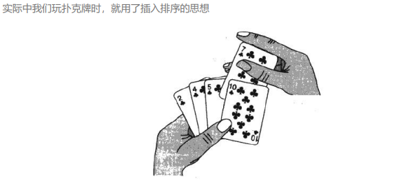
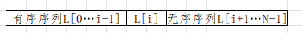
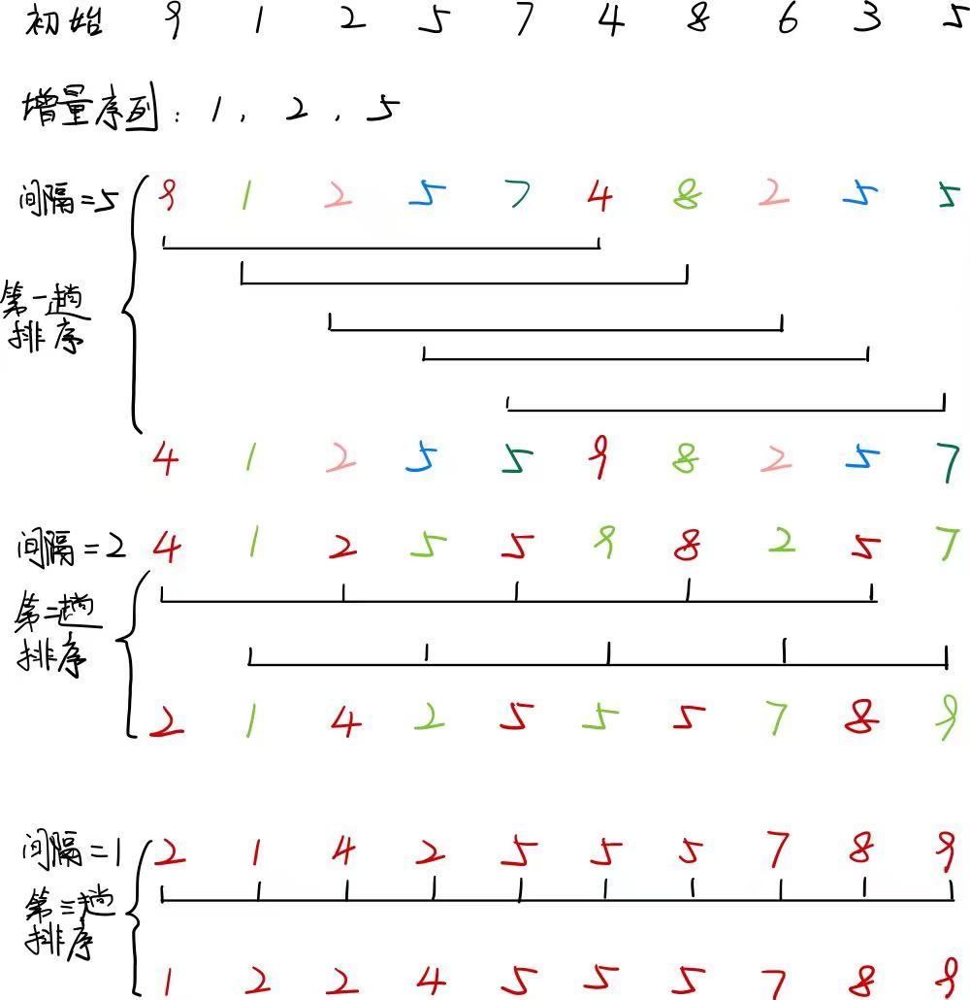
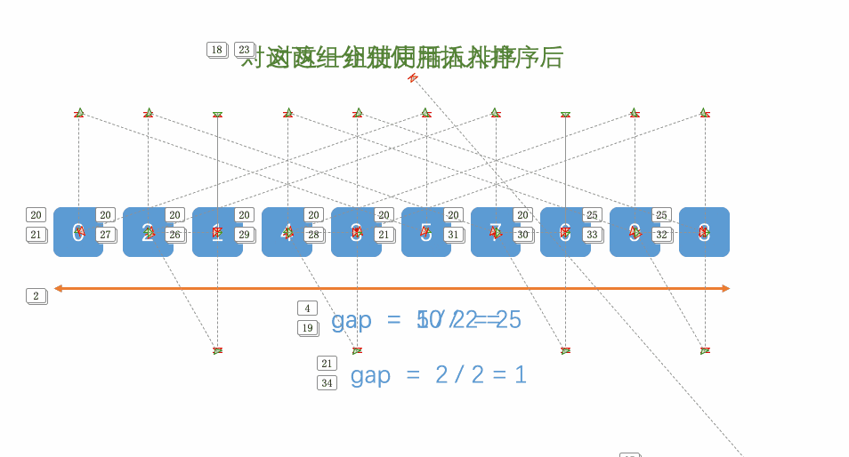

在这一章, 我们讨论数组元素的排序问题. 为简单起见, 假设在我们的例子中数组只包含整数, 如果是结构体等复杂的数据则需要考虑到排序稳定性等, 在文章最后会进行讨论.

同样, 所有的排序将能够在主存中完成, 即元素的个数相对来说比较小(小于$10^6$).当然, 不能在主存中完成的而必须在磁盘上或磁带上完成的排序也相当重要. 这种类型的排序叫做**外部排序**(externeal sorting), 也会在文章末尾讨论, 主要是归并排序.

# 1. 预备知识
> **排序**: 所谓排序, 就是使一串记录, 按照其中的某个或某些关键字的大小, 递增或递减的排列起来的操作. (本章所有的排序将按递增排序)

> **稳定性**: 假定在待排序的记录序列中, 存在多个具有相同关键字的记录, 若经过排序, 这些记录的相对次序保持不变, 即在原序列中, `r[i]=r[j], 且r[i]在r[j]之前, 而在排序后的序列中, r[i]仍在r[j]之前`.则称这种排序算法是稳定的; 否则则称为不稳定的.

> **内部排序**: 数据元素全部放在内存中的排序. (本章所有的排序都是内部排序, 归并排序同样也是外部排序)

> **外部排序**: 数据元素太多不能同时放在内存中, 根据排序过程的要求不能在内外存之间移动数据的排序

> **基于比较的排序**: 根据符号`>` `<`而进行排序的排序算法, 称作基于比较的排序, 而这种排序均需要 $\Omega(N logN)$次比较.

对于排序代码的书写, 推荐先把**单趟**写出来, 再考虑**整体**一共要进行多少趟. 最初我们学习冒泡排序也是这个思想. 

# 2. 插入排序
> 每次将一个待排序的记录按其关键字大小插入前面已经排好序的子序列, 直到全部记录插入完成. 


插入排序的思想可以引申出三个重要的排序算法: **直接插入排序, 折半插入排序和希尔排序**.

## 2.1 直接插入排序
假设在排序过程中, 待排序表 L[0..N-1] 在某次排序过程中某一时刻状态如下:

要将下标为 i 的元素插入到有序序列中需要进行如下操作:
1) 将L[i] 从后向前依次与有序序列的元素进行比较; 
2) 如果L[i] 比 L[k] 要小, 将 L[k] 向后移动一个元素位置, k = k-1. 重复步骤2
3) 如果L[i] 大于等于 L[k], 将 L[k] 向后移动一个元素位置, L[i] 插入到 L[k] 位置上
4) 如果 k < 0, 则直接结束, 将 L[i] 插入到 L[0] 的位置上

第一轮将L[0]视为有序序列, 即从L[1]开始到L[N-1]进行每一轮的插入, 一共需要进行 N-1 轮, 能将表 L[0..N-1]排序成一个有序序列. 真正实施交换的时机只有在找到L[i] 应该插入位置的时候.


*** 
代码实现
```c
void InsertSort(int* a, int n)
{
    int i = 0;
    for (i = 0; i < N-1; i++)
    {
        int end = i;                //end 记录有序序列最后一个元素下标
        int key = a[end + 1];       //key 记录无序序列第一个元素下标
        
        while (end >= 0)
        {
            if (key < a[end])
            {
                a[end+1] = a[end];
                end--;
            }
            else 
            {
                break;
            }
        }

        //插入数据
        a[end+1] = key;
    }
}
```
> - 将有序数组的最后一个元素的下标定义为end
> - 每次将end+1 的元素插入到有序数组中,从end一直比较到0
>      - 如果比有序数组中的元素小  则将有序数组中的元素向后移动一位   
>      - 接着向前比较 如果比有序数组中的元素大  则直接break
> 跳出循环后将元素插入到end+1位置
> - 一共进行 n－1轮  end从0到n-2

*** 
直接插入排序算法的特性总结: 
- **空间复杂度**: 仅使用了常数个辅助单元, 空间复杂度为 $O(N)$

- **时间复杂度**: 嵌套循环每趟花费 N 次迭代, 因此直接插入排序为 $O(N^2)$, 而且这个界是精确的
    - 最好情况下: 表中元素已经有序, 此时每插入一个元素, 都只需比较一次而不用移动元素, 一共比较 N-1 次. 因而**最好情况下时间复杂度**为 $O(N)$
    - 最坏情况下: 表中元素全为逆序, 此时一共需要移动$\sum_{i=0}^{n-2} {i+1} = 1 + 2 + ... + (n-1) = \theta(N^2)$, 因而**最坏情况下时间复杂度**为 $O(N^2)$
  
- **稳定性**: 由于每次插入元素总是从后向前比较再移动, 所以不会出现相同元素相对位置变化的情况. 直接插入排序是**稳定**的排序方法.

## 2.2 折半插入排序
从直接插入排序算法中, 不难看出每趟插入的过程中都进行了两项工作
1) 从前面的有序序列中查找到待插入元素应该插入的位置
2) 给插入位置腾出空间, 再将元素插入进去.

在直接插入排序中, 边比较边移动. 其实可以直接**将查找和移动这两项工作分开**.

> 先折半查找出元素应该插入的位置, 再给插入的元素腾出位置

代码实现如下: 
```c
void InsertSort(int* a, int n)
{
    int i, j, left, right, mid;
    for (i = 0; i < N-1; i++)
    {
        int end = i;                //end 记录有序序列最后一个元素下标
        int key = a[end + 1];       //key 记录无序序列第一个元素下标  
        left = 0;
        right = end;

        while (left <= right)
        {//最后找到的right+1即为元素应该插入的位置
            mid = left / 2 + right / 2;
            if (a[mid] > key)
            {
                right = mid - 1;    //查找左半部分有序序列
            }
            else
            {
                left = mid + 1;     //查找右半部分有序序列
            }
        }

        for (j = end; j >= right+1; j--)
        {
            a[j+1] = a[j];
        }

        a[right+1] = key;
    } 
}
```

*** 
虽然上述算法将查找的时间复杂度缩减为$O(NlogN)$, 但是移动元素的时间复杂度仍然是$O(N^2)$.所以折半排序的时间复杂度仍为$O(N^2)$.

但是对于数据量不是很大的排序表, 折半插入排序往往能够表现出很好的性能. 折半插入排序也是一种稳定的排序算法.

# 3. 希尔排序
从前面的分析可以得知, 直接插入排序在数组"有序"的情况下时间复杂度为$O(N)$, 也就是说, 直接插入排序适用于基本有序和数据量不大的有序表. **希尔排序**正是由这两点分析对直接插入排序进行改进得来的, 又称 **缩小增量排序(diminishing increment sort)**

> 希尔序列使用一个序列: $h_1, h_2, h_3,...,h_t$, 叫做**增量序列(increment sequence)**. 只要 $h_1 = 1$, 任何增量序列都是可行的,不过有些增量序列更好.

> 从$h_t到h_1$, 在使用增量为$h_k$的排序之后, 对于每一个 i, 都有$A[i] <= A[i+h_k]$, 即所有相隔$h_k$的元素都是被排序的, 称为${h_k}^-$排序的. 注意每次取得间隔是从$h_t到h_1$的(即依次减小的), 当间隔为$h_1 = 1$ 时, 该序列有序.



Shell建议的序列: $h_t = \lfloor N/2 \rfloor 和 h_k = \lfloor h_{k+1} / 2 \rfloor$. (流行但是不好).

*** 
总的来说思路就是: 使用一个 $h_1=1$的增量序列, 每次 ${h_k}^-$排序使用直接插入排序.

> 希尔排序的意义: 小的数据迅速移动到序列前部分, 大的数据迅速移动到序列后部分, 同时使用直接插入排序对于有序序列排序接近$O(N)$的优点.

代码实现:
```c
void ShellSort(int* a, int n)
{
    int gap = n;
 
    while (gap > 1)
    {
        gap /= 2;
        int i = 0;
        for (i = 0; i < n-gap; i++)
        {   //进行间隔为gap的排序
            int end = i;            //记录有序序列的最后一个元素
            int tmp = a[end+gap];   //记录无序序列的第一个元素

            while (end >= 0)
            {
                if (tmp < a[end])
                {
                    a[end+gap] = a[end];
                    end -= gap;
                }
                else 
                {
                    break;
                }
            }

            //插入元素
            a[end+gap] = tmp;
        }
    }
}
```

