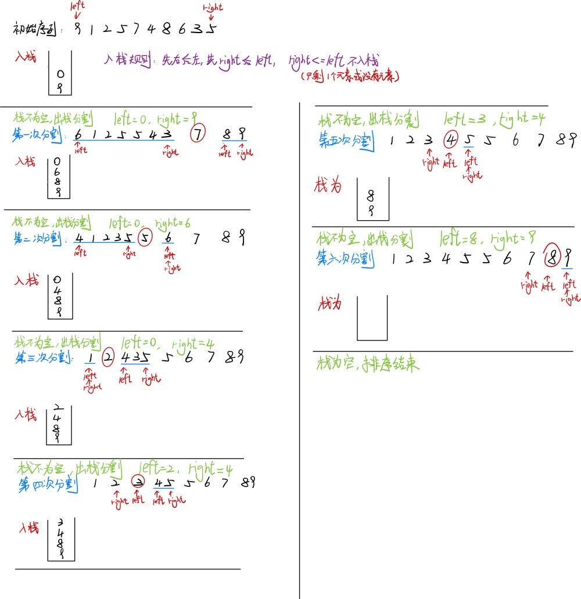
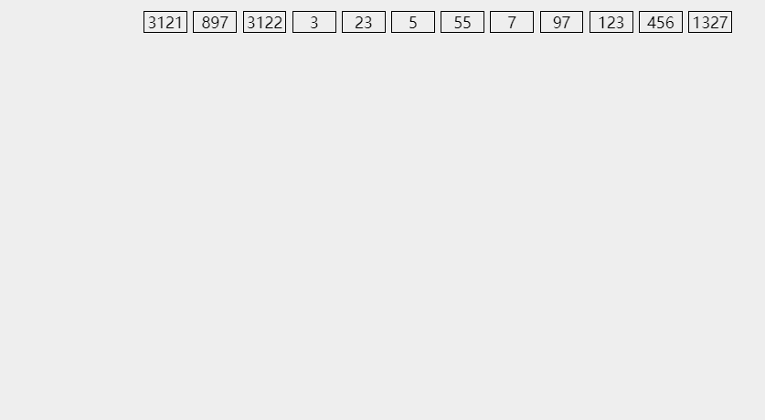

在这一章, 我们讨论数组元素的排序问题. 为简单起见, 假设在我们的例子中数组只包含整数, 如果是结构体等复杂的数据则需要考虑到排序稳定性等, 在文章最后会进行讨论.

同样, 所有的排序将能够在主存中完成, 即元素的个数相对来说比较小(小于$10^6$).当然, 不能在主存中完成的而必须在磁盘上或磁带上完成的排序也相当重要. 这种类型的排序叫做**外部排序**(externeal sorting), 也会在文章末尾讨论, 主要是归并排序.

# 1. 预备知识
> **排序**: 所谓排序, 就是使一串记录, 按照其中的某个或某些关键字的大小, 递增或递减的排列起来的操作. (本章所有的排序将按递增排序)

> **稳定性**: 假定在待排序的记录序列中, 存在多个具有相同关键字的记录, 若经过排序, 这些记录的相对次序保持不变, 即在原序列中, `r[i]=r[j], 且r[i]在r[j]之前, 而在排序后的序列中, r[i]仍在r[j]之前`.则称这种排序算法是稳定的; 否则则称为不稳定的.

> **内部排序**: 数据元素全部放在内存中的排序. (本章所有的排序都是内部排序, 归并排序同样也是外部排序)

> **外部排序**: 数据元素太多不能同时放在内存中, 根据排序过程的要求不能在内外存之间移动数据的排序

> **基于比较的排序**: 根据符号`>` `<`而进行排序的排序算法, 称作基于比较的排序, 而这种排序均需要 $\Omega(N logN)$次比较.

对于排序代码的书写, 推荐先把**单趟**写出来, 再考虑**整体**一共要进行多少趟. 最初我们学习冒泡排序也是这个思想. 

# 2. 插入排序
> 每次将一个待排序的记录按其关键字大小插入前面已经排好序的子序列, 直到全部记录插入完成. 


插入排序的思想可以引申出三个重要的排序算法: **直接插入排序, 折半插入排序和希尔排序**.

## 2.1 直接插入排序
假设在排序过程中, 待排序表 L[0..N-1] 在某次排序过程中某一时刻状态如下:

要将下标为 i 的元素插入到有序序列中需要进行如下操作:
1) 将L[i] 从后向前依次与有序序列的元素进行比较; 
2) 如果L[i] 比 L[k] 要小, 将 L[k] 向后移动一个元素位置, k = k-1. 重复步骤2
3) 如果L[i] 大于等于 L[k], 将 L[k] 向后移动一个元素位置, L[i] 插入到 L[k] 位置上
4) 如果 k < 0, 则直接结束, 将 L[i] 插入到 L[0] 的位置上

第一轮将L[0]视为有序序列, 即从L[1]开始到L[N-1]进行每一轮的插入, 一共需要进行 N-1 轮, 能将表 L[0..N-1]排序成一个有序序列. 真正实施交换的时机只有在找到L[i] 应该插入位置的时候.


*** 
代码实现
```c
void InsertSort(int* a, int n)
{
    int i = 0;
    for (i = 0; i < N-1; i++)
    {
        int end = i;                //end 记录有序序列最后一个元素下标
        int key = a[end + 1];       //key 记录无序序列第一个元素下标
        
        while (end >= 0)
        {
            if (key < a[end])
            {
                a[end+1] = a[end];
                end--;
            }
            else 
            {
                break;
            }
        }

        //插入数据
        a[end+1] = key;
    }
}
```
> - 将有序数组的最后一个元素的下标定义为end
> - 每次将end+1 的元素插入到有序数组中,从end一直比较到0
>      - 如果比有序数组中的元素小  则将有序数组中的元素向后移动一位   
>      - 接着向前比较 如果比有序数组中的元素大  则直接break
> 跳出循环后将元素插入到end+1位置
> - 一共进行 n－1轮  end从0到n-2

*** 
直接插入排序算法的特性总结: 
- **空间复杂度**: 仅使用了常数个辅助单元, 空间复杂度为 $O(N)$

- **时间复杂度**: 嵌套循环每趟花费 N 次迭代, 因此直接插入排序为 $O(N^2)$, 而且这个界是精确的
    - 最好情况下: 表中元素已经有序, 此时每插入一个元素, 都只需比较一次而不用移动元素, 一共比较 N-1 次. 因而**最好情况下时间复杂度**为 $O(N)$
    - 最坏情况下: 表中元素全为逆序, 此时一共需要移动$\sum_{i=0}^{n-2} {i+1} = 1 + 2 + ... + (n-1) = \Theta(N^2)$, 因而**最坏情况下时间复杂度**为 $O(N^2)$
  
- **稳定性**: 由于每次插入元素总是从后向前比较再移动, 所以不会出现相同元素相对位置变化的情况. 直接插入排序是**稳定**的排序方法.

## 2.2 折半插入排序
从直接插入排序算法中, 不难看出每趟插入的过程中都进行了两项工作
1) 从前面的有序序列中查找到待插入元素应该插入的位置
2) 给插入位置腾出空间, 再将元素插入进去.

在直接插入排序中, 边比较边移动. 其实可以直接**将查找和移动这两项工作分开**.

> 先折半查找出元素应该插入的位置, 再给插入的元素腾出位置

代码实现如下: 
```c
void InsertSort(int* a, int n)
{
    int i, j, left, right, mid;
    for (i = 0; i < N-1; i++)
    {
        int end = i;                //end 记录有序序列最后一个元素下标
        int key = a[end + 1];       //key 记录无序序列第一个元素下标  
        left = 0;
        right = end;

        while (left <= right)
        {//最后找到的right+1即为元素应该插入的位置
            mid = left / 2 + right / 2;
            if (a[mid] > key)
            {
                right = mid - 1;    //查找左半部分有序序列
            }
            else
            {
                left = mid + 1;     //查找右半部分有序序列
            }
        }

        for (j = end; j >= right+1; j--)
        {
            a[j+1] = a[j];
        }

        a[right+1] = key;
    } 
}
```

*** 
虽然上述算法将查找的时间复杂度缩减为$O(NlogN)$, 但是移动元素的时间复杂度仍然是$O(N^2)$.所以折半排序的时间复杂度仍为$O(N^2)$.

但是对于数据量不是很大的排序表, 折半插入排序往往能够表现出很好的性能. 折半插入排序也是一种稳定的排序算法.

# 3. 希尔排序
从前面的分析可以得知, 直接插入排序在数组"有序"的情况下时间复杂度为$O(N)$, 也就是说, 直接插入排序适用于基本有序和数据量不大的有序表. **希尔排序**正是由这两点分析对直接插入排序进行改进得来的, 又称 **缩小增量排序(diminishing increment sort)**

> 希尔序列使用一个序列: $h_1, h_2, h_3,...,h_t$, 叫做**增量序列(increment sequence)**. 只要 $h_1 = 1$, 任何增量序列都是可行的,不过有些增量序列更好.

> 从$h_t到h_1$, 在使用增量为$h_k$的排序之后, 对于每一个 i, 都有$A[i] <= A[i+h_k]$, 即所有相隔$h_k$的元素都是被排序的, 称为${h_k}^-$排序的. 注意每次取得间隔是从$h_t到h_1$的(即依次减小的), 当间隔为$h_1 = 1$ 时, 该序列有序.


Shell建议的序列: $h_t = \lfloor N/2 \rfloor 和 h_k = \lfloor h_{k+1} / 2 \rfloor$. (流行但是不好).

*** 
总的来说思路就是: 使用一个 $h_1=1$的增量序列, 每次 ${h_k}^-$排序使用直接插入排序.

> 希尔排序的意义: 小的数据迅速移动到序列前部分, 大的数据迅速移动到序列后部分, 同时使用直接插入排序对于有序序列排序接近$O(N)$的优点.

希尔增量的代码实现:
```c
void ShellSort(int* a, int n)
{
    int gap = n;
 
    while (gap > 1)
    {
        gap /= 2;
        int i = 0;
        for (i = 0; i < n-gap; i++)
        {   //进行间隔为gap的排序
            int end = i;            //记录有序序列的最后一个元素
            int tmp = a[end+gap];   //记录无序序列的第一个元素

            while (end >= 0)
            {
                if (tmp < a[end])
                {
                    a[end+gap] = a[end];
                    end -= gap;
                }
                else 
                {
                    break;
                }
            }

            //插入元素
            a[end+gap] = tmp;
        }
    }
}
```


***
**希尔排序的最坏情况分析**
希尔排序的运行时间依赖于增量序列的选择， 而证明可能相当复杂， 下面将证明两个特别的增量序列下最坏情况的精确的界

>	使用希尔增量时希尔排序的最坏情形运行时间为 $\Theta(N^2)$

举个例子：`{1,9,2,10,3,11,4,12,5,13,6,14,7,15,8,16}`
- 这一串序列有N = 16 个元素，也就是说，使用希尔增量则每次的间隔都为偶数(除了最后一个1)
- 它的偶数位有N/2个同为最大的数，奇数位上有N/2个同为最小的数

这样在最后一次间隔为 1 的排序前，所有的数仍然保持原来的位置不变。
最后一趟排序需要将第 2i-1 个数移动到第 i 个位置，仅仅将最小的数放到正确位置就需要 $\sum_{i=1}^{N/2}{i-1} = \Omega(N^2)$的工作量。

所以希尔排序最坏情况是可以$\Theta(N^2)$的，原因就是增量序列有公因子，对一些特殊情况可能效率极低。

> Hibbard提出了稍微不同的增量序列形如$1,3,7,…,2^{k-1}$，**这个序列的最坏运行时间为$\Theta(N^{3/2})$**

> Sedgewick提出的增量序列$9*4^i-9*2^i+1$，可以达到$O(N^{4/3})$

总之：
希尔排序的时间复杂度可以认为是$O(N^{1.3})$
但是希尔排序不是一个稳定的排序算法，如果相同的数被分到了不同的组，后一个数是有可能被移动到前面去的。

# 4. 交换排序
> 根据序列中的两个元素关键字的比较结果来对换这两个记录在序列中的位置

 本文主要涉及冒泡排序和快速排序
 
## 4.1 冒泡排序
> 1. 由后往前（由前往后）两两比较相邻的值，若两值为逆序即(`a[i-1]>a[i]`), 则交换两值，直到序列比较完。
> 2. 步骤一得到的最小（最大）元素不再参与排序，继续新的一轮的步骤一
> 3. 每轮不断得到当前序列的最小（最大）值，并将最小（最大）值放置序列的头（尾），最多需要 n-1轮


代码实现：
```c
void BubbleSort(int* a, int n)
{
    int i = 0;
    for (i = 0; i < n-1; i++)
    {
    	int exchange = 0;
        int j = 0;
        for (j = 0; j < n-1-i; j++)
        {
            if (a[j-1] > a[j])
            {
                Swap(&a[j-1], &a[j]);
                exchange = 1;
            }
        }
	
	if (exchange == 0)
	{
		break;
	}
    }
}
```
***
冒泡排序算法的分析
- **空间复杂度**：仅使用了常数个辅助单元，空间复杂度为$O(1)$
- **时间复杂度**：冒泡排序分为比较和交换。
	- 最好情况：当序列本身有序时， 需要比较 n-1次， 此时未发生交换，直接跳出循环，时间复杂度为$O(N)$	 
	- 最坏情况：当序列全部逆序的时候，则一共需要比较$\sum_{i=1}^{n-1}{n-i} = \frac{n(n-1)}{2}$，而移动次数需要$\sum_{i=1}^{n-1}{3(n-i)} = \frac{3n(n-1)}{2}$
	由此可以看出冒泡排序的时间复杂度为$O(N^ 2)$
- **稳定性**：由于相邻两个元素只有前一个元素大于后面一个元素才会发生交换，所以当i < j时且a[i] = a[j]时，两个元素的顺序不会发生改变

注意：冒泡排序后的所产生的有序序列一定是全局有序的，即有序序列中所有的关键字一定大于（小于）剩余无序序列的所有关键字
## 4.2 快速排序
> 快速排序是Hoare提出的一种基于二叉树结构的排序算法。其思路主要是：**首先选取序列中某一个关键字当作基准值， 随后将整个序列分成左右序列，左序列的所有关键字小于基准值，右序列的所有关键字大于等于基准值。随后左右序列重复该过程，直至整个序列的元素全部有序**


快速排序是一种分治的递归算法。将数组 S 排序的基本算法分为下面四步：
1） 如果 S 中元素个数是 1 或者 0， 直接返回
2） 取 S 中任一元素 v， 称为该元素为基准值（也叫枢纽元pivot）
3） 将 S - {v}（S中其余元素）分成两个不相关的集合：其中一个集合$S_1$所有元素小于基准值，另一个集合$S_2$的所有元素大于等于基准值
4） 最后返回`QuickSort(S1)`后，继而 v ，继而返回`QuickSort(S2)`

对于基准值的取法（步骤2）和如何分割（步骤3）这是不唯一的。可以预想到的，如果每次的基准值都是序列的中位数，这样递归形成的二叉树可以看作一个平衡二叉树，由于递归所消耗的时间是线性时间的，这样的情况能保证递归次数最少，这样整个算法的时间复杂度也会低。

***
### 4.2.1 选取基准值
虽然上面的步骤无论选择哪个元素当作基准值都是可以完成排序的，但是经过分析，肯定是每次都能选到序列的中位数当作基准值是最好的

**一种错误的方法**
一种方法是选择序列的第一个元素当作基准值。如果输入的序列是随机的，那么结果还可以接受；但是如果输入的序列是预排序的或者是反序的，那么以这种策略造成的分割是恶劣的，所有的元素不是被分到$S_1就是S_2$中，更有可能的是，接下来的所有分割都是这种情况的。那么一共会有 N-1 次分割，而每次分割的时间复杂度是 $O(N)$的，这样整个算法的时间复杂度会直接到达$O(N^2)$，这显然不是我们想得到的。

**一种安全的方法**
另一种方法是使用随机数随机选取基准值。一般来说这样不会每次都是恶劣的分割，但是生成随机数消耗并不小，也减小不了多少时间

**三数中值分割法（	Median-of-Three Partitioning）**
一般的方法是使用左端，右端和中心位置的中值作为基准值。显然得到整个序列的中值消耗是十分巨大的，这样的策略能几乎避免第一种每次都是恶劣分割的情形。例如有一串序列`{8,1,3,7,6,2,8,0,4}`,它的左端值是8，右端值是4，中心位置4的值是6，于是基准值为6.这样能减小快速排序接近5%的运行时间。
```c
int getMidi(int* a, int left, int right)
{
	int mid = left/2 + right/2;
	if (a[mid] > a[left])
	{
		if (a[left] > a[right])	//此时mid最大
		{
			return left;
		}
		else if (a[mid] > a[right])
		{
			return right;
		}
		else
		{
			return mid;
		}
	}
	else	//a[mid] <= a[left]
	{
		if (a[right] > a[left])	//此时mid最小
		{
			return left;
		}
		else if (a[mid] < a[right])
		{
			return right;
		}
		else 
		{
			return mid;
		}
	}
}
```

###  4.2.2 分割策略
**Hoare版本**
> 1) 左右指针分别指向序列左端和右端。
>       - 右指针先向左移动直到遇到比基准值小的值
>       - 左指针随后向右移动直到遇到比基准值大的值
> 2) 将左右指针指向的两个元素进行交换
> 3) 一次分割结束的标志是：左右指针相遇
> 4) 最后将基准值的和相遇位置的元素进行交换


代码实现：
```c
int Partition(int* a, int left, int right)
{
	int mid = getMidi(a, left, right);
	Swap(&a[left], &a[mid]);
	
	int keyi = left;
	while (left < right)
	{
		while(left <= right && a[keyi] >= a[right])
		{//先找右小
			right--;
		}
		
		while (left <= right && a[keyi] <= a[left])
		{//再找左大
			left++；
		}
		
		//交换两值
		Swap(&a[left], &[right])
	}
	
	Swap(&a[left], &a[keyi]);
	return left;
}

void QuickSort(int* a, int left, int right)
{
    if (right <= left)
        return;

    int keyi = Partition(a, left, right);
    QuickSort(a, left, keyi-1);
    QuickSort(a, keyi+1, right);
}
```

这个版本有三个点要注意
1）找左和找右只能找大于和小于基准值的值，而不是大于等于和小于等于，这样是会造成死循环的


2）在找右小左大的时候不能让 left 或者 right 越界 

如果一直没有找到右小或者左大, 当left 和 right相遇的的时候需要跳出循环
所以需要在内部的`while`循环中也进行`left <= right`的判断

3）交换的时候, 将下标为 keyi 和 相遇位置上的元素进行交换

因为实现已经将基准值交换到序列首元素位置,所以交换的是该段序列首元素和left 与right 相遇位置的元素;而不是直接交换 key 的值, key只是函数临时构建的局部变量, 并不会对原序列有影响. 所以最终记录了该序列首元素的下标 keyi.

*** 
这里还有一个问题: left 和 right 相遇的位置的元素一定比基准值小吗?

对于相遇的位置有两种情况:
> 1. 右小找到了, 但是左大一直在寻找中, 最后相遇点就是 right 所在的位置, 这个位置上的元素一定比基准值小
> 2. 上一轮交换后, 此时 left 的位置上一定是比基准值小的值, 下一轮寻找, 右小没有找到, right 直接减小到该位置上, 所以这个情况下也是符合的

****
**挖坑法**

Hoare版本有很多的注意点, 有人就更新了一种新的策略, 这样不需要再额外考虑left 和 right 相遇点是否比基准值小

> 1) 首先将基准值设为坑
> 2) 两个左右指针分别指向序列的左端和右端
> 3) 先找右小, 找到后将该位置元素放置坑位, 同时 right 此时设置为坑
> 4) 再找左大, 找到后将该位置元素放置坑位, 同时 left 此时设置为坑
> 5) 如果left 和 right 没有相遇, 重复步骤3, 4;如果相遇,将基准值放置坑位


代码实现: 
```c
void Partition(int* a, int left, int right)
{
    int mid = geiMidi(a, left, right);
    Swap(&a[left], &a[mid]);

    int key = a[left];
    int hole = left;

    while (left <= right)
    {
        while (left <= right && a[right] >= key)
        {
            right--;
        }
        //找到直接赋值到坑位, 同时将此时的right位置当作坑
        a[hole] = a[right];
        hole = right;

        while (left < right && a[left] <= key)
        {
            left++;
        }
        //找到直接赋值到坑位, 同时将此时的left位置当作坑
        a[hole] = a[left];
        hole = left;
    }

    a[hole] = key;
    return left;
}
```

*** 
**前后指针法**
思路:
> 1) 将基准值放置数组首元素
> 2) 前后指针 prev 指向序列开头, cur 指向prev下一个位置
> 3) 随后判断 cur 指向位置所在元素与基准值的大小
>       - 如果 cur 指向元素比基准值小, 则prev+1, 同时将cur所指元素和prev所指元素交换, cur随后++
>       - 如果 cur 指向元素不比基准值小, prev 不动, 只有cur++
> 4) 一直重复步骤3直到 cur 越界, 此时交换 prev 指向位置元素和序列首元素进行交换


代码实现:
```c
int Partition(int* a, int left, int right)
{
    int mid = getMidi(a, left, right);
    Swap(&a[left], &a[mid]);

    int prev = left;
    int cur = prev + 1;
    int keyi = left;

    while (cur <= right)
    {
        if (a[cur] < a[keyi] && ++prev != cur)
        {
            Swap(&a[prev], &a[cur]);
        }   
        cur++;
    }
    Swap(&a[prev], &a[keyi]);
    return prev;
}
```
prev指向的位置永远是比基准值小的序列的最后一个元素, 这样最后结束可以保证prev 指向位置上面的元素是比基准值小的.

### 4.2.3 小数组
我们知道, 满二叉树的最后一层的结点占据所有结点的一半.

我们假设快速排序是最好情况, 这样形成的递归树接近一个满二叉树, 而每个结点代表要开辟一块栈帧空间, 需要消耗线性时间

换一个方式来说, 如果需要排序的数组只有十个元素, 那么对此需要三层的二叉树, 消耗可能还不如插入排序(插入排序在数量小和接近有序的情况下花费$O(N)$).


在数量比较大的数组进行快速排序中, 这三层恰好是整个递归二叉树的最下面三层左右, 如果能将这三层优化掉, 可以减少递归树约87.5%的结点个数.


措施是当序列结点小于 10 的时候, 直接使用插入排序, 能很好的发挥好插入排序在序列已经预排序且数量小的情况下时间复杂度为$O(N)$这个优势

### 4.2.4 基于Hoare版本 最后优化 递归版本 快速排序
```c
void QuickSort(int* a, int left, int right)
{
  // 每一次排序可以确认一个数的位置, 再在这个数左右进行二分继续排序
  
  if (left >= right)
    return ;

  int mid = getMidi(a, left, right);
  Swap(&a[left], &a[mid]);

  int keyi = left;
  
  // 小区间情况 right-left+1 <= 10, 直接插入排序可以省去87.5%的递归子树
  int size = right - left + 1;
  if (size <= 10)
  {
    InsertSort(a, size);
  }
  else 
  {
    while (left < right)
    {
      // 先从right开始向前找比key小的值
      while (left < right && a[right] >= a[keyi])
      {
        right--;
      }

      // 再从left开始向后找比key大的值
      while (left < right && a[left] <= a[keyi])
      {
        left++;
      }
      Swap(&a[left], &a[right]);
    }
  }
  Swap(&a[keyi], &a[left]);

  keyi = left;
  QuickSort1(a, left, keyi-1);
  QuickSort1(a, keyi+1, right);
}
```

### 4.2.5 快速排序的非递归版本
虽然递归可能涉及栈溢出的情形，但是一般深度到1万才会爆，快速排序一般不会出现栈溢出的情况，并且现在的编译器已经将递归优化的很好了。

但是，学习快速排序的非递归形式可以对深度优先遍历和广度优先遍历有着更深层次的了解。

既然每次调用递归函数需要将子序列的左端和右端传入到函数参数，接着开辟函数栈帧。那么为何不直接将这两个数直接放入栈这个数据结构中呢，需要对该区间进行排序再出栈？



思路如下：
> 1. 	使用深度优先遍历
> 2. 首先将序列的首尾序号按照顺序（先尾后首）入栈
> 3. 此时如果栈不为空，将栈顶两元素出栈，并分割对应序列。将得到的左右子序列的首尾序号一共四个值按照顺序（先尾后首，先右后左）入栈，如果序列只有一个元素或者没有元素（right <=left），就不需要入栈
> 4. 重复步骤3直至栈为空，排序完毕

代码实现：
```c
void QuickSortNorR(int*a, int left, int right)
{
  // 创建栈 并按照先left后right的顺序入栈
  Stack stack;
  StackInit(&stack);
  StackPush(&stack, left);
  StackPush(&stack, right);

  // 将栈顶两个元素出栈 进行一轮排序
  // 每次排序后 按照先右后左的顺序将区间的left和right入栈
  // 如果right<=left 不入栈
  while (!StackEmpty(&stack))
  {
    int right = StackTop(&stack);
    StackPop(&stack);
    int left = StackTop(&stack);
    StackPop(&stack);

    // 这里使用挖坑法
    int keyi = PartSort2(a, left, right);
    
    // 先右后左 先left后right入栈
    if (right > keyi+1)
    {
      StackPush(&stack, keyi+1);
      StackPush(&stack, right);
    }
    
    if (keyi-1 > left)
    {
      StackPush(&stack, left);
      StackPush(&stack, keyi-1);
    }
  }
  StackDestroy(&stack);
}
```

当然，也是可以使用队列的，这样就是广度优先遍历，类似于之前的二叉树层次遍历，先将每一层处理好，随后继续下一层。

使用栈，先将左子序列排序完再排序右子序列。
使用队列，先将左右子序列都分割一次后，再进行下一次分割。

### 4.2.6 快速排序的分析
快速排序是递归的，因此它的分析需要求解一个递推公式。其消耗空间容量与递归的最大深度一致。

我们对快速排序这样分析，假设有一个随机的基准值（不用三数中值分割法），对一些小的文件也不用截止范围。
取$T(0) = T(1) = 1$,	快速排序的运行时间等于两个递归调用的运行时间加上花费在分割上的线形时间（基准值的选取仅花费常数时间）。我们得到基本的快速排序关系：
$$T(N) = T(i) + T(N-i-1) + cN$$
其中，$i=|S_1|$是$S_1$中的元素个数
***
**最坏情形的分析**
基准值始终是最小元素。此时 i = 0，此时递推关系为
$$T(N) = T(N-1) + cN, N>1$$
反复递推可以得到
$$T(N-1) = T(N-2) + c(N-1)$$
$$T(N-2) = T(N-3) + c(N-2)$$
$$…$$
$$T(2) = T(1) + c(2)$$
将以上所有方程相加得到
$$T(N) = T(1) + c\sum_{i=2}^{N}{i} = O(N^2)$$

栈的深度为$O(N)$
***
**最好情形的分析**
最好情况下，每次的基准值都位于中间，为了简化数学推导，假设两个子序列刚好各为原数组的一半
$$T(N) = 2T(N/2) + cN$$
用N除去等式两边
$$\frac{T(N)}{N} = \frac{T(N/2)}{N/2} + c$$
反复套用得到
$$\frac{T(N/2)}{N/2} = \frac{T(N/4)}{N/4} + c$$
$$\frac{T(N/4)}{N/4} = \frac{T(N/8)}{N/8} + c$$
$$…$$
$$\frac{T(2)}{2} = \frac{T(1)}{1} + c$$
同样相加得到
$$\frac{T(N)}{N} = \frac{T(1)}{1} + c logN$$
由此得到
$$T(N) = cN logN + N = O(N logN)$$

栈的深度为$O(logN)$
***
**平均情形的分析**
时间复杂度为$O(N logN)$,好在快速排序的平均情况下的运行时间与其最佳情况下的运行时间很接近，而不是接近其最坏情况下的运行时间。

栈的深度为$O(logN)$
***
**稳定性**：在分割操作中，若右端区间有两个关键字相同，且均小于基准值，则在交换到左端区间后，它们的相对位置会发生变化，即**快速排序是一种不稳定的排序方法**。

例如，表 L={3,**2**,2}, 经过一趟排序后 L={2,**2**,3},两个2的相对次序已经发生了变化

***
注意：在快速排序算法中，并不产生有序子序列，但每趟排序后会将上一趟划分的各个无序子表的基准值放到其最终的位置上。
快速排序的平均时间复杂度是最低的，所以说快速排序是最综合的排序。

# 5. 选择排序
选择排序的思想是：每一趟（如第i趟）在后面 n - 1 - i （i = 1, 2, 3, ..., n-1）个待排序元素中选取关键字最小的元素，作为有序子序列的第 i 个元素，直到 n-1 趟走完， 此时还剩 1 个元素没有排序， 就不用选了


## 5. 1 简单选择排序
根据上面的思想进行了一小段优化：每一趟（如第 i 趟）取当前子序列的最小值和最大值，将最小值放置子序列的第 i 个元素，将最大值防置子序列的第(n - i +1)个元素，直到只剩下一个元素，这样经过 n/2 趟就可以将整个序列有序

代码如下：
```c
void SelectSort(int* a, int n)
{
  // 每轮选出数组中最大数和最小数的下标
  // 将最大数放在数组最后 将最小数放在数组最前
  int begin = 0;
  int end = n - 1;

  while (begin < end)
  {
    int maxi = begin;
    int mini = begin;
    int i = 0;
    
    // 找到最大和最小下标
    for (i = begin+1; i <= end; i++)
    {
      if (a[i] > a[maxi])
      {
        maxi = i;
      }

      if (a[i] < a[mini])
      {
        mini = i;
      }
    }

    // 交换 注意可能会出现最大或最小数已经被交换了的情况
    Swap(&a[begin], &a[mini]);

    if (maxi == begin)
    {
      maxi = mini;
    }
    Swap(&a[end], &a[maxi]);

    begin++;
    end--;
  }
}
```
这段代码需要注意的是，如果首先将最小值放到了序列首元素位置，而最大值恰好又在序列首元素位置，这个时候需要进行判断，如果最大值被换走了，则修改最大值所在位置的下标 maxi
*** 
**简单选择排序的性能分析**

**空间效率**： 仅使用常数个个辅助单元， 空间复杂度为 $O(N)$

**时间效率**：$T(N) = N + (N-2) + (N-4) +...+3 = \frac{(N+3)(\frac{N-3}{2} + 1)}{2} = O(N^2)$

**稳定性**：假设序列 L = {2，**5**，3，5，1}，经过一趟排序后变成 L = {1， 2， 3， 5， **5**}。显然，5 和 **5** 的相对次序已经发生了变化。简单选择排序是一个不稳定的排序。

## 5. 2 堆排序
关于堆排序已经在之前文章中写明，这里不过多赘述。
[关于堆排序的详解](https://editor.csdn.net/md/?articleId=133302058)

# 6. 归并排序
> 归并排序(MERGE-SORT)是建立在归并操作上的一种有效的排序算法, 该算法是采用分治法 (Divide and Conquer) 的一个非常典型的应用. 

> 将已有序的子序列合并, 得到完全有序的序列;即先使每个子序列有序, 再使子序列间有序. 若将两个有序表合并成一个有序表, 称为二路归并.


由上图可知, 我们先要将当前的有序表长度为 1 或者 0(即有序)才可以进行归并.可以将一个有序表均分为两个子序列表,直至分到只剩长度为 1 或者 0, 再进行归并, 两两归并直至归并成一个长度为 n 的有序表.

与快速排序是前序不同, 归并排序按照这个思路其实是后序.先将序列的左右子序列排序后, 再将这两个子序列进行归并操作.

步骤如下:
> 1. 动态申请一个长度为 n 的tmp表用来存放归并的结果
> 2. 将序列平分为左右两个子序列, 若左右子序列无序(长度不为 1 或者 0),继续按照先左后右的顺序平分
> 3. 直至分解到序列长度为1 或者 0,此时将左右子序列两两归并入 tmp 数组,再将 tmp 数组拷贝至原数组,返回上一层
> 4. 继续两两归并, 直至归并成一个长度为 n 的有序表

代码如下:
```c
void Merge(int* a, int* tmp, int left, int mid, int right)
{
  int cur1 = left;  //数组1首元素下标
  int cur2 = mid + 1;   //数组2首元素下表
  int index = left; //tmp数组首元素下标

  while (cur1 <= mid && cur2 <= right)
  {//去两数组最小值尾插至tmp数组
    if (a[cur1] < a[cur2])
    {
      tmp[index++] = a[cur1++];   
    }
    else 
    {
      tmp[index++] = a[cur2++];
    }
  }

  while (cur1 <= mid)
  {//如果数组1没有遍历完
    tmp[index++] = a[cur1++];
  }

  while (cur2 <= right)
  {//如果数组2没有遍历完
    tmp[index++] = a[cur2++];
  }

  //拷贝tmp数组至a数组
  memcpy(a+left, tmp+left, sizeof(int) * (right - left + 1)); 
}

void _MergeSort(int* a, int* tmp, int left, int right)
{
  if (right <= left)
    return;

  int mid = (left + right) / 2;
  //分解
  _MergeSort(a, tmp, left, mid); 
  _MergeSort(a, tmp, mid+1, right);

  //归并
  Merge(a, tmp, left, mid, right);
}

void MergeSort(int* a, int n)
{
  // 先开辟一个tmp数组空间
  int* tmp = (int*)malloc(sizeof(int) * n);
  
  if (tmp == NULL)
  {
    perror("malloc");
  }

  _MergeSort(a, tmp, 0, n-1); //[0, n-1]

  free(tmp);
}
```

***
**归并排序的非递归版本**
归并排序的非递归不能使用栈或者队列, 归并排序是后序的, 即使先两两归并完了, 还需要拿值, 这就会显得很复杂.


其实观看上图归并的区域, 我们可以不分解, 直接归并. 通过遍历数组, 调整每次子序列个数达到手动归并的效果.**11归并->22归并->44归并...->得到长度为n的子序列**

但是如果每次都是将序列长度乘以2, 除非 n 是 2 的幂次方, 否则肯定会出现越界的情况.

这就要求, 在两序列进行合并的时候, 先添加一些判断, 来判断两序列是否有下标越界的情况, 如果越界, 直接结束就可以了

代码实现:
```c
void MergeSortNorR(int* a, int n)
{
  int* tmp = (int*)malloc(sizeof(int) * n);
  if (tmp == NULL)
  {
    perror("malloc fail");
  }

  // 11归并->22归并->...
  int gap = 1;
  int i = 0;
  
  while (gap < n)
  {
    for (i = 0; i < n; i += 2*gap)
    {
      int mid = i + gap - 1;
      int left = i;
      int right = i + 2*gap - 1;
      
      if (mid+1 >= n)
      {//如果右子序列的左下标越界，直接返回
        break;
      }

      if (right >= n)
      {//如果右子序列的右下标越界，修改下标
        right = n-1;
      }
      Merge(a, tmp, left, mid, right);
    }
    gap *= 2;
  }

  free(tmp);
}
```

***

**2路归并排序算法的性能分析如下**

**空间效率**: 辅助空间为 n 个单元, 所以算法的空间复杂度为 $O(N)$

**时间效率**: 每趟归并的时间复杂度为 $O(N)$, 共需进行 $\lfloor log_2N \rfloor$趟归并, 所以算法的时间复杂度为 $O(N logN)$

**稳定性**: 归并操作不会改变相同关键词记录的相对次序, 所以2路归并排序算法是一种稳定的排序方法.

# 7. 计数排序
> 计数排序的思想很好理解
> 1. 遍历数组统计每个数出现的次数, 存放到一个计数器数组, 计数器数组长度为原数组的范围
> 2. 遍历统计数组, 并按顺序重新放置原数组中


代码实现:
```c
void CountSort(int* a, int n)
{
  int min = a[0];
  int max = a[0];
  int i = 0;
  
  // 得到序列的最大最小值
  for (i = 1; i < n; i++)
  {
    if (a[i] < min)
    {
      min = a[i];
    }

    if (a[i] > max)
    {
      max = a[i];
    }
  }

  // 得到序列的范围
  int range = max - min + 1;
  printf("range:%d\n", range);

  int* tmp = (int*)calloc(range, sizeof(int));
  if (tmp == NULL)
  {
    perror("malloc fail");
  }

  // 统计各数
  for (i = 0; i < n; i++)
  {
    tmp[a[i] - min]++;
  }

  // 从小到大重新copy到原数组
  int index = 0;
  for (i = 0; i < range; i++)
  {
    while (tmp[i])
    {
      a[index++] = i + min;
      tmp[i]--;
    }
  }
  
  free(tmp);
}
```
***
**计数排序的性能分析**

**空间复杂度**: 使用了计数器数组, 该数组长度为 range (原数组的范围), **空间复杂度为$O(range)$**

**时间复杂度**: 排序一共有三次循环: 得到原数组的最小值和最大值(循环n次), 构建计数器数组(循环n次),将计数器数组的计数反映到原数组中去(循环range次). 所以**时间复杂度为$O(max(n, range))$**

虽然计数排序的效率很高, 但是它的使用空间很小, 对于范围比较小的一串序列, 速度是十分惊人的.

# 8. 基数排序
> 基数排序是一种很特别的排序方法, 它不基于比较和移动进行排序, 而基于关键字各位的大小进行排序. **基数排序是一种借助多关键字牌序的思想对单逻辑关键字进行排序的方法**

> 为实现多关键字排序, 通常由两种方法: 
> - 第一种是**最高位优先(MSD)**, 按关键字位权重递减一次逐层划分成若干更小的子序列, 最后将所有子序列依次链接成一个有序序列.
> - 第二种是**最低位优先(LSD)**, 按关键字位权重递增进行排序, 最后形成一个有序序列



***
步骤如下:
> 1. 创建一个长度为10的队列数组
> 2. 如果数组中最小值为负数, 先将数组所有元素加上负数的绝对值
> 3. 得到数组中最大数, 并取到最大数的位数
> 4. 从个位->十位->百位->...->最高位, 依次按位权重排序
> 5. 每位排完后, 按顺序出队列, 返回原数组

代码实现:
```c
int getMax(int* a, int n)
{
  int i = 0;
  int max = a[0];
  for (i = 1; i < n; i++)
  {
    if (a[i] > max)
    {
      max = a[i];
    }
  }

  return max;
}

int getMin(int* a, int n)
{
  int i = 0; 
  int min = a[0];

  for (i = 1; i < n; i++)
  {
    if (a[i] < min)
    {
      min = a[i];
    }
  }

  return min;
}

int getMaxDigit(int* a, int n)
{
  // 得到最大数, 并取到其的位数
  int max = getMax(a, n);
  int max_digit = 1;
  while (max >= 10)
  {
    max_digit++;
    max /= 10;
  }
  
  return max_digit;
}

int getDigitNum(int num, int base)
{
  while (base > 1)
  {
    num /= 10;
    base--;
  }

  return num % 10;
}

// 将数组所有元素变为非负数, 返回最小值
int arrayToNonnegative(int*a, int n)
{
  int min = getMin(a, n);
  int i = 0;
  if (min < 0)
  {
    for (i = 0; i < n; i++)
    {
      a[i] -= min ; 
    }
  }
  
  return min;
}

//将数组恢复原来的状态
void arrayToPreliminary(int* a, int n, int min)
{
  int i = 0;
  
  if (min < 0)
  {
    for (i = 0; i < n; i++)
    {
      a[i] += min;
    }
  }
}

void RadixSort(int* a, int n)
{
  // 创建长度为10的队列数组
  Queue* count = (Queue*)malloc(sizeof(Queue) * 10);
  int i = 0;
  for (i = 0; i < 10; i++)
  {
    QueueInit(&count[i]); 
  }

  int min = arrayToNonnegative(a, n);

  int max_digit = getMaxDigit(a, n);

  // 1-个位 2-十位 3-百位
  int base = 1;
  // 从个位到最高位, 如果某数该位是i, 入i队列
  while (base <= max_digit)
  {
    for (i = 0; i < n; i++)
    {
      int digit_num = getDigitNum(a[i], base);  //得到每个数在该位的数字 
      QueuePush(&count[digit_num], a[i]);       //入对应下标序号的队列中
    }
    
    int index = 0;
    for (i = 0; i < 10; i++)
    {//按升序将每个队列的元素重新放回数组中
      while (!QueueEmpty(&count[i]))
      {
        a[index++] = QueueFront(&count[i]);
        QueuePop(&count[i]);
      }
    }
    base++;
  }
  
  arrayToPreliminary(a, n, min);

  // 释放数组空间
  for (i = 0; i < 10; i++)
  {
    QueueDestroy(&count[i]);
  }

  free(count);
}
```
***
**基数排序算法的性能分析**
**空间分析**: 一趟排序需要的辅助存储空间为r(r个队列:r个队头指针和r个尾指针), 但以后的排序中会重复使用这些队列, 所以基数排序的空间复杂度为$O(r)$

**时间效率**: 基数排序需要进行 d 趟分配和收集, 一趟分配需要 $O(N)$, 一趟收集需要 $O(r)$ , 所以基数排序的时间复杂度为 $Od(N+r)$

**稳定性**: 对于基数排序算法而言, 很重要的一点就是按位排序时必须是稳定的. 因此, 这也保证了基数排序的稳定性.

# 9. 排序算法复杂度及稳定性总结


本章完.
