- [1. 数据结构基本概念](#1-数据结构基本概念)
  - [1.1 基本概念和术语](#11-基本概念和术语)
    - [1.1.1 数据](#111-数据)
    - [1.1.2 数据元素](#112-数据元素)
    - [1.1.3 数据项](#113-数据项)
    - [1.1.4 数据对象](#114-数据对象)
    - [1.1.5 数据结构](#115-数据结构)
  - [1.2 逻辑结构与物理结构](#12-逻辑结构与物理结构)
    - [1.2.1 逻辑结构(我们最需要关注的问题)](#121-逻辑结构我们最需要关注的问题)
    - [1.2.2 物理机构](#122-物理机构)
  - [1.3 数据类型](#13-数据类型)
  - [1.3.1 数据类型定义](#131-数据类型定义)
  - [1.3.2 抽象数据类型](#132-抽象数据类型)
- [2. 算法分析](#2-算法分析)
  - [2.1 算法的复杂度](#21-算法的复杂度)
  - [2.2 复杂度的渐进表示法](#22-复杂度的渐进表示法)
  - [2.3 时间复杂度](#23-时间复杂度)
    - [2.3.1 一个简单的例子](#231-一个简单的例子)
    - [2.3.2 一般法则](#232-一般法则)
    - [2.3.3 其他一些例子](#233-其他一些例子)
  - [2.4 空间复杂度](#24-空间复杂度)
    - [2.4.1 一些例子](#241-一些例子)
  - [2.5 常见复杂度](#25-常见复杂度)
# 1. 数据结构基本概念
> 数据结构是一门研究非数值计算的程序设计问题中的操作对象,以及它们之间的关系和操作等相关问题的学科

## 1.1 基本概念和术语
### 1.1.1 数据
> 数据: 描述客观事物的符号,是计算机中可以操作的对象,是能被计算机识别,并输入给计算机处理的符号集合.

数据不仅包括整型,实型等数据类型,还包括字符及声音,图像,视频等非数值类型.

例如:
网页,图片,音频,视频等  

再比如学校学习的各种知识  


对于计算机来说,数据就是符号,这些符号必须具有两个前提:
- 可以输入到计算机中
- 能被计算机程序处理

对于整型,实型等数据类型,可以进行数值计算
对于字符数据类型,就需要进行二进制编码来存储.

### 1.1.2 数据元素
> 数据元素: 是组成数据的,有一定意义的基本单位,在计算机中通常作为整体处理,也被称为记录

例如:
人类中,人是数据元素
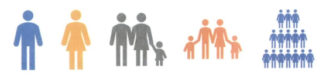
畜禽类,牛,马,羊等动物是畜禽类的数据元素


### 1.1.3 数据项
> 数据项: 一个数据元素可以由若干个数据项组成

例如:
一个人有眼睛,耳朵,鼻子,嘴巴等数据项;也有姓名,年龄,性别,家庭地址等数据项
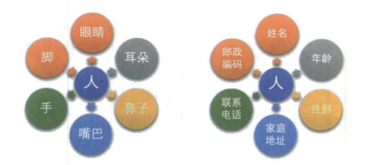

**数据项**是数据不可分割的最小单位.

但真正讨论问题,数据元素才是数据结构中建立数据模型的着力点.就比如通讯录管理系统中,构建人信息的顺序表时,是将人这个数据元素作为着力点,而不会关心具体的年龄等数据项的.

### 1.1.4 数据对象
> 数据对象: 是性质相同的数据元素的集合,是数据的子集

对于有眼睛,耳朵,鼻子,嘴巴的人这个数据元素组成的数据对象,和对于有姓名,年龄,性别,家庭地址的人的这个数据元素组成的数据对象,两者是不同的数据对象.

### 1.1.5 数据结构
> 是相互之间存在一种或多种特定关系的数据元素的集合

计算机中,数据元素并不是孤立,杂乱无序的,而是具有内在联系的数据集合.数据元素之间存在的一种或多种特定关系,也就是数据的组织形式.


## 1.2 逻辑结构与物理结构
> 数据结构分为 逻辑结构 和 物理结构

### 1.2.1 逻辑结构(我们最需要关注的问题)
> 逻辑结构: 是指数据对象中数据元素之间的相互关系.

1. 集合结构
> 集合结构中的数据元素除了同属于一个集合外,它们之间没有其他关系

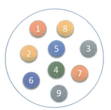

2. 线性结构
> 线性结构中的数据元素之间是**一对一**的关系

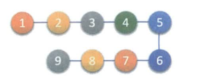

3. 树形结构
> 树形结构中的数据元素之间存在一种**一对多**的层次关系

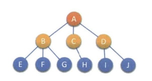

4. 图形结构
> 图形结构中的数据元素是**多对多**的关系

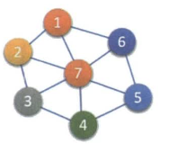
每个数据元素用圆圈表示,元素之间的逻辑关系用结点之间的连线表示,如果这个关系是有方向的,那么用带箭头的连线表示.

在问题理解的基础上,选择一个合适的数据结构表示数据之间的逻辑关系.

### 1.2.2 物理机构
> 物理结构: 是指数据的逻辑结构在计算机中的存储形式

1. 顺序存储结构
> 是把数据元素存放在地址里连续的存储单元里, 其数据间的逻辑关系和物理关系是一致的

例如C语言中的数组就是顺序存储结构的
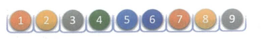

2. 链式存储结构
> 是把数据元素存放在任意的存储单元里,这组存储单元可以是连续的,也可以是不连续的.

例如单链表就是链式存储结构的
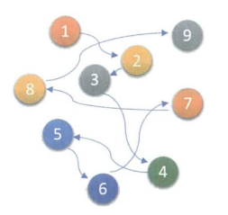

## 1.3 数据类型
> 数据类型: 是指一组性质相同的值的集合及定义在此集合上的一些操作的总称

## 1.3.1 数据类型定义
C语言中,按照取值的不同,数据类型可以分为两类:
1. 原子类型
是不可以再分解的基本类型,包括整型,实型,字符型等等
2. 结构类型
有若干个类型组合而成,是可以再分解的.例如,整型数组是由若干个整型数据组成的.

## 1.3.2 抽象数据类型
> 抽象数据类型(Abstract Data Type, ADT): 一个数学模型及定义在该模型上的一组操作

描述抽象数据类型的标准格式
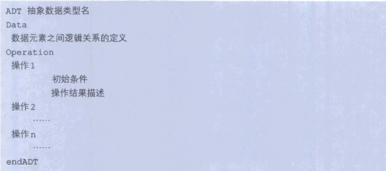

# 2. 算法分析
> 算法(alorithm)是为求解一个问题需要遵循的,被清楚地指定的简单指令的集合.

> 对于一个问题,一旦给定某种算法并且(以某种方式)确定其是正确的,那么重要的一部就是确定该算法将需要多少诸如时间或者空间等资源量的问题.

对于以下斐波那契数列:
```c
long long Fib(int N)
{
    if (N < 3)
        return 1;
    
    return Fib(N-1) + Fib(N-2);
}
```
斐波那契数列的递归实现方式非常简洁,但是这种写法并不好.就需要从时间或者空间来衡量其好坏.

## 2.1 算法的复杂度
> 算法在编写成可执行程序后,运行时需要耗费时间资源和空间(内存)资源.

> 因此,**衡量一个算法的好坏**,一般是从**时间**和**空间**两个维度来衡量的,即 *时间复杂度* 和 *空间复杂度*

- **时间复杂度**主要衡量一个算法的运行快慢
- **空间复杂度**主要衡量一个算法运行所需要的额外空间.

在计算机发展的早期,计算机的存储容量很小,所以对空间复杂度很是在乎.但是经过计算机行业的迅速发展,计算机中的存储容量已经达到了很高的程度.所以我们如今已经不需要再特别关注一个算法的空间复杂度.

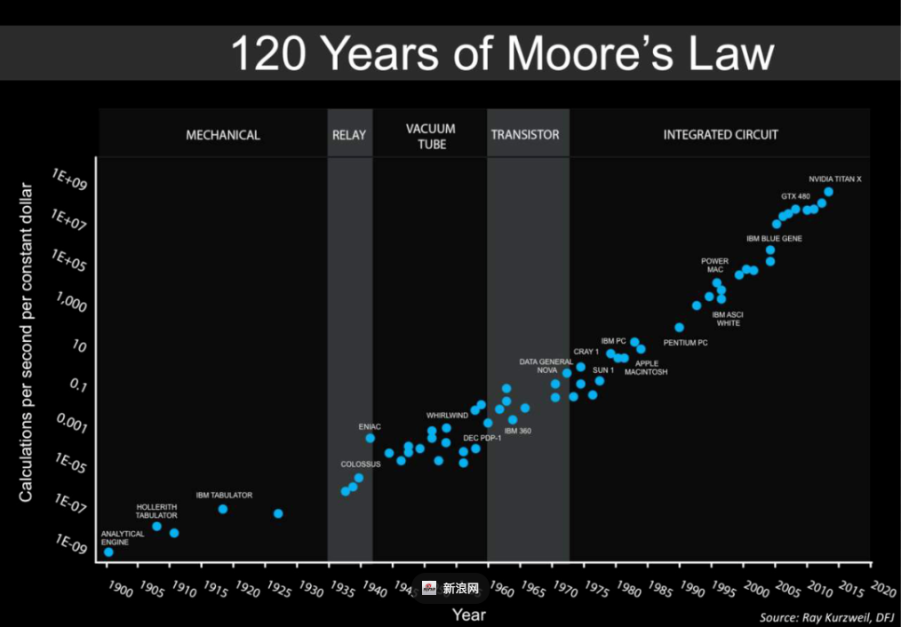
具体可以详细了解以下摩尔定律对于芯片领域的影响

## 2.2 复杂度的渐进表示法
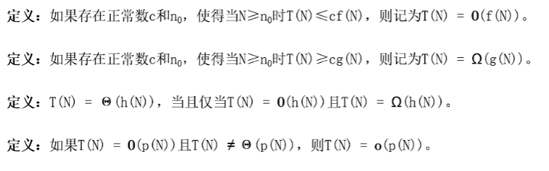
这些定义的目的是在函数间建立一种相对的级别.在算法分析中,比较函数间的**相对增长率**(relative rate of growth)是十分重要的度量.

例如:
$T(N) = 1000N,F(N) = N^2$.

$虽然N较小时1000N要比N^2大,但N^2以更快的速度增长,因此N^2最终将更大.$

$在第一个定义中:n_0 = 1000而c =1,也可以令n_0 = 10而c=100.$

$因此可以说1000N=O(N^2)(N平方级)$,$这种记法成为大O记法.$

***
如果用传统的不等式来计算增长率,那么

$第一个定义是说T(N)的增长率小于等于f(N)的增长率$

$第二个定义是说T(N)的增长率大于等于f(N)的增长率$

$第三个定义是说T(N)的增长率等于f(N)的增长率$

$第四个定义是说T(N)的增长率小于f(N)的增长率$
***

需要掌握的重要结论为:

**法则1**:如果$T_1(N) = O(f(N))且T_2(N)=O(g(N))$,那么
(a)$T_1(N)+T_2(N) = max(O(f(N)), O(g(N)))$
(b)$T_1(N) * T_2(N) = O(f(N) * g(N))$

**法则2**:如果$T(N)$是一个$k$次多项式,则$T(N) =\theta(N^k)$

**法则3**:对任意常数$k$,$log^kN=O(N)$.它告诉我们对数增长的非常缓慢.

## 2.3 时间复杂度
> 时间复杂的定义: 在计算机科学中, **算法的时间复杂度是一个函数**, 它定量描述了该算法的运行时间.

> 一个算法执行所耗费的时间,从理论上来说,是不能算出来的,只有你把你程序放在机器上跑起来,才能知道.

> 但是我们需要每个算法都上机测试嘛?是可以都上机测试,但是这很麻烦,所以才有了**时间复杂度**这个分析方式.

> 一个算法所花费的时间与其中语句的执行次数成正比例,**算法中的基本操作的执行次数,为算法的时间复杂度**

为了简化分析,忽略特定的时间单元,只要计算大$O$运行时间.

1. 抛弃前导常数, 即用常数 1 取代运行时间中的所有加法常数
2. 抛弃低阶项, 即再修改后的运行次数函数中, 只保留最高阶项

由于大$O$是一个上界,因此我们必须仔细,绝对不要低估程序的运行时间.

实际上,分析的结果为程序在一定的时间范围内能够终止运行提供了保障.程序可能提前结束,但绝不可能延后.

### 2.3.1 一个简单的例子
这里是计算 $\sum_{i=1}^{N}i^3$ 的一个简单的程序片段:
```c
int sum(int N)
{
    int i, PartialSum;

    PartialSum = 0;                 //1
    for (i = 1; i <= N; i++)        //2
        PartialSum += i * i * i;    //3

    return PartialSum;              //4
}
```
对这个程序的分析很简单.
1. 声明不计时间
2. 第 1 行和第 4 行各占一个时间单元.
3. 第 3 行每执行一次占用 4 个时间单元(两次乘法, 一次加法和一次赋值).执行 $N$ 次占用 $4N$ 个时间单元
4. 第 2 行在初始化 $i$,测试 $i \leqslant N$和对 $i$的自增运算中隐含着开销.  
   第 2 行的总开销是: 初始化占 1 个时间单元, 所有的测试占 $N+1$ 个时间单元,以及所有的自增运算占 $N$ 个时间单元, 共 $2N + 2$ 个时间单元.
5. 忽略调用函数和返回值的开销,得到的总量是 $6N + 4$.因此,该函数是 $O(N)$ 的.


但是如果每次分析一个程序都要演示所有这些工作,这显然是不可行的.  
根据大 $O$ 的结果,因此就存在许多可以采取的简化并且不影响最后的结果.  
例如,第 3 行(每次执行时)显然是 $O(1)$ 语句. 第 1 行与`for`循环相比显然是不重要的.

由此得到若干一般法则.

### 2.3.2 一般法则
**法则 1 ---- `for`循环:**
> 一次`for`循环的运行时间至多是该`for`循环内语句(包括测试)的运行时间乘以迭代的次数


**法则 2 ---- 嵌套的`for`循环:**
> 从里向外分析这些循环.在一组嵌套循环内部的一条语句总的运行时间为 该语句的运行时间 乘以 该组所有的`for`循环的大小的乘积.

例如:下列程序片段的运行时间为$O(N^2)$:
```c
for(i = 0; i < N; i++)
    for (j = 0; j < N; j++)
        k++;
```

**法则3 ---- 顺序语句:**
> 将各个语句的运行时间求和即可(这意味着, 其中的最大值就是所得的运行时间, 见2.2 法则1(a))

例如:下面的程序片段先用去 $O(N)$, 再花费 $O(N^2)$, 总的开销也是 $O(N^2)$:
```c
for (i = 0; i < N; i++)
    A[i] = 0;
for (i = 0; i < N; i++)
    for (j = 0; j < N; j++)
        A[i] += A[j] + i + j;
```

**法则4 ---- `if`/`else`语句:**
> 一个`if`/`else`语句的运行时间从不超过判断的时间加上 $S1$ 和 $S2$ 中运行时间较长者的总的运行时间

显然某些情形下这么估计有些过高, 但绝对不会过低.

其他的法则都是显而易见的,但是,分析的基本策略是从内部(或最深层部分)向外展开的.  
如果有函数调用,那么这些调用要首先分析.  


如果有递归过程,那么存在几种选择.  
若递归实际上时稍加演示的`for`循环,则分析通常是很简单的.  
例如下面的函数实际上就是一个简单的循环,从而其运行时间为 $O(N)$ :
```c
long int Factorial(int N)
{
    if (N <= 1)
        return 1;
    else
        return N * Factorial(N - 1);
}
```

现在我们重回斐波那契数列,他对递归使用的效率低的令人诧异.
```c
long long Fib(int N)
{
    if (N <= 1)                     //1
        return 1;                   //2    
    else                                
        return Fib(N-1) + Fib(N-2); //3
}
```
令 $T(N)$ 为函数 $Fib(N)$ 的运行时间

如果 $N = 0 或 N = 1$,则运行时间是某个常数值,即第 1 行做判断以及返回所用的时间.
因为常数并不重要,所以我们可以说 $T(0) = T(1) = 1$.

若 $N > 2$, 则执行该函数的时间是第 1 行上的常数工作加上第 3 行上的工作.
第 3 行由一次加法和两次函数调用组成.由于函数调用不是简单的计算,必须通过它们本身来分析.

$ 2^0 $ &nbsp;&nbsp;&nbsp;&nbsp;$ Fib(N) $  
$ 2^1 $ &nbsp;&nbsp;&nbsp;&nbsp;$ Fib(N-1) +  Fib(N-2) $  
$ 2^2 $ &nbsp;&nbsp;&nbsp;&nbsp;$ Fib(N-2) + Fib(N-3) +  Fib(N-3)  + Fib(N-4) $  
$ 2^3 $ &nbsp;&nbsp;&nbsp;&nbsp;$ Fib(N-3)  +  Fib(N-4)  +  Fib(N-4)  +  Fib(N-5)  + Fib(N-4)  +  Fib(N-5)  +  Fib(N-5)  +  Fib(N-6) $  
...
...
$ 2^{N-1} $ &nbsp;&nbsp;&nbsp;&nbsp;$ Fib(1) + .....$  

$T(N) = 2^0 + 2^1 + 2^2 +...+ 2^{N-1} - X(X指缺的一些调用, 往高了算, 可以直接省去 - X)$

$T(N) = 2^N - 1 $

所以该程序是 $O(2^N)$ 的,这是指数倍增长.

### 2.3.3 其他一些例子
**实例1:** 计算`Func1`的时间复杂度
```c
void Func1(int N) 
{
    int count = 0;
    for (int i = 0; i < N; ++i) 
    {
        for (int j = 0; j < N; j++) 
        {
            ++count;
        }
    }
 
    for (int k = 0; k < 2 * N; ++k) 
    {
        ++count;
    }
 
    int M = 10;
    while (M--) 
    {
        ++count;
    }
 
    printf("%d\n", count);
}
```
$ F(N) = N^2 + 2N + 10$ $\Rightarrow$ $O(N^2)$ 
***
**实例2:** 计算`Func2`的时间复杂度
```c
void Func2(int N) 
{
    int count = 0;
    for (int k = 0; k < 2 * N ; ++ k) 
    {
        ++count;
    }
 
    int M = 10;
    while (M--) 
    {
        ++count;
    }
    
    printf("%d\n", count);
}
```
$ F(N) = 2N + 10$ $\Rightarrow$ $O(N)$ 
***
**实例3** 计算`Func3`的时间复杂度
```c
void Func3(int N, int M) 
{
    int count = 0;
    for (int k = 0; k < M; ++ k) 
    {
        ++count;
    }
    
    for (int k = 0; k < N ; ++ k) 
    {
        ++count;
    }
 
    printf("%d\n", count);
}
```
$ F(N) = N + M$ $\Rightarrow$ $O(N + M)$ 
> N 远大于 M时, $O(N)$
> N 远小于 M时, $O(M)$
> N 和 M 差不多大时, $O(N + M)$
***
**实例4** 计算`Func4`的时间复杂度
```c
void Func4(int N) 
{
    int count = 0;
    for (int k = 0; k < 100; ++ k) 
    {
        ++count;
    }
 
    printf("%d\n", count);
}
```
$ F(N) = 100$ $\Rightarrow$ $O(1)$ 
> 常数无论多大都是$O(1)$ 
***
**实例5** 计算`strchr`的时间复杂度
```c
const char * strchr ( const char * str, int character );
```
> 最好 1 次, 最坏 N 次,时间复杂度取最坏情况

$ F(N) = N$ $\Rightarrow$ $O(N)$ 
***
**实例6** 计算`BubbleSort`的时间复杂度
```c
void BubbleSort(int* a, int n) 
{
    assert(a);
    for (size_t end = n; end > 0; --end) 
    {
    int exchange = 0;
        for (size_t i = 1; i < end; ++i) 
        {
            if (a[i-1] > a[i]) 
            {
                Swap(&a[i-1], &a[i]);
                exchange = 1;
            }
        }
 
        if (exchange == 0) 
        {
            break;
        }
    }
} 
```
> 第一轮 n - 1 次, 第二轮 n - 2 次 ... 最后一轮 1 次

$ F(N) = N(N - 1)/2$ $\Rightarrow$ $O(N^2)$ 

***

**实例7** 计算`BinarySearch`的时间复杂度
```c
int BinarySearch(int* a, int n, int x) 
{
    assert(a);
    int begin = 0;
    int end = n - 1;
    while (begin < end) 
    {
        int mid = begin + ((end-begin) >> 1);
        if (a[mid] < x)
            begin = mid + 1;
        else if (a[mid] > x)
            end = mid;
        else
            return mid;
    }
 
    return -1;
}
```
> 若遇到复杂算法, 不能看循环, 要思考其中的思想

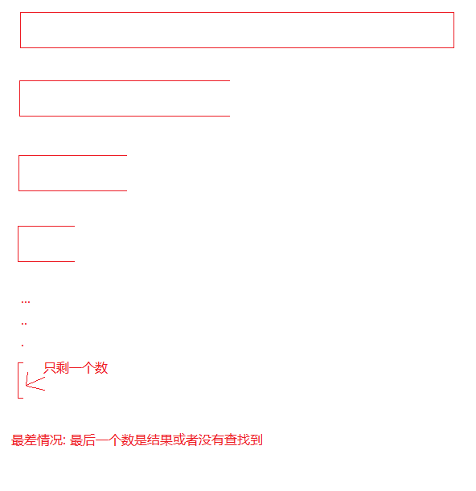
假设一共由 $N$ 个数,最坏情况下经过 $x$ 次查找,最后只剩一个数,那么 $2^x = N$ $\Rightarrow$ $x = log_2N$

那么时间复杂度为 $O(logN)$

> 在数据有序的情况下,二分查找确实效率很快

N 个数中查找|大概查找次数
---|---
1000|10
100W|20
1亿|30

***
**实例7:** 计算递归版阶乘的时间复杂度
```c
long long Fac(size_t N)
{
    if (0 == N)
        return 1;
    return Fac(N - 1) * N;
}
```
> 递归操作了 N 次

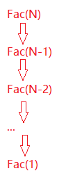

时间复杂度为 $O(N)$

## 2.4 空间复杂度
> 空间复杂度也是一个数学表达式,是对一个算法在运行过程中**临时占用存储空间大小的量度**.

> 空间复杂度不是程序占用了多少 bytes 的空间,因为这个也没太大意义, 所以空间复杂度算的是**变量的个数**.空间复杂度也使用**大 $O$ 渐进表示法**.

> <font color='red'> 注意 </font>:**函数运行时所需要的栈空间(存储参数,局部变量,一些寄存器信息等)在编译期间已经确定好了,因此空间复杂度主要通过函数在运行时候显式申请的额外空间来确定.**

### 2.4.1 一些例子
**实例1:** 计算`BubbleSort`的空间复杂度
```c
void BubbleSort(int* a, int n) 
{
    assert(a);
    for (size_t end = n; end > 0; --end) 
    {
    int exchange = 0;
        for (size_t i = 1; i < end; ++i) 
        {
            if (a[i-1] > a[i]) 
            {
                Swap(&a[i-1], &a[i]);
                exchange = 1;
            }
        }
 
        if (exchange == 0) 
        {
            break;
        }
    }
}
```
> 使用了常数个空间(创建了`end`,`exchange`,`i`三个变量)

结果为 $ O(1) $

***
**实例2:** 计算迭代版本的`Fibonacci`的空间复杂度
```c
// 返回斐波那契数列的前n项
long long* Fibonacci(size_t n) 
{
    if(n==0)
        return NULL;
 
    long long * fibArray = (long long *)malloc((n+1) * sizeof(long long));  //1
    fibArray[0] = 0;
    fibArray[1] = 1;
    for (int i = 2; i <= n ; ++i) 
    {
        fibArray[i] = fibArray[i - 1] + fibArray [i - 2];
    }
 
    return fibArray;
}
```
> 第 1 行开辟了 n + 1 个内存空间 

结果为 $ O(N) $

***
**实例3:** 计算递归版阶乘`Fac`的空间复杂度
```c
long long Fac(size_t N)
{
    if (0 == N)
        return 1;
    return Fac(N - 1) * N;
}
```
> 递归调用了 N 次, 开辟了 N 个栈帧空间, 每个栈帧空间使用常数个空间

结果为 $ O(N) $
***
**实例4:** 计算递归版斐波那契数列`Fib`的空间复杂度
```c
long long Fib(int N)
{
    if (N <= 1)                     //1
        return 1;                   //2    
    else                                
        return Fib(N-1) + Fib(N-2); //3
}
```
下面是我调用`Fib(5)`,进行调式得到的部分开辟堆栈图  
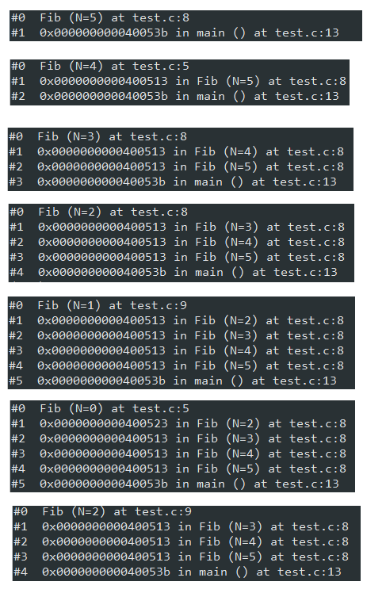
发现 N 从 `Fib(5)` -> `Fib(2)` 一直在开辟栈帧  
直到 `Fib(1)`,一次调用返回,开辟的一次空间归还给操作系统,继续调用`Fib(0)`,发现用的还是同一块栈.

空间是重复利用的!

回到题目`Fib(N)`开辟空间一直到`Fib(1)`,随后释放栈帧返回到`Fib(2)`,继续`Fib(0)`开辟栈帧;
随后返回`Fib(3)`...依次类推.最多只开辟了 N 个栈帧, 每个栈帧使用了常数个空间

结果是 $O(N)$

> 由此也能看出递归的最大问题:深度太深,容易栈溢出
***
> 时间是累积的,空间重复利用

## 2.5 常见复杂度
函数式|复杂度|阶数
---|---|---
$5201314$|$O(1)$|常数阶
$3n+4$|$O(n)$|线性阶
$3n^2+4n+5$|$O(n^2)$|平方阶
$3long_2n+4$|$O(logn)$|对数阶
$2n+3nlog_2n+14$|$O(nlogn)$|$nlogn$阶
$n^3+2n^2+4n+6$|$O(n^3)$|立方阶
$2^n$|$O(2^n)$|指数阶
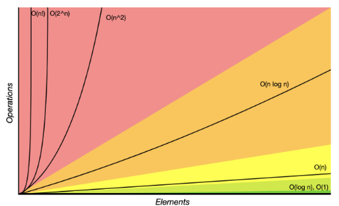

本章完.


