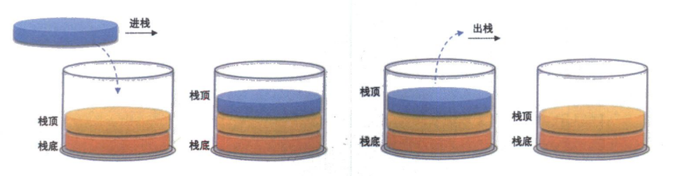

# 1. 栈(Stack)
## 1.1 栈的概念
> - 栈(Stack)是只允许在一端进行插入或删除操作的线性表.首先栈是一种线性表,但限定这种线性表只能在某一端进行插入和删除操作.
> - 进行**数据插入和删除操作的一端**叫**栈顶**,另一端称为**栈底**.
> - 栈中的元素遵循**后进先出**LIFO(Last In First Out)的原则

**压栈**:栈的插入操作叫做进栈/压栈/入栈,**入数据在栈顶**.
**出栈**:栈的删除操作叫做出栈,**出数据也在栈顶**.

## 1.2 栈的结构

栈的元素,遵循后进先出原则

***
栈采用什么逻辑结构呢?
通常栈可以用链表和数组实现.
当然我们调用的时候不需要知道,使用的是什么方法实现.

### 链表栈
通过在**表前端**插入来实现 push ,通过删除**表前端**元素实现 pop.
可以使用之前实现的单链表来实现栈,[单链表实现详见](https://blog.csdn.net/Kuzuba/article/details/132014266).只用注意,栈只有插入删除操作,需要头删和头插.

虽然操作都是花费常数时间,但是对`malloc`和`free`的调用是十分昂贵的.

### 数组栈
更为流行的是使用数组来实现栈.虽然数组的大小需要提前说明或者临时开辟,但是,在典型的应用程序中,栈元素的实际个数一般不会太大,使用数组是更加高效的方法.

***
总结: 
> - 推荐使用数组结构实现栈
> - 若使用链表实现栈
> 用尾做栈顶,尾删尾插,要设计成双向链表
> 用头做栈顶,头删头插,要设计成单链表

# 2. 栈的定义
一般来说,使用动态栈而非静态栈,需要扩容的时候,可以进行适当扩容,增加了程序的适用性.

动态栈实现的**数据结构**
```c
typedef int STDataType;

typedef struct Stack
{
  STDataType* a;  //指向栈空间
  int top;        //栈顶
  int capacity;   //容量
}Stack;
```

**接口函数**
```c
// 初始化栈
void StackInit(Stack* ps);
// 入栈
void StackPush(Stack* ps, STDataType data);
// 出栈
void StackPop(Stack* ps);
// 获取栈顶元素
STDataType StackTop(Stack* ps);
// 获取栈中有效元素个数
int StackSize(Stack* ps);
// 检测栈是否为空, 如果为空返回非零结果, 如果不为空返回 0
int StackEmpty(Stack* ps);
// 销毁栈
void StackDestroy(Stack* ps);
```

# 3. 栈的实现
## 3.1 初始化栈 (StackInit)
```c
// 初始化栈
void StackInit(Stack* ps)
{
  assert(ps);
  
  ps->a = NULL;     
  ps->top = 0;
  ps->capacity = 0;
}
```
> 1. 和创建顺序表的操作是一致的,通过结构体指针`ps`修改主函数中的结构体的成员变量,将`ps`指向的数组指针指向`NULL`,同时将容量`capacity`和栈顶元素`top`置为 0. 

> 2. 注意,在这里,`top`所指向的是栈顶元素后一个空间,此时没有元素,自然就指向了数组的第一个空间

## 3.2 入栈 (StackPush)
```c
//入栈
void StackPush(Stack* ps, STDataType data)
{
  assert(ps);       //确保ps合法

  //如果容量不够则扩容
  if (ps->capacity == ps->top)
  {
    int newCapacity = ps->capacity == 0 ? 4 : 2 * ps->capacity;   //定义新的容量
    STDataType* tmp = (STDataType*)realloc(ps->a, sizeof(STDataType) * newCapacity);  //开辟新的空间
    if (tmp == NULL)
    {
      perror("malloc error");
      exit(-1);
    }
    else 
    {
      ps->a = tmp;
      ps->capacity = newCapacity;
    }
  }

  //将数据入栈
  ps->a[ps->top] = data;
  ps->top++;
}
```
> 1. 首先确保`ps`合法
> 2. 因为是动态栈,会出现空间不够的情况,在入栈之前首先确保容量充足,如果容量不够,则进行扩容
> 3. 将数据入栈,同时`top++`

## 3.3 出栈 (StackPop)
```c
// 出栈
void StackPop(Stack* ps)
{
  assert(ps); //确保ps合法

  assert(!StackEmpty(ps));  //确保栈不为空
  ps->top--;

}
```
> 1. 确保 ps 合法
> 2. 确保栈不为空
> 3. 直接将`top--`即可

## 3.4 检测栈是否为空 (StackEmpty)
```c
// 检测栈是否为空, 如果为空返回非零结果, 如果不为空返回 0
int StackEmpty(Stack* ps)
{
  assert(ps); //确保ps合法
  
  if (ps->top > 0)
  {
    return 0;
  }
  else 
  {
    return 1;
  }
}
```
> 1. 确保ps合法
> 2. 如果`top`大于0,说明栈不为空,反之则为空

## 3.5 获取栈顶元素 (StackTop)
```c
// 获取栈顶元素
STDataType StackTop(Stack* ps)
{
  assert(ps);   //确保ps合法
  assert(!StackEmpty(ps));  //确保栈不为空

  return ps->a[ps->top - 1];
}
```
> 1. 确保ps合法
> 2. 确保栈不为空
> 3. 直接返回`top - 1`位置的元素

## 3.6 获取栈中有效元素个数 (StackSize)
```c
// 获取栈中有效元素个数
int StackSize(Stack* ps)
{
  assert(ps);   //确保ps合法
  return ps->top;
}
```
> 1. 确保ps合法
> 2. 直接将`top`返回即可

## 3.7 销毁栈 (StackDestroy)
```c
// 销毁栈
void StackDestroy(Stack* ps)
{
  assert(ps); //确保ps合法

  free(ps->a);
  ps->a = NULL;
  ps->capacity = 0;
  ps->top = 0;
}
``` 
> 1. 确保ps合法
> 2. 将ps指向的数组空间归还给操作系统,同时将`top`和`capacity`置为0

## 3.8 完整代码
- `Stack.h`
```c
#pragma once 

#include <stdio.h>
#include <assert.h>
#include <stdlib.h>
#include <stdbool.h>

typedef int STDataType;

typedef struct Stack
{
  STDataType* a;  //指向栈空间
  int top;        //栈顶
  int capacity;   //容量
}Stack;

// 初始化栈
void StackInit(Stack* ps);
// 入栈
void StackPush(Stack* ps, STDataType data);
// 出栈
void StackPop(Stack* ps);
// 获取栈顶元素
STDataType StackTop(Stack* ps);
// 获取栈中有效元素个数
int StackSize(Stack* ps);
// 检测栈是否为空, 如果为空返回非零结果, 如果不为空返回 0
int StackEmpty(Stack* ps);
// 销毁栈
void StackDestroy(Stack* ps);


```

- `Stack.c`
```c
#include "Stack.h"

// 初始化栈
void StackInit(Stack* ps)
{
  assert(ps);
  
  ps->a = NULL;     
  ps->top = 0;
  ps->capacity = 0;
}

//入栈
void StackPush(Stack* ps, STDataType data)
{
  assert(ps);       //确保ps合法

  //如果容量不够则扩容
  if (ps->capacity == ps->top)
  {
    int newCapacity = ps->capacity == 0 ? 4 : 2 * ps->capacity;   //定义新的容量
    STDataType* tmp = (STDataType*)realloc(ps->a, sizeof(STDataType) * newCapacity);  //开辟新的空间
    if (tmp == NULL)
    {
      perror("malloc error");
      exit(-1);
    }
    else 
    {
      ps->a = tmp;
      ps->capacity = newCapacity;
    }
  }

  //将数据入栈
  ps->a[ps->top] = data;
  ps->top++;
}

// 出栈
void StackPop(Stack* ps)
{
  assert(ps); //确保ps合法

  assert(!StackEmpty(ps));  //确保栈不为空
  ps->top--;

}

// 检测栈是否为空, 如果为空返回非零结果, 如果不为空返回 0
int StackEmpty(Stack* ps)
{
  assert(ps); //确保ps合法
  
  if (ps->top > 0)
  {
    return 0;
  }
  else 
  {
    return 1;
  }
}

// 获取栈顶元素
STDataType StackTop(Stack* ps)
{
  assert(ps);   //确保ps合法
  assert(!StackEmpty(ps));  //确保栈不为空

  return ps->a[ps->top - 1];
}

// 获取栈中有效元素个数
int StackSize(Stack* ps)
{
  assert(ps);   //确保ps合法
  return ps->top;
}

// 销毁栈
void StackDestroy(Stack* ps)
{
  assert(ps); //确保ps合法

  free(ps->a);
  ps->a = NULL;
  ps->capacity = 0;
  ps->top = 0;
}

```

- `Test.c`
```c
#include "Stack.h"

void StackTest1()
{
  Stack st;

  StackInit(&st);
  StackPush(&st, 1);
  printf("%d\n", StackSize(&st));
  printf("%d\n", StackTop(&st));

  StackPush(&st, 2);
  printf("%d\n", StackSize(&st));
  printf("%d\n", StackTop(&st));
 
  StackPush(&st, 3);
  printf("%d\n", StackSize(&st));
  printf("%d\n", StackTop(&st));
  
  StackPush(&st, 4);
  printf("%d\n", StackSize(&st));
  printf("%d\n", StackTop(&st));
  
  StackPush(&st, 5);
  printf("%d\n", StackSize(&st));
  printf("%d\n", StackTop(&st));
  
  StackPop(&st);
  printf("%d\n", StackSize(&st));
  printf("%d\n", StackTop(&st));
  
  StackPop(&st);
  printf("%d\n", StackSize(&st));
  printf("%d\n", StackTop(&st));
  
  StackPop(&st);
  printf("%d\n", StackSize(&st));
  printf("%d\n", StackTop(&st));
  
  StackPop(&st);
  printf("%d\n", StackSize(&st));
  printf("%d\n", StackTop(&st));
  
  StackPop(&st);
  printf("%d\n", StackSize(&st));
  printf("%d\n", StackTop(&st));
  
  StackPop(&st);
}

int main(void)
{
  StackTest1();

  return 0;
}

```