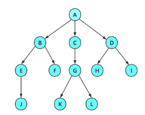

# 1. 树的概念

> 树是一种**非线性**的数据结构,它是由 n (n >= 0)个有限结点组成一个具有层次关系的.

> 把它叫做树是因为它看起来像一棵倒挂的树,也就是说它是根朝上,而叶朝下的.

# 2. 树的结构
- 有一个特殊的结点,称为**根节点**,根节点没有前驱节点.
- 除根节点外,**其余结点被分成M(M>0)个互不相交的集合T1,T2,....Tm**,其中每一个集合本身又是一棵树,并且称为根的子树
- 树是递归定义的.

注意:树形结构中,子树之间不能有交集,否则就不是树形结构,是图结构了.
***
下面就是一个平平无奇的树

子树 T1 和子树 T2 是根节点 A 的子树,同时 D,G,H,J 组成的树也是以 B 为根节点的子树,所以说树是递归定义的.

***
对于树的定义还需要强调两点:
- n > 0 时根节点是唯一的,不可能存在多个根节点
- m > 0 时,子树的个数没有限制,但是它们一定是不相交的.

# 3. 树的相关概念

> **结点的度**:<font color=red>一个结点含有子树的个数称为该结点的度;</font></td></tr> 如上图,A的为 2 ,D的为 3
> **叶结点或终端结点**:<font color=red>度为 0 的结点称为叶结点;</font> 如上图, G, H, I, J, F为叶节点
> **非终端结点或分支结点**:<font color=red>度不为 0 的结点;</font> 如上图, A, B, C, D, E为分支结点
> **双亲结点或父节点**:<font color=red>若一个结点含有子节点,则这个结点称为其子节点的父节点;</font> 如上图,A 为 B 的父节点
> **孩子结点或子节点**:<font color=red>一个结点含有的子树的根节点称为该结点的子节点;</font> 如上图,E 是 C 的孩子结点
> **兄弟结点**:<font color=red>具有相同父节点的结点互称为兄弟结点;</font>如上图,G, H, I互称为兄弟结点
> **树的度**:<font color=red>一棵树中,最大的结点的度称为树的度</font>如上图,树的度为 3
> **结点的层次**:从根开始定义起, 根为第1层,根的子节点为第2层,以此类推
> **树的高度或深度**:<font color=red>树中结点的最大层次</font>如上图,该树的高度为4
> **堂兄弟结点**:<font color=red>双亲在同一层的结点互为堂兄弟</font>如上图, I, J互为堂兄弟结点
> **结点的祖先**:<font color=red>从根到该结点所经分支上的所有节点</font>如上图,A 是所有结点的祖先
> **子孙**:<font color=red>以某结点为根的子树中任一节点都称为该节点的子孙</font>如上图:所有结点都是 A 的子孙
> **森林**:<font color=red>由 m (m > 0) 棵互不相交的树的集合称为森林</font>

# 4. 树的表示
以前学单链表的时候就有一个指针,双链表有两个指针,但是树有几个指针就不确定了,因为树没有规定每个结点有多少孩子.
有三种方式来表示
## 孩子表示法
说明了树的度为N,使用顺序表表示
> 每个结点有多个指针域,其中每个指针指向一棵子树的根节点
```c
#define N 3     //假设树的度为N

struct TreeNode
{
    int val;
    struct TreeNode* child[N];  //指针数组
};  
```
但是这样的表示也有缺陷,就是需要知道树的度,而且很有可能造成空间的浪费

## 双亲表示法
> 每个结点中,附设一个指示器指示其双亲结点在数组中的位置
```c
struct TreeNode
{
    int val;
    int parent;
}
```


虽然找到该结点的双亲结点时间复杂度为$O(1)$, 但是要找到该结点的子节点却仍然需要遍历整个树才可以找到,显然这个结构也有缺陷

## 孩子兄弟表示法
> 任意一棵树,它的结点的第一个孩子如果存在就是唯一的,它的右兄弟如果存在也是唯一的.因此,我们设置两个指针,分别指向该结点的第一个孩子和此结点的右兄弟.

```c
struct TreeNode
{
    int val;
    struct TreeNode* firstchild;
    struct TreeNode* nextbrother;
}
```


这样可以说是最优的表示法了
如果我们想要得到某个结点的所有孩子,下面的代码就可以了.
```c
struct TreeNode* Anode;
struct TreeNode* child = Anode->firstchild;

while (child)
{
    printf("%d ", child->val);
    child = child->nextbrother;
}
```
这样确实做到了最大节省空间,同时,这也是一个二叉树,它的逻辑结构适合很多操作,是一个很优秀的逻辑结构.

# 5. 树在实际中的应用
文件系统的目录树结构、网络拓扑，最短路径问题，搜索引擎、思维导图等
