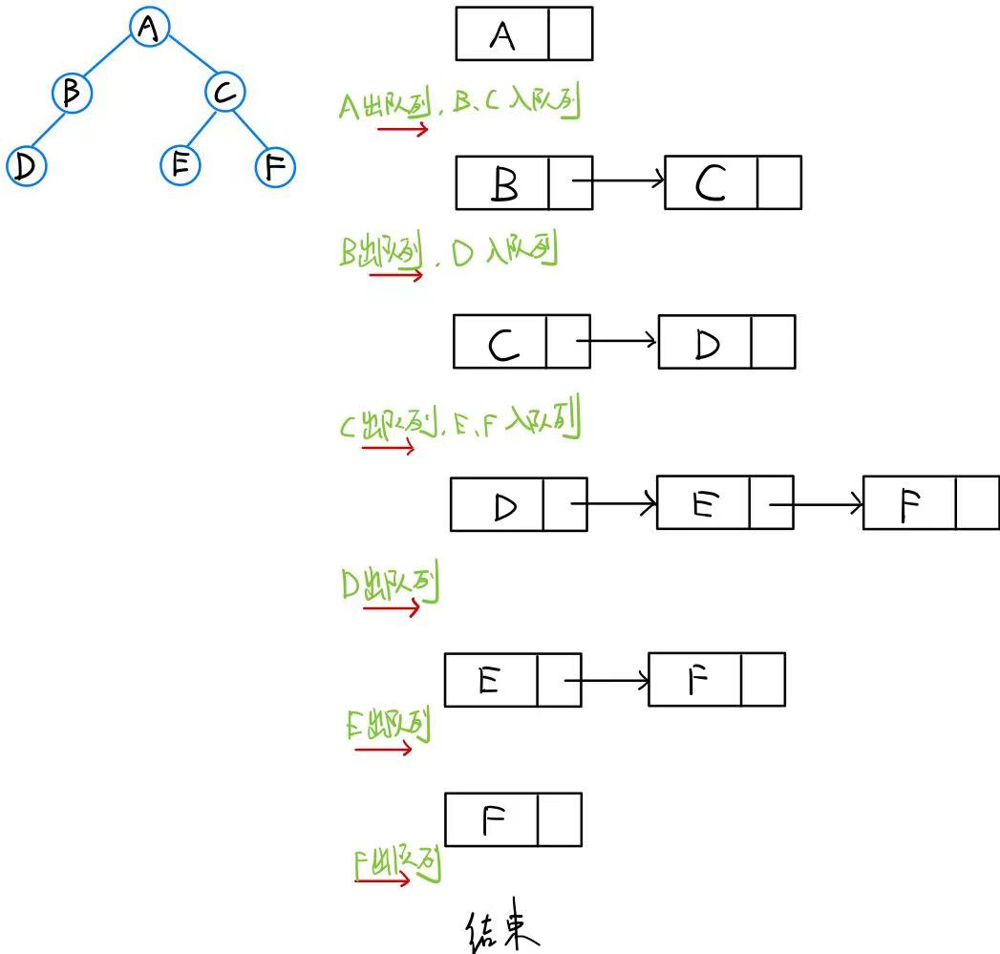
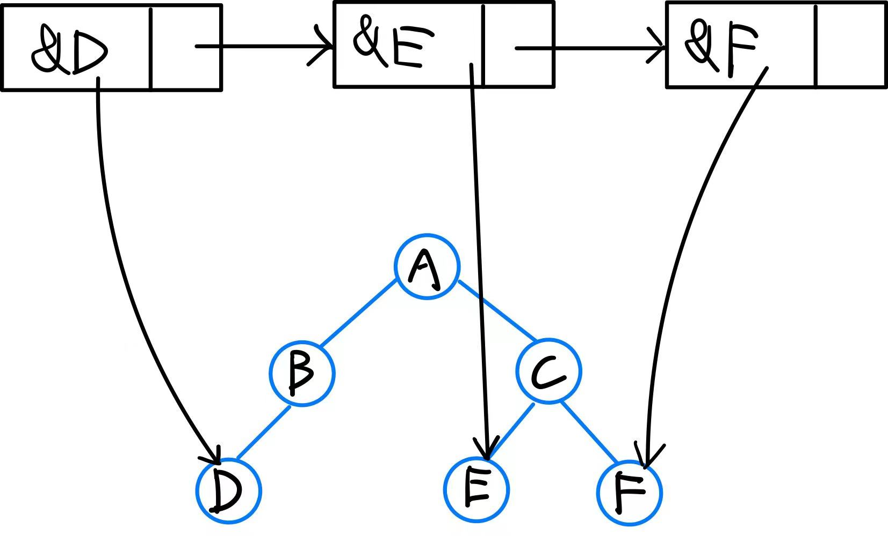
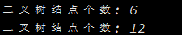
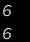
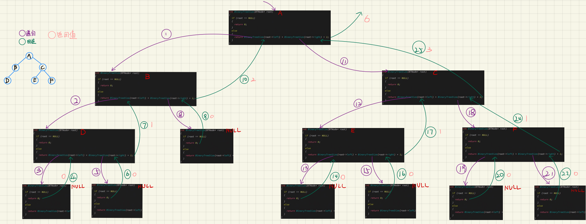
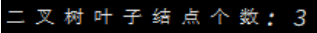
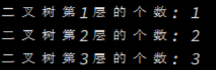
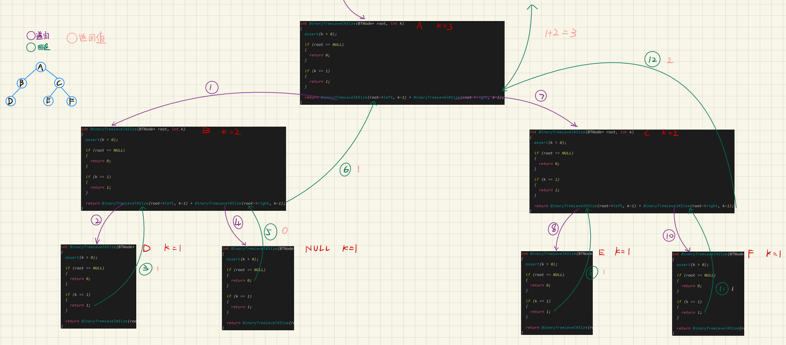
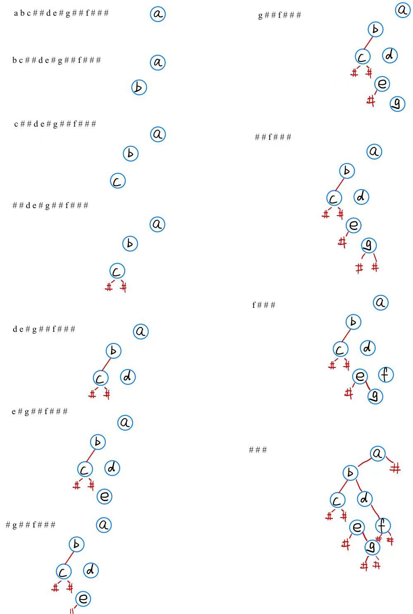

上一章讲了堆,堆是完全二叉树的顺序存储结构,本章将要全面讲解一下二叉树的链式存储结构即**链式二叉树**

我们已经学习了二叉树的概念和性质了,本章重点学习二叉树相关操作,可以更好的理解分治算法思想;也需要对递归有更深次的理解.

> 其实普通的链式二叉树的增删查改没有什么意义,学习二叉树主要是为了二叉搜索树(AVL 树, 红黑树) 以及 解决二叉树相关题目.

# 1. 链式二叉树的结构
> 在学习二叉树的基本操作前,需要先创建一棵二叉树,但是构建一棵二叉树需要首先我们对二叉树的操作足够熟悉.

> 所以先手动创建了一个二叉树,熟悉二叉树结构后,再研究真正的创建方式

***
下面,定义了二叉树的链式结构
每个结点的 data 用来存放结点的值, 有两个结构体指针分别指向左孩子和右孩子
```c
#include <stdio.h>
#include <stdlib.h>
#include <assert.h>

typedef char BTDataType;
typedef struct BinaryTreeNode
{
  BTDataType data;  
  struct BinaryTreeNode* left;  //指向左孩子
  struct BinaryTreeNode* right; //指向右孩子
}BTNode;  //二叉树结点
```

随后直接手动创建一个二叉树,如下图

代码如下
```c
// 创建结点
BTNode* BuyNode(BTDataType x)
{
  BTNode* node = (BTNode*)malloc(sizeof(BTNode));
  if (node == NULL)
  {
    perror("malloc");
  }

  node->data = x;
  node->left = NULL;
  node->right = NULL;

  return node;
}

// 手动创建二叉树
BTNode* CreateBinaryTree()
{
  BTNode* node1 = BuyNode('A');
  BTNode* node2 = BuyNode('B');
  BTNode* node3 = BuyNode('C');
  BTNode* node4 = BuyNode('D');
  BTNode* node5 = BuyNode('E');
  BTNode* node6 = BuyNode('F');

  node1->left = node2;
  node1->right = node3;
  node2->left = node4;
  node3->left = node5;
  node3->right = node6;
  
  return node1;
}
```
由于创建结点的时候已经手动将两个指针都指向了 `NULL`, 所以在建树的时候就不需要再手动赋值 `NULL` 了

***
再回顾以下二叉树的概念, 二叉树是:
- 空树
- 非空:根结点,根结点的**左子树**,根结点的**右子树**


> 所以见到非空二叉树, 我们就要自动将它分成根结点,左子树,右子树.

# 2. 二叉树的遍历
## 2.1 前序、中序和后序遍历
> 学习二叉树结构, 最简单的方式就是遍历.

> 所谓**二叉树遍历(Traversal)是按照某种特定的规则, 依次对二叉树的结点进行相应的操作, 并且每个结点只操作一次**

> 遍历是二叉树最重要的计算之一, 也是其他二叉树运算的基础.

***
按照规则, 二叉树的遍历有: **前序/中序/后序的递归结构遍历**
- 前序遍历(Preorder Traversal 亦称先序遍历)------访问根节点的操作发生在遍历其左右子树之前
- 中序遍历(Inorder Traversal)------访问根节点的操作发生在遍历其左右子树之间
- 后序遍历(Postorder Traversal)------访问根节点的操作发生在遍历其左右子树之后

> 由于被访问的结点必是某子树的根, 所以**N(Node), L(Left subtree), R(Right  subtree)又可解释为根, 根的左子树, 根的右子树**.

> NLR, LNR, LRN 分别又称为先根遍历, 中根遍历, 后根遍历.

### 2.1.1 前序遍历

> 前序遍历是先访问根结点,再访问左子树随后右子树.

> 上述树的前序遍历序列为: <font color=red>A B D 空 空 空 C E 空 空 F 空 空</font>, 把所有空结点去除得到的序列为 <font color=red>A B D C E  F</font>

***
由于思路是: 先访问根结点, 直到根节点是 空结点 ;再访问左子树 和 右子树.
树是递归的, 下面用递归的方法来遍历
```c
// 二叉树前序遍历
void PreOrder(BTNode* root)
{
  // 如果是空结点, 直接返回
  if (root == NULL)
  {
    printf("NULL ");
    return;
  }

  // 根 左 右
  printf("%c ", root->data);  //访问根结点,就把该结点的值打印出来
  PreOrder(root->left);
  PreOrder(root->right);
}
```

根据递归展开图可以更好的进行理解


程序运行也确实是这样


### 2.1.2 中序遍历
> 中序遍历则是先访问左子树,再访问根结点,最后访问右子树


> 该树的中序遍历序列是: <font color=red>空 D 空 B 空 A 空 E 空 C 空 F 空</font>, 把所有空结点去除得到的序列为 <font color=red>D B A E C F</font>
> 

代码实现
```c
// 二叉树中序遍历
void InOrder(BTNode* root)
{
  if (root == NULL)
  {
    printf("NULL ");
    return;
  }

  // 左 根 右
  InOrder(root->left);
  printf("%c ", root->data);
  InOrder(root->right);
}

```

程序运行如下


### 2.1.3 后序遍历
> 后续遍历是先访问左右子树, 再访问根节点


> 该树的后序遍历序列是: <font color=red>空 空 D 空 B 空 空 E 空 空 F C A</font>, 把所有空结点去除得到的序列为 <font color=red>D B E F C A</font>
> 

代码如下
```c
// 二叉树后序遍历
void PostOrder(BTNode* root)
{
  if (root == NULL)
  {
    printf("NULL ");
    return;
  }

  // 左 右 根
  PostOrder(root->left);
  PostOrder(root->right);
  printf("%c ", root->data);
}
```

程序运行结果如下


## 2.2 层序遍历
> 层序遍历实际上就是广度优先遍历(BFS), 广度优先遍历一般需要配合队列进行操作


思路如下:
> 1. 先将根入队列
> 2. 队头结点出队列后, 同时将该结点的左右孩子依次入队列
> 3. 循环往复直至队列为空

图示:


代码示例:
```c
// 层序遍历
void levelOrder(BTNode* root)
{
  // 创建队列
  Queue que;
  QueueInit(&que);

  // 将根结点放入队列后, 如果队列不为空,弹出队列元素同时入该结点的左右孩子, 不存空结点
  if (root)
  {
    QueuePush(&que, root);
  }

  while (!QueueEmpty(&que)) 
  {
    //出队头元素, 并打印
    BTNode* front = QueueFront(&que);
    printf("%c ", front->data);
    QueuePop(&que);

    //如果刚才的front有左右孩子, 将左右孩子入队列
    if (front->left)
    {
      QueuePush(&que, front->left);
    }

    if (front->right)
    {
      QueuePush(&que, front->right);
    }
  }

  //销毁队列
  QueueDestroy(&que);
}  
```
注意: 这里的`QDataType`是`BTNode*`, 为了节省空间, 使用结构体指针指向二叉树的每个结点;所以即使出队列, 原二叉树的结点不受影响, 受影响的只是队列中结点的指向.



# 3. 结点个数以及高度等
## 3.1 二叉树结点个数
根据以前的思路,第一下想到的可能是遍历二叉树,使用一个计数器用来计数.但是刚开始写就遇到了难题,二叉树是递归的,相关操作也是递归的,我这个计数器变量在哪里定义呢,定义了怎么返回呢?

一种想法是,使用静态`static`,这样就可以直接得到计数器的值
```c
int BinaryTreeSize(BTNode* root)
{
  static int count = 0;
  if (root == NULL)
    return count;

  count++;  //遇到非空结点就++
  BinaryTreeSize(root->left);
  BinaryTreeSize(root->right);
}

int main(void)
{
  ...省略手动构造二叉树的代码
  printf("%d\n", BinaryTreeSize(BinaryTree));
  printf("%d\n", BinaryTreeSize(BinaryTree));
}
```
但是还是有一个问题,虽然计数器变量再编译的时候就已经在静态区空间创建好了,但是执行一次后该变量不会被改变,如果我需要执行多次呢?这个时候就会出现问题.


***
当然,也可以将指针放入函数参数以达到通过形参改变实参的作用,但是这样仍然需要每次重新将主函数的变量手动赋值为 0 .
```c

```
结果如下:


***
当然是有更好的递归方法,不使用计数器.
```c
// 二叉树结点个数
int BinaryTreeSize(BTNode* root)
{
  if (root == NULL)
  {
    return 0;
  }
  else 
  {
    return BinaryTreeSize(root->left) + BinaryTreeSize(root->right) + 1;
  }
}
```
还是一样, 将二叉树看为 根节点, 左子树, 右子树.

那么二叉树的结点个数 = 1 + 左子树结点个数 + 右子树结点个数

最后再定义一下边界条件, 如果访问到空结点, 直接返回 0即可.
***
下面是该程序的递归展开图:


## 3.2 二叉树叶子结点个数
> 将二叉树看成根结点, 左子树 和 右子树.这样结果就是 左右子树的叶子结点之和.最终会分到只剩空结点.

> 如果当前结点左右都是空,则返回 1; 如果当前结点是空结点, 则返回 0;剩余情况只有当前结点为分支结点, 递归调用函数.

```c
// 二叉树叶子结点个数
int BinaryTreeLeafSize(BTNode* root)
{
  if (root == NULL) //如果二叉树为空,或者遇到空结点, 返回 0
  {
    return 0;
  }

  if (root->left == NULL && root->right == NULL) //如果该结点是叶子结点, 返回 1
  {
    return 1;
  }

  return BinaryTreeLeafSize(root->left) + BinaryTreeLeafSize(root->right);  //既不是空结点也不是叶子结点
}
```

程序运行结果如下:



## 3.3 二叉树第k层的结点个数
> 还是一样分析, 把二叉树分为根结点, 左子树, 右子树. 这样整个二叉树第 k 层的结点个数就转换为 左子树 和 右子树 第 k-1 层的结点个数之和.

> 再考虑临界情况, 如果结点为空, 返回 0; 如果 k == 1, 说明这个结点就是该层的, 返回1.

```c
// 二叉树第k层结点个数
int BinaryTreeLevelKSize(BTNode* root, int k)
{
  assert(k > 0);

  if (root == NULL)
  {
    return 0;
  }

  if (k == 1)
  {
    return 1;
  }

  return BinaryTreeLevelKSize(root->left, k-1) + BinaryTreeLevelKSize(root->right, k-1);
}
```

程序运行结果如下: 


递归展开图如下:



## 3.4 二叉树查找值为x的结点
> 用分治的思想将二叉树分为 根 左子树 右子树

> 递归只能将结果返回给上一层, 所以在对于返回值的表达式需要着重注意一下
> 返回结点指针, 不能使用逻辑符号

> 1. 如果该树是空树, 直接返回 NULL
> 2. 如果该树不是空树,先判断根的值是不是 x.
> 如果根的值不是, 则先查找左子树, 如果左子树找到直接返回; 
> 再查找右子树, 如果右子树找到直接返回; 
> 都找不到返回 NULL

代码实现:
```c
// 二叉树查找值为x的结点
BTNode* BinaryTreeFind(BTNode* root, BTDataType x)
{
  //如果树是空树, 直接返回NULL
  if (root == NULL)
  {
    return NULL;
  }

  //如果当前结点的值是 x, 直接返回当前结点
  if (root->data == x)
  {
    return root;
  }
 
  //如果当前结点的值不是 x, 依次查找左子树和右子树

  BTNode* ret;
  ret = BinaryTreeFind(root->left, x);
  if (ret)
  {
    return ret;
  }

  ret = BinaryTreeFind(root->right, x);
  if (ret)
  {
    return ret;
  }

  // 如果根, 左子树, 右子树都找不到, 返回NULL
  return NULL;
}
```

# 4. 二叉树的创建和销毁
## 4.1 通过前序遍历的数组 例如"ABD##E#H##CF##G##" 构造二叉树

> 分治思想, 先创建根节点, 随后创建左子树和右子树, 链接到根结点上

> 基础条件无非就是遍历字符串遍历到 `#`, 返回 NULL

先利用例子,自己动手构造一下, 就知道流程了


```c
#include <stdio.h>
#include <stdlib.h>

// 二叉树的结构
typedef char BTDataType;
typedef struct BinaryTreeNode
{
  BTDataType data;  
  struct BinaryTreeNode* left;  //指向左孩子
  struct BinaryTreeNode* right; //指向右孩子
}BTNode;  //二叉树结点

// 通过前序遍历的数组构建二叉树
BTNode* BinaryTreeCreate(BTDataType* str, int* pi)
{
    // 如果遇到 #, 将空结点链接到父节点上
    if (str[*pi] == '#')
    {
        (*pi)++;
        return NULL;
    }

    // 如果不是 #, 则构造根结点
    BTNode* root = (BTNode*)malloc(sizeof(BTNode));
    root->data = str[*pi];
    (*pi)++;

    // 并将左右构造的子树链接上来
    BTNode* leftTree = BinaryTreeCreate(str, pi);
    BTNode* rightTree = BinaryTreeCreate(str, pi);
    root->left = leftTree;
    root->right = rightTree;

    return root;
}

// 中序遍历
void InOrder(BTNode* root)
{
    if (root == NULL)
        return;
    
    InOrder(root->left);
    printf("%c ", root->data);
    InOrder(root->right);
}

int main() 
{
    // 输入先序遍历字符串
    BTDataType str[100] = {0, };
    scanf("%s", str);

    // 构造树
    int i = 0;
    BTNode* binaryTree = BinaryTreeCreate(str, &i);

    // 中序遍历
    InOrder(binaryTree);

    return 0;
}
```

## 4.2 二叉树销毁
> 经过结点的时候先不处理, 先处理左子树, 然后处理右子树, 最后处理结点
> 和后续遍历的思想相同, 因为如果先把当前结点 free 了,就找不到该结点的左右子树了

> 释放掉后, 根结点不需要置空, 这里的 root 是指针变量, 仅仅将 root 置空不会修改主函数中二叉树根结点的值

代码实现:
```c
// 销毁二叉树
void BinaryTreeDestory(BTNode* root)
{
  if (root == NULL)
  {
    return ;
  }

  // 后序顺序销毁
  BinaryTreeDestory(root->left);
  BinaryTreeDestory(root->right);
  free(root);
}
```

## 4.3 判断二叉树是否为完全二叉树
首先回顾一下完全二叉树的性质
> 完全二叉树层序遍历,非空结点是连续的.

根据这个性质可以得到思路
> 将二叉树层序遍历, 同时也把空结点入队列
> 直至出队头元素时队头元素为空, 此时遍历队列中的元素, 检查是否有非空结点.
>  - 如果有非空结点, 该二叉树不是完全二叉树
>  - 如果没有非空结点, 该二叉树是完全二叉树

代码实现
```c
// 判断二叉树是否为完全二叉树
int BinaryTreeComplete(BTNode* root)
{
  // 创建队列用来存放层序遍历的二叉树的结果
  Queue que;
  QueueInit(&que);

  // 层序遍历二叉树, 同样将NULL也存放进去
  if (root)
  {
    QueuePush(&que, root);
  }

  while(!QueueEmpty(&que))
  {
    // 得到此时队头元素,并将该元素出队列
    // 如果队头元素为空,直接break
    BTNode* front = QueueFront(&que);
    if (front == NULL)
    {
      break;
    }
    QueuePop(&que);

    // 将队头元素的左右结点入队列,NULL结点也入队列
    QueuePush(&que, front->left);
    QueuePush(&que, front->right);
  }

  // 遍历此时队列中剩余元素,如果有非空元素则不为完全二叉树
  QNode* cur = que.front;
  while (cur != que.rear)
  {
    if (cur->data != NULL)
    {
      return 0;
    }
    cur = cur->next;
  }

  // 如果运行到这,说明该树是完全二叉树
  return 1;
}
```

还有二叉树相关的OJ题, 后续会把相关解析发布出来
1. 单值二叉树。[Oj链接](https://leetcode-cn.com/problems/univalued-binary-tree/)
2. 检查两颗树是否相同。[Oj链接](https://leetcode-cn.com/problems/same-tree/)
3. 对称二叉树。[Oj链接](https://leetcode-cn.com/problems/symmetric-tree/)
4. 二叉树的前序遍历。 [Oj链接](https://leetcode-cn.com/problems/binary-tree-preorder-traversal/)
5. 二叉树中序遍历 。[Oj链接](https://leetcode-cn.com/problems/binary-tree-inorder-traversal/)
6. 二叉树的后序遍历 。[Oj链接](https://leetcode-cn.com/problems/binary-tree-postorder-traversal/)
7. 另一颗树的子树。[Oj链接](https://leetcode-cn.com/problems/subtree-of-another-tree/)

本章完.

