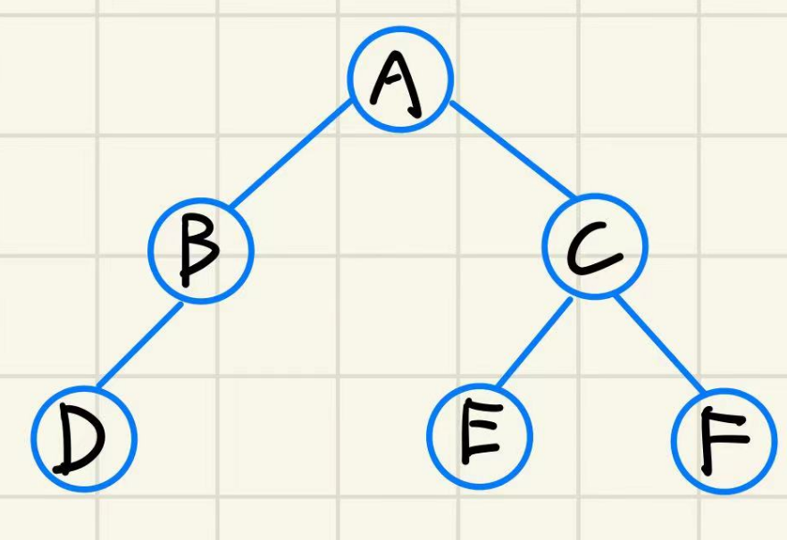
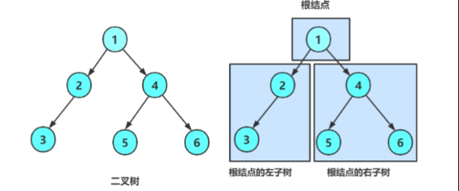
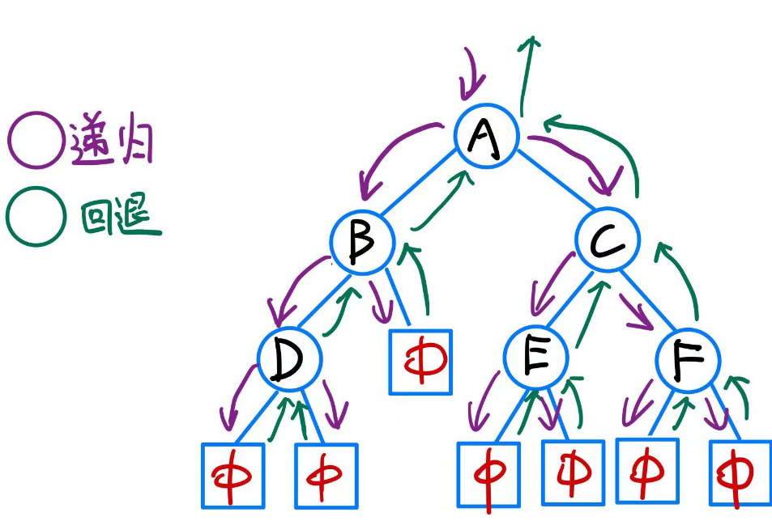
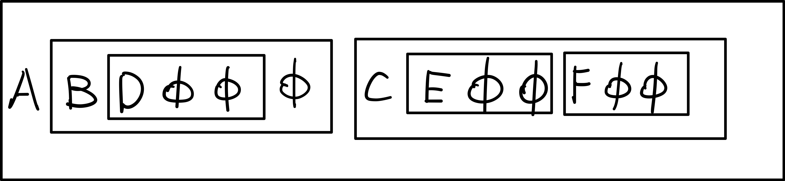
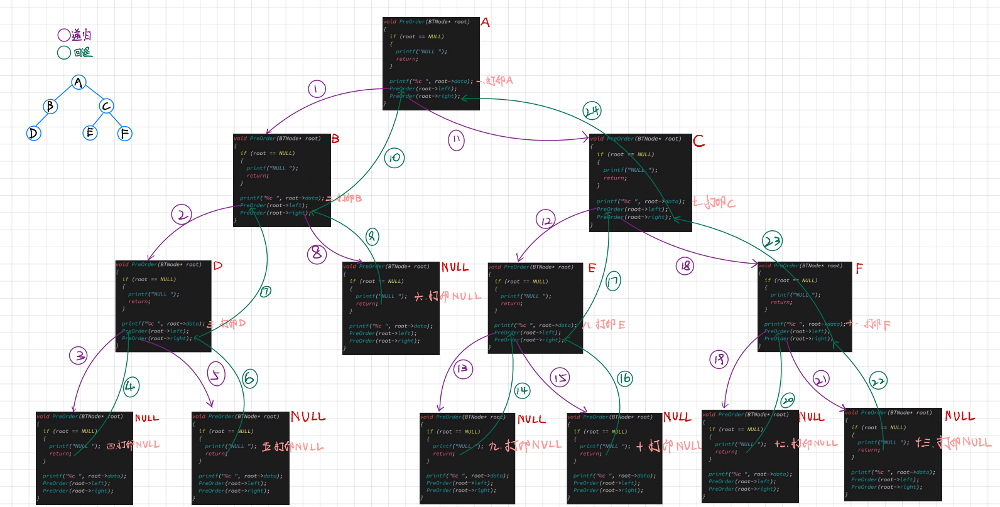
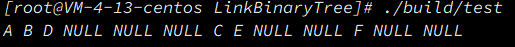
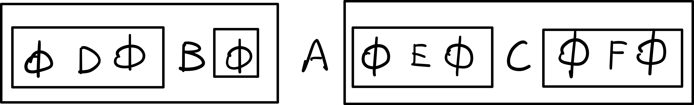
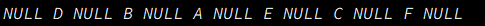
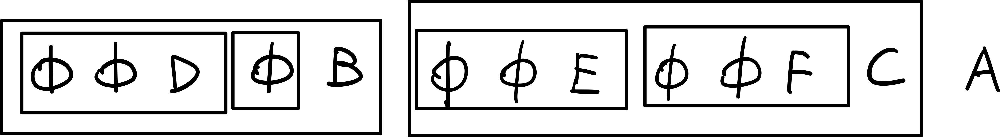
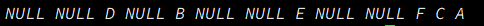

上一章讲了堆,堆是完全二叉树的顺序存储结构,本章将要全面讲解一下二叉树的链式存储结构即**链式二叉树**

我们已经学习了二叉树的概念和性质了,本章重点学习二叉树相关操作,可以更好的理解分治算法思想;也需要对递归有更深次的理解.

> 其实普通的链式二叉树的增删查改没有什么意义,学习二叉树主要是为了二叉搜索树(AVL 树, 红黑树) 以及 解决二叉树相关题目.

# 1. 链式二叉树的结构
> 在学习二叉树的基本操作前,需要先创建一棵二叉树,但是构建一棵二叉树需要首先我们对二叉树的操作足够熟悉.

> 所以先手动创建了一个二叉树,熟悉二叉树结构后,再研究真正的创建方式

***
下面,定义了二叉树的链式结构
每个结点的 data 用来存放结点的值, 有两个结构体指针分别指向左孩子和右孩子
```c

```

随后直接手动创建一个二叉树,如下图

代码如下
```c

```
由于创建结点的时候已经手动将两个指针都指向了 `NULL`, 所以在建树的时候就不需要再手动赋值 `NULL` 了

***
再回顾以下二叉树的概念, 二叉树是:
- 空树
- 非空:根结点,根结点的**左子树**,根结点的**右子树**


> 所以见到非空二叉树, 我们就要自动将它分成根结点,左子树,右子树.

# 2. 二叉树的遍历
## 2.1 前序、中序和后序遍历
> 学习二叉树结构, 最简单的方式就是遍历.

> 所谓**二叉树遍历(Traversal)是按照某种特定的规则, 依次对二叉树的结点进行相应的操作, 并且每个结点只操作一次**

> 遍历是二叉树最重要的计算之一, 也是其他二叉树运算的基础.

***
按照规则, 二叉树的遍历有: **前序/中序/后序的递归结构遍历**
- 前序遍历(Preorder Traversal 亦称先序遍历)------访问根节点的操作发生在遍历其左右子树之前
- 中序遍历(Inorder Traversal)------访问根节点的操作发生在遍历其左右子树之间
- 后序遍历(Postorder Traversal)------访问根节点的操作发生在遍历其左右子树之后

> 由于被访问的结点必是某子树的根, 所以**N(Node), L(Left subtree), R(Right  subtree)又可解释为根, 根的左子树, 根的右子树**.

> NLR, LNR, LRN 分别又称为先根遍历, 中根遍历, 后根遍历.

### 2.1.1 前序遍历

> 前序遍历是先访问根结点,再访问左子树随后右子树.

> 上述树的前序遍历序列为: <font color=red>A B D 空 空 空 C E 空 空 F 空 空</font>, 把所有空结点去除得到的序列为 <font color=red>A B D C E  F</font>

***
由于思路是: 先访问根结点, 直到根节点是 空结点 ;再访问左子树 和 右子树.
树是递归的, 下面用递归的方法来遍历
```c

```

根据递归展开图可以更好的进行理解


程序运行也确实是这样


### 2.1.2 中序遍历
> 中序遍历则是先访问左子树,再访问根结点,最后访问右子树


> 该树的中序遍历序列是: <font color=red>空 D 空 B 空 A 空 E 空 C 空 F 空</font>, 把所有空结点去除得到的序列为 <font color=red>D B A E C F</font>
> 

代码实现
```c

```

程序运行如下


### 2.1.3 后序遍历
> 后续遍历是先访问左右子树, 再访问根节点


> 该树的后序遍历序列是: <font color=red>空 空 D 空 B 空 空 E 空 空 F C A</font>, 把所有空结点去除得到的序列为 <font color=red>D B E F C A</font>
> 

代码如下
```c

```

程序运行结果如下
