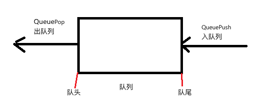
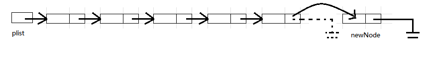
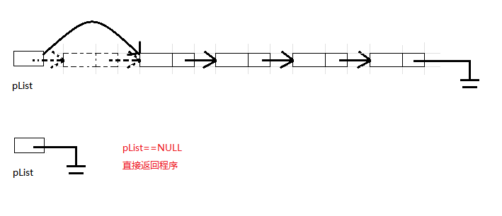

# 1. 队列的概念及结构
> 队列:只允许在一端进行插入数据操作,在另一端进行删除操作的特殊线性表,队列具有先进先出(FIFO)的特性.
> 进行插入操作的一端称为**队尾**;进行删除操作的一端叫做**队头**



队列应用于
1. 解决公平性排队(抽号机)
2. 广度优先遍历(BFS)

# 2. 队列的定义
和栈一样,队列也可以使用两种物理结构进行存储:数组存储和链表存储
但是更推荐使用**链表**进行实现,链表尾插头删,相比于数组尾插头删所消耗的时间要小很多
> 注: 如果实现循环队列,更推荐使用数组

- 单链表实现队列的头删尾插图示:



- 队列的链式实现
```c
typedef int QDataType;

// 链式结构表示队列
typedef struct QListNode
{
  struct QListNode* next;
  QDataType data;
}QNode;

// 队列的结构
typedef struct Queue
{
  QNode* front;    //指向队列头
  QNode* rear;     //指向队列尾
  int size;        //记录队列的元素个数
}Queue;
```
> 1. 队列的每个结点使用链表结点
> 2. 同时,在单链表的基础上,队列还多加了两个指针指向头尾,方便使用$O(1)$的时间复杂度找到队列的头和尾,进行头删尾插

- 队列相关接口函数
```c
// 初始化队列
void QueueInit(Queue* q);
// 队尾入队列
void QueuePush(Queue* q, QDataType x);
// 队头出队列
void QueuePop(Queue* q);
// 获取队列头部元素
QDataType QueueFront(Queue* q);
// 获取队列尾部元素
QDataType QueueBack(Queue* q);
// 获取队列有效元素个数
int QueueSize(Queue* q);
// 检测队列是否为空, 如果为空返回非零结果, 如果非空返回0
int QueueEmpty(Queue* q);
// 销毁队列
void QueueDestroy(Queue* q);
```

# 3. 队列的实现
## 3.1 初始化队列 (QueueInit)
```c
// 初始化队列
void QueueInit(Queue* q)
{
  assert(q);  //确保q合法

  q->front = q->rear = NULL;  //将头和为置为 NULL 
  q->size = 0;
}
```
> 1. 首先确保 q 合法
> 2. 将队列中的成员变量初始化, 头尾指针置为 NULL, 队列的大小置为 0

## 3.2 队尾入队列 (QueuePush)
```c
void QueuePush(Queue* q, QDataType x)
{
  assert(q);  //确保q合法

  //创建新结点
  QNode* newNode = (QNode*)malloc(sizeof(QNode));
  newNode->data = x;
  newNode->next = NULL;

  //入队列
  if (QueueEmpty(q))
  {
    //如果队列为空,直接赋值
    q->front = q->rear = newNode;
  }
  else 
  {
    //如果队列不为空,直接尾插
    q->rear->next = newNode;
    q->rear = newNode;
  }

  q->size++;
}

```
1. 首先确保 q 合法
2. 创建新结点
3. 进行队列的尾插,分为两种情况:队列为空的时候直接赋值;队列不为空的时候正常进行尾插


## 3.2 队头出队列 (QueuePop)
```c
void QueuePop(Queue* q)
{
  assert(q);  //确保q合法
  assert(!QueueEmpty(q)); //确保队列不为空

  if (q->size == 1)
  {
    //如果只有一个元素,头删的同时还要将尾指针置空
    free(q->front);
    q->front = q->rear = NULL;
  }
  else 
  {
    //如果不止一个元素,则只头删
    QNode* nextNode = q->front->next;
    free(q->front);
    q->front = nextNode;
  }

  q->size--;
}
```
1. 首先确保 q 合法
2. 分为三种情况:
    - 队列为空直接返回错误
    - 队列只有一个结点,头尾指针都置空
    - 队列有两个及以上的结点,简单头删

## 3.3 获取队列头部元素 (QueueTop)
```c
QDataType QueueFront(Queue* q)
{
  assert(q);  //确保q合法
  assert(!QueueEmpty(q)); //确保队列不为空

  return q->front->data;
}
```

## 3.4 获取队列尾部元素 (QueueBack)
```c
QDataType QueueBack(Queue* q)
{
  assert(q);  //确保q合法
  assert(!QueueEmpty(q)); //确保队列不为空

  return q->rear->data;
}
```

## 3.5 获取队列大小 (QueueSize)
```c
int QueueSize(Queue* q)
{
  assert(q);  //确保q合法

  return q->size;
} 
```

## 3.6 判断队列是否为空, 如果为空返回非0, 非空返回0 (QueueEmpyt)
```c
int QueueEmpty(Queue* q)
{
  assert(q);  //确保q合法

  if (q->size == 0)
  {
    return 1;
  }
  else 
  {
    return 0;
  }
}
```

## 3.7 销毁队列 (QueueDestroy)
```c
void QueueDestroy(Queue* q)
{
  assert(q);

  while(!QueueEmpty(q))
  {
    QNode* nextNode = q->front->next;
    free(q->front);
    q->front = nextNode;
  }

  q->front = q->rear = NULL;
  q->size = 0;
}
```
> 1. 首先确保 q 合法
> 2. 从头遍历队列,依次释放每个结点的空间,注意先要记录当前要销毁结点的下一个结点.

## 3.8 完整代码
- `Queue.h`
```c
#pragma once 

#include <stdio.h>
#include <stdlib.h>
#include <assert.h>

typedef int QDataType;

// 链式结构表示队列
typedef struct QListNode
{
  struct QListNode* next;
  QDataType data;
}QNode;

// 队列的结构
typedef struct Queue
{
  QNode* front;    //指向队列头
  QNode* rear;     //指向队列尾
  int size;        //记录队列的元素个数
}Queue;

// 初始化队列
void QueueInit(Queue* q);
// 队尾入队列
void QueuePush(Queue* q, QDataType x);
// 队头出队列
void QueuePop(Queue* q);
// 获取队列头部元素
QDataType QueueFront(Queue* q);
// 获取队列尾部元素
QDataType QueueBack(Queue* q);
// 获取队列有效元素个数
int QueueSize(Queue* q);
// 检测队列是否为空, 如果为空返回非零结果, 如果非空返回0
int QueueEmpty(Queue* q);
// 销毁队列
void QueueDestroy(Queue* q);

```

- `Queue.c`
```c
#pragma once 

#include <stdio.h>
#include <stdlib.h>
#include <assert.h>

typedef int QDataType;

// 链式结构表示队列
typedef struct QListNode
{
  struct QListNode* next;
  QDataType data;
}QNode;

// 队列的结构
typedef struct Queue
{
  QNode* front;    //指向队列头
  QNode* rear;     //指向队列尾
  int size;        //记录队列的元素个数
}Queue;

// 初始化队列
void QueueInit(Queue* q);
// 队尾入队列
void QueuePush(Queue* q, QDataType x);
// 队头出队列
void QueuePop(Queue* q);
// 获取队列头部元素
QDataType QueueFront(Queue* q);
// 获取队列尾部元素
QDataType QueueBack(Queue* q);
// 获取队列有效元素个数
int QueueSize(Queue* q);
// 检测队列是否为空, 如果为空返回非零结果, 如果非空返回0
int QueueEmpty(Queue* q);
// 销毁队列
void QueueDestroy(Queue* q);

```

- `test.c`
```c
#include "Queue.h"

void QueueTest1()
{
  Queue queue;
  QueueInit(&queue);
  QueuePush(&queue, 1);
  QueuePush(&queue, 2);
  QueuePush(&queue, 3);
  QueuePush(&queue, 4);
  QueuePush(&queue, 5);
  QueuePop(&queue);
  QueuePop(&queue);
  QueuePop(&queue);
  QueuePop(&queue);
  QueuePop(&queue);
  QueuePop(&queue);
}

void QueueTest2()
{
  Queue queue;
  QueueInit(&queue);
  QueuePush(&queue, 1);
  QueuePush(&queue, 2);
  QueuePush(&queue, 3);
  QueuePush(&queue, 4);
  QueuePush(&queue, 5);
  QueuePush(&queue, 6);

  while (!QueueEmpty(&queue))
  {
    fprintf(stdout, "%d ", QueueFront(&queue));
    QueuePop(&queue);
  }
  printf("\n");

}
int main(void)
{
  //QueueTest1();
  QueueTest2();

  return 0;
}

```

本章完.