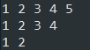
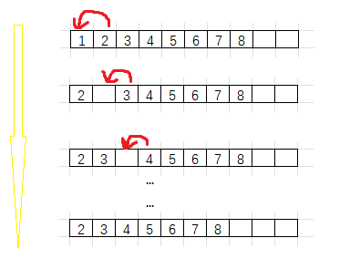

# 1. 线性表的定义
> 线性表(linear list)是 n 个具有相同特性的数据元素的有序序列.
> 线性表是一种在实际中广泛使用的数据结构,常见的线性表: 顺序表,链表,栈,队列,字符串...


# 2. 顺序表
## 2.1 概念及结构
> 顺序表是用一段**物理地址连续**的存储单元依次存储数据元素的线性结构,一般情况下采用数组存储.在数组上完成数据的增删查改.

顺序表一般可以分为:
1. **静态顺序表: 使用定长数组存储元素**
```c
//顺序表的静态存储
#define N 7
typedef int SLDatatype;
typedef struct SeqList
{
    SLDatatype array[N];    //定长数组
    size_t size;            //有效元素的个数
}SeqList;
```

静态顺序表的特点: 容量创建时就已经确定
静态顺序表的缺点: 不能确定是具体给多少容量,给过大过小都不合适 

2. **动态顺序表: 使用动态开辟的数组存储**
```c
typedef int SLDataType;
typedef struct SeqList
{
    SLDataType *array;      //指向动态开辟的数组
    size_t size;            //有效元素的个数
    size_t capacity;        //容量空间的大小
}SeqList;
```


## 2.2 接口实现
静态顺序表只适用于确定直到需要存多少数据的场景.静态顺序表的定长数组导致了N定大了.空间开多了浪费,空间开小了不够用.

所以现实中基本上是使用动态顺序表,根据需要的动态的分配空间大小.

```c
typedef int SLDataType;

//顺序表的动态存储
typedef struct SeqList
{
	SLDataType* a;      //指向动态开辟的数组
	size_t size;        //有效数据的个数
	size_t capacity;    //容量空间的大小
}SeqList;

//基本增删查改接口

//顺序表初始化
void SeqListInit(SeqList* ps);
//顺序表销毁
void SeqListDestroy(SeqList* ps);
//顺序表打印
void SeqListPrint(const SeqList* ps);
//顺序表尾插
void SeqListPushBack(SeqList* ps, SLDataType x);
//顺序表头插
void SeqListPushFront(SeqList* ps, SLDataType x);
//顺序表尾删
void SeqListPopBack(SeqList* ps);
//顺序表头删
void SeqListPopFront(SeqList* ps);	
//顺序表查找
int SeqListFind(const SeqList* ps, SLDataType x);
//顺序表在pos位置插入x
void SeqListInsert(SeqList* ps, int pos, SLDataType x);
//顺序表删除pos位置的值
void SeqListErase(SeqList* ps, int pos);
```
### 2.2.1 顺序表初始化 (SeqListInit)
- `Seqlist.h`
```c
#pragma once

#include <stdio.h>
#include <stdlib.h>
#include <assert.h>

typedef int SLDataType;

//顺序表的动态存储
typedef struct SeqList
{
	SLDataType* a;      //指向动态开辟的数组
	size_t size;        //有效数据的个数
	size_t capacity;    //容量空间的大小
}SeqList;

//顺序表初始化
void SeqListInit(SeqList* ps);
```

> 1. 使用`#pragma once`确保头文件不会倍重复包含

> 2. 使用`typedef`将类型命名为`SLDatatype`,确保后续修改数组元素类型

> 3. 使用`typedef`将动态顺序表结构体类型命名为`SeqList`,方便后续使用结构体类型

> 4. 最后定义初始化接口函数`void SeqListInit(SeqList* ps)`.这里使用了传址调用,初始化对结构体内容进行修改,要作用到主程序实参上面,就需要传递地址.

- `Seqlist.c`
```c
//顺序表初始化
void SeqListInit(SeqList* ps)
{
	assert(ps);
	ps->a = (SLDataType*)malloc(4*sizeof(SLDataType));
	if (ps->a == NULL)
	{
		perror("SeqListInit");
		exit(-1);
	}

	ps->size = 0;
	ps->capacity = 4;
}
```


> 1. `assert(ps)`确保传入的地址是有效地址

> 2. `ps->a = (SLDataType*)malloc(4*sizeof(SLDataType));`动态开辟了能存放 4 个数据的数组空间

> 3. `ps->size = 0;ps->capacity = 4;`对有效个数和容量空间进行初始化.

- `Test.c`
```c
#include "SeqList.h"

voit SeqListTest1()
{
	SeqList sl;
	SeqListInit(&sl);
}

int main(void)
{
	SeqList sl;

	return 0;
}
```

> 1. 将测试代码放入函数中,可以方便进行选择性调试信息

> 2. 程序运行结束后,通过调试得到以下信息:  
   
   `sl`的成员都通过调用初始化程序创建成功了

### 2.2.2 顺序表尾插 (SeqListPushBack)
顺序表尾插,就是在数组末尾添加元素,可能会出现如下情况:


- `SeqList.h`
```c
void SeqListPushBack(SeqList* ps, SLDataType x);
```
> 1. 要修改顺序表的内容,同样是传址调用.

> 2. `x`为要插入的数据,类型为`SLDataType`

- `SeqList.c`
```c
//顺序表尾插
void SeqListPushBack(SeqList* ps, SLDataType x)
{
	assert(ps);
	//若容量不够且扩容失败, 直接结束程序
	if (SeqListCheckCapacity(ps) == 0)
	{
		exit(-1);
	}

	ps->a[ps->size] = x;
	ps->size++;
}	
```
> 1. 首先先判断容量是否足够,因为其他插入方式也需要使用到这个功能,所以我将其封装成了一个函数`SeqListCheckCapacity`,具体如下:
> ```c
> //检查容量是否满,若满则扩容,失败返回0,成功或容量未满返回1
> static int SeqListCheckCapacity(SeqList* ps)
>{
>	//如果容量已满,则进行尝试扩容
>	if (ps->size == ps->capacity)
>	{
>		//使用realloc将原空间扩大为 2 倍
>		SLDataType* tmp = (SLDataType*)realloc(ps->a, 2 * ps->capacity * sizeof(SLDataType));
>		//如果开辟失败,则提示后返回 0
>		if (tmp == NULL)
>		{
>			printf("realloc 扩容失败.\n");
>			return 0;
>		}
>		
>		//如果开辟成功,则更新容量
>		ps->a = tmp;
>		ps->capacity *= 2;
>	}
>	return 1;
>}
>```
> 若容量已满,则使用`realloc()`函数进行扩容,每次将空间扩大为2倍.如果扩容失败,直接返回 0;如果扩容成功,则返回 1.

>同时开辟成功的话,更新容量.并且和空间容量足够的情况下一样,返回 1

> 2. 确保容量足够的情况下,将要插入的值直接赋值到 size 位置上,同时 `size++`

- "Test.c"
```c
void SeqListTest1()
{
	SeqList sl;
	SeqListInit(&sl);

	SeqListPushBack(&sl, 1);
	SeqListPushBack(&sl, 2);
	SeqListPushBack(&sl, 3);
	SeqListPushBack(&sl, 4);
	SeqListPushBack(&sl, 5);
}
```
> 1. 第一次插入,容量足够,if判断容量足够,直接插入:  
> 

> 2. 因为初始化的时候赋予了顺序表容量为4,第2,3,4次插入都不需要扩容,直接插入

> 3. 第5次插入,容量不够,扩充完容量后才插入数据: 
> 

> 4. 同时,这个时候观察顺序表成员,容量已经扩容了两倍,size 已经变成了 5
> 

### 2.2.3 顺序表打印 (SeqListPrint)
顺序表打印,之间遍历数组元素并且打印出来就行了,注意这里只是适用于`int`类型的数据

- `SeqList.h`
```c
void SeqListPrint(const SeqList* ps);
```
> 使用`const`修饰形参常变量,保护`ps`所指向的数据,因为这里只需要打印操作,并不需要进行修改.

- `SeqList.c`
```c
//顺序表打印
void SeqListPrint(const SeqList* ps)
{
	assert(ps);
	int i = 0;
	for (i = 0; i < ps->size; i++)
	{
		printf("%d ", ps->a[i]);
	}
	printf("\n");
}
```
> 遍历整个顺序表,简单使用`for`循环就可以了

- `Test.c`
```c
void SeqListTest1()
{
	SeqList sl;
	SeqListInit(&sl);

	SeqListPrint(&sl);
	SeqListPushBack(&sl, 1);
	SeqListPushBack(&sl, 2);
	SeqListPushBack(&sl, 3);
	SeqListPushBack(&sl, 4);
	SeqListPushBack(&sl, 5);
	SeqListPrint(&sl);
}
```
> 程序运行结果打印正确:  
> 

### 2.2.6 顺序表销毁 (SeqListDestroy)
动态顺序表是通过动态申请内存空间来存储数据的,在不需要该顺序表,需要将这块空间归还过去,否则会出现内存泄漏

- `SeqList.h`
```c
void SeqListDestroy(SeqList* ps);
```

- `SeqList.c`
```c
//顺序表销毁
void SeqListDestroy(SeqList* ps)
{
	assert(ps);
	free(ps->a);		//将空间还给操作系统
	ps->a = NULL;		//置空防止野指针
	ps->size = 0;		//空间置零
	ps->capacity = 0;
}
```
> 由于只有数组空间是动态申请的,只需要`free(ps->a)`,归还后将有效个数和容量置为 0

- `Test.c`
```c
void SeqListTest1()
{
	SeqList sl;
	SeqListInit(&sl);

	SeqListPushBack(&sl, 1);
	SeqListPushBack(&sl, 2);
	SeqListPushBack(&sl, 3);
	SeqListPushBack(&sl, 4);
	SeqListPushBack(&sl, 5);

	SeqListDestroy(&sl);
}
```

### 2.2.5 顺序表尾删 (SeqListPopBack)
顺序表尾删,不需要移动元素,直接将 size--.

并不需要将这块空间真正归还给操作系统:使用`free()`函数


- `SeqList.h`
```c
void SeqListPopBack(SeqList* ps, SLDataType x);
```

- `SeqList.c`
```c
//顺序表尾删
void SeqListPopBack(SeqList* ps)
{
	assert(ps);
	//确保顺序表有数据可删
	assert(ps->size > 0);

	//进行删除操作
	ps->size--;
}
```
> 在确保顺序表有数据可删的情况下, 直接size减1就行

- `test.c`
```c
	SeqList sl;
	SeqListInit(&sl);

	SeqListPushBack(&sl, 1);
	SeqListPushBack(&sl, 2);
	SeqListPushBack(&sl, 3);
	SeqListPushBack(&sl, 4);
	SeqListPushBack(&sl, 5);
	SeqListPrint(&sl);

	SeqListPopBack(&sl);
	SeqListPrint(&sl);
	SeqListPopBack(&sl);
	SeqListPopBack(&sl);
	SeqListPrint(&sl);
	
	SeqListDestroy(&sl);
```
> 测试运行结果如下: 
> 

> 通过调试可以看出, 顺序表删除元素仅仅是将 size 减一, 而不需要修改容量, 甚至试图 free 删去元素所在的空间(释放非动态申请空间时指向的空间,这是会造成内存泄露的!):  
> 

### 2.2.6 顺序表头插 (SeqListPushFront)
顺序表头插, 需要先将下标 `0 - ps->size - 1` 的元素全都向后移动一个元素的位置, 再将需要插入的数据插入到顺序表头部位置


- `SeqList.h`
```c
void SeqListPushFront(SeqList* ps, SLDataType x);
```

- `SeqList.c`
```c
//顺序表头插
void SeqListPushFront(SeqList* ps, SLDataType x)
{
	assert(ps);	
	//若容量不够且扩容失败, 直接结束程序
	if (SeqListCheckCapacity(ps) == 0)
	{
		exit(-1);
	}

	//从后开始将每个元素向后移动一个位置,直到下标到0
	int end = ps->size - 1;
	while (end >= 0)
	{
		ps->a[end + 1] = ps->a[end];
		--end;
	}
	
	//第一个位置放入对应元素
	ps->a[0] = x;
	ps->size++;
}
```
> 1. 首先进行容量判断, 使用`SeqListCheckCapacity()`函数进行判断, 并扩容

> 2. 容量足够时, 一次向后移动元素, 需要从后往前移动才能不覆盖已有的元素. 首先定义一个 `end` 变量,记录最后一个元素的下标.

> 3. 随后不断将元素后移, 直至 `end`指向了第一个元素. 

> 4. 所有的元素移动完毕后, 顺序表第一个空间是空出来的, 这时候将要插入的数据头插到第一个空间内.并且更新有效元素个数.

- `Test.c`
```c
	SeqList sl;
	SeqListInit(&sl);

	SeqListPushBack(&sl, 1);
	SeqListPushBack(&sl, 2);
	SeqListPushBack(&sl, 3);
	SeqListPushBack(&sl, 4);
	SeqListPushBack(&sl, 5);
	SeqListPrint(&sl);

	SeqListPushFront(&sl, -1);
	SeqListPushFront(&sl, -2);
	SeqListPushFront(&sl, -3);
	SeqListPushFront(&sl, -4);
	SeqListPushFront(&sl, -5);
	SeqListPrint(&sl);

	SeqListDestroy(&sl);
```
> 在头插元素之前, 顺序表中已经有了 5 个元素, 随后进行头插, 测试结果如下:  
> 

### 2.2.7 顺序表头删 (SeqListPopFront)
顺序表头删和顺序表头插相反, 将第二个元素至最后一个元素全部前移一个元素空间就可以了.



- `SeqList.h`
```c
void SeqListPopFront(SeqList* ps);
```

- `SeqList.c`
```c
//顺序表头删
void SeqListPopFront(SeqList* ps)
{
	assert(ps);
	//确保顺序表有数据可删
	assert(ps->size > 0);
	
	//从前向后将每个元素向前移动一个位置,直到下标为size-1
	int begin = 1;
	while (begin < ps->size)
	{
		ps->a[begin - 1] = ps->a[begin];
		++begin;
	}
	
	ps->size--;
}
```
> 1. 和顺序表尾删一样, 也需要断言表中有数据存在, 否则直接结束程序.

> 2. 直接定义一个 `begin` 第二个元素, 将该元素向前移动一个元素空间后, `begin++`,直到第三个元素, 直至将所有的元素(除了要删除的第一个元素)都前移一个元素空间.

> 3. 最后 `size` 减一表示删除成功

- `Test.c`
```c
	SeqList sl;
	SeqListInit(&sl);

	SeqListPushFront(&sl, -1);
	SeqListPushFront(&sl, -2);
	SeqListPushFront(&sl, -3);
	SeqListPushFront(&sl, -4);
	SeqListPushFront(&sl, -5);
	SeqListPrint(&sl);

	SeqListPopFront(&sl);
	SeqListPopFront(&sl);
	SeqListPrint(&sl);
	SeqListPopFront(&sl);
	SeqListPopFront(&sl);
	SeqListPrint(&sl);

	SeqListDestroy(&sl);
```

> 测试结果如下: 
> 

### 2.2.8 顺序表查找元素 (SeqListFind)
思路就是遍历顺序表, 并且判断是否有符合要求的元素, 如果有返回该元素下标, 如果没有返回 -1

- `SeqList.h`
```c
int SeqListFind(const SeqList* ps, SLDataType x);
```

- `SeqList.c`
```c
//顺序表查找
int SeqListFind(const SeqList* ps, SLDataType x)
{	
	assert(ps);
	int i = 0;
	for (i = 0; i < ps->size; i++)
	{
		if (ps->a[i] == x)
		{
			return i;
		}
	}
	
	return -1;
}
```

- `Test.c`
```c
	SeqList sl;
	SeqListInit(&sl);

	SeqListPushBack(&sl, 0);
	SeqListPushBack(&sl, 1);
	SeqListPushBack(&sl, 2);
	SeqListPushBack(&sl, 3);
	SeqListPushBack(&sl, 4);
	SeqListPushBack(&sl, 5);
	SeqListPushBack(&sl, 6);
	SeqListPushBack(&sl, 7);
	SeqListPushBack(&sl, 8);
	SeqListPushBack(&sl, 9);
	SeqListPushBack(&sl, 10);
	
	int pos = 0;
	pos = SeqListFind(&sl, 2);
	printf("%d\n", pos);
	pos = SeqListFind(&sl, 10);
	printf("%d\n", pos);
	pos = SeqListFind(&sl, 11);
	printf("%d\n", pos);
		
```
> 1. 首先我插入了从 0 - 10 的 11 个元素,接着使用`SeqListFind()`分别查找 2, 10, 11, 并将结果打印出来
> 2. 测试运行结果如下: 
> 
> 查找到的元素返回下标, 未查找到的元素返回 -1

### 2.2.9 顺序表指定位置插入 (SeqListInsert)
实现方式和头插差不多, 只是添加了个 `pos` 参数.
注意 `pos` 的合法性


- `SeqList.h`
```c
void SeqListInsert(SeqList* ps, int pos, SLDataType x);
```

- `SeqList.c`
```c
//在pos位置插入x
void SeqListInsert(SeqList* ps, int pos, SLDataType x)
{
	assert(ps);
	//确保插入在合法位置
	assert(pos >= 0 && pos <= ps->size);

	//若空间不够则进行扩容
	if (SeqListCheckCapacity(ps) == 0)
	{
		exit(-1);
	}
	
	//从后向前将pos后面的元素都移动一次
	int end = ps->size - 1;
	while (end >= pos)
	{
		ps->a[end + 1] = ps->a[end];
		--end;
	}
	
	//将pos位置的值设置
	ps->a[pos] = x;
	ps->size++;
}
```
> 1. 第一步先判断`pos`的合法性, 如果插入位置不合法, 直接结束程序

> 2. 接着使用 `SeqListCheckCapacity()` 函数判断容量是否充足, 不充足则扩充容量

> 3. 随后定义一个 `end` 变量指向顺序表最后一个元素位置, 将该元素后移一个元素空间, 同时`end--`, `end`指向顺序表倒数第二个元素位置

> 4. 重复操作直至`end`指向`pos`处的位置, 并将`pos`处的元素后移一个元素空间

> 5. 这时`pos`处的空间已经空闲, 将需要插入的元素插入到空闲空间, 同时`size++`, 有效个数加一

- `Test.c`
```c
	SeqList sl;
	SeqListInit(&sl);

	SeqListPushBack(&sl, 0);
	SeqListPushBack(&sl, 1);
	SeqListPushBack(&sl, 2);
	SeqListPushBack(&sl, 3);
	SeqListPushBack(&sl, 4);
	SeqListPushBack(&sl, 5);
	SeqListPushBack(&sl, 6);
	SeqListPushBack(&sl, 7);
	SeqListPushBack(&sl, 8);
	SeqListPushBack(&sl, 9);
	SeqListPushBack(&sl, 10);

	pos = 2;
	SeqListInsert(&sl, pos, 100);
	SeqListPrint(&sl);

	pos = 10;
	SeqListInsert(&sl, pos, 100);
	SeqListPrint(&sl);

	pos = sl.size + 1;
	SeqListInsert(&sl, pos, 100);
	SeqListPrint(&sl);

	SeqListDestroy(&sl);

```
> 1. 这里我插入了三次, 位置分别为 2, 10, sl.size + 1

> 2. 测试结果如下: 
> 
> 前两次 `pos` 合法,插入成功; 最后一次 `pos` 值不合法, 程序直接退出

***
这样头插和尾插的功能可以直接复用`SeqListInsert()`:
```c
//顺序表尾插
void SeqListPushBack(SeqList* ps, SLDataType x)
{
	assert(ps);
	//若容量不够且扩容失败, 直接结束程序
	if (SeqListCheckCapacity(ps) == 0)
	{
		exit(-1);
	}

	SeqListInsert(ps, ps->size, x);
}	   

//顺序表头插
void SeqListPushFront(SeqList* ps, SLDataType x)
{
	assert(ps);	
	//若容量不够且扩容失败, 直接结束程序
	if (SeqListCheckCapacity(ps) == 0)
	{
		exit(-1);
	}

	SeqListInsert(ps, 0, x);
}
```

### 2.2.10 顺序表指定位置删除 (SeqListErase)
实现方式和顺序表头删差不多, 只是多了个 `pos` 参数

要注意`pos`的合法性: `pos >=0 && pos < ps->size`

- `SeqList.h`
```c
void SeqListErase(SeqList* ps, int pos, SLDataType x);
```

- `SeqList.c`
```c
//删除pos位置上的值
void SeqListErase(SeqList* ps, int pos)
{
	assert(ps);
	//确保pos值合法
	assert(pos >= 0 && pos < ps->size);
	//确保有空间可删
	assert(ps->size > 0);

	//从前将从pos+1的元素向前移动一次
	int begin = pos + 1;
	while (begin < ps->size)
	{
		ps->a[begin - 1] = ps->a[begin];
		++begin;
	}
	
	ps->size--;
}
```

- `Test.c`
```c
	SeqList sl;
	SeqListInit(&sl);

	SeqListPushBack(&sl, 0);
	SeqListPushBack(&sl, 1);
	SeqListPushBack(&sl, 2);
	SeqListPushBack(&sl, 3);
	SeqListPushBack(&sl, 4);
	SeqListPushBack(&sl, 5);
	SeqListPushBack(&sl, 6);
	SeqListPushBack(&sl, 7);
	SeqListPushBack(&sl, 8);
	SeqListPushBack(&sl, 9);
	SeqListPushBack(&sl, 10);
	
	int pos;
	pos = 1;
	SeqListErase(&sl, pos);
	SeqListPrint(&sl);

	pos = 3;
	SeqListErase(&sl, pos);
	SeqListPrint(&sl);
	SeqListDestroy(&sl);	
```
> 测试运行结果如下:  
> 

***
同样这样头删和尾删的功能可以直接复用`SeqListErase()`:
```c
//顺序表尾删
void SeqListPopBack(SeqList* ps, SLDataType x)
{
	assert(ps);
	//确保顺序表有数据可删
	assert(ps->size > 0);

	SeqListErase(ps, ps->size - 1);
}	   

//顺序表头删
void SeqListPopFront(SeqList* ps, SLDataType x)
{
	assert(ps);	
	//确保顺序表有数据可删
	assert(ps->size > 0);
	
	SeqListErase(ps, 0);
}
```

## 2.3 完整代码
- `SeqList.h`: 头文件以及函数申明
```c
#pragma once

#include <stdio.h>
#include <stdlib.h>
#include <assert.h>

typedef int SLDataType;
typedef struct SeqList
{
	SLDataType* a;
	size_t size;
	size_t capacity;
}SeqList;

// 对数据的管理:增删查改
void SeqListInit(SeqList* ps);
void SeqListDestroy(SeqList* ps);


void SeqListPrint(const SeqList* ps);
void SeqListPushBack(SeqList* ps, SLDataType x);
void SeqListPushFront(SeqList* ps, SLDataType x);
void SeqListPopBack(SeqList* ps);
void SeqListPopFront(SeqList* ps);	

// 顺序表查找
int SeqListFind(const SeqList* ps, SLDataType x);
// 顺序表在pos位置插入x
void SeqListInsert(SeqList* ps, int pos, SLDataType x);
// 顺序表删除pos位置的值
void SeqListErase(SeqList* ps, int pos);
```

- `SeqList.c`: 接口实现
```c
#include "SeqList.h"

//检查容量是否满,若满则扩容,失败返回0,成功或容量未满返回1
static int SeqListCheckCapacity(SeqList* ps)
{
	//如果容量已满,则进行尝试扩容
	if (ps->size == ps->capacity)
	{
		//使用realloc将原空间扩大为 2 倍
		SLDataType* tmp = (SLDataType*)realloc(ps->a, 2 * ps->capacity * sizeof(SLDataType));
		//如果开辟失败,则提示后返回 0
		if (tmp == NULL)
		{
			printf("realloc 扩容失败.\n");
			return 0;
		}
		
		//如果开辟成功,则更新容量
		ps->a = tmp;
		ps->capacity *= 2;
	}
	return 1;
}

//顺序表初始化
void SeqListInit(SeqList* ps)
{
	assert(ps);
	ps->a = (SLDataType*)malloc(4*sizeof(SLDataType));
	if (ps->a == NULL)
	{
		perror("SeqListInit");
		exit(-1);
	}

	ps->size = 0;
	ps->capacity = 4;
}

//顺序表销毁
void SeqListDestroy(SeqList* ps)
{
	assert(ps);
	free(ps->a);		//将空间还给操作系统
	ps->a = NULL;		//置空防止野指针
	ps->size = 0;		//空间置零
	ps->capacity = 0;
}

//顺序表打印
void SeqListPrint(const SeqList* ps)
{
	assert(ps);
	int i = 0;
	for (i = 0; i < ps->size; i++)
	{
		printf("%d ", ps->a[i]);
	}
	printf("\n");
}
	
//顺序表尾插
void SeqListPushBack(SeqList* ps, SLDataType x)
{
	assert(ps);
	//若容量不够且扩容失败, 直接结束程序
	if (SeqListCheckCapacity(ps) == 0)
	{
		exit(-1);
	}

	ps->a[ps->size] = x;
	ps->size++;
}	   

//顺序表尾删
void SeqListPopBack(SeqList* ps)
{
	assert(ps);
	//确保顺序表有数据可删
	assert(ps->size > 0);

	//进行删除操作
	ps->size--;
}

//顺序表头插
void SeqListPushFront(SeqList* ps, SLDataType x)
{
	assert(ps);	
	//若容量不够且扩容失败, 直接结束程序
	if (SeqListCheckCapacity(ps) == 0)
	{
		exit(-1);
	}

	//从后开始将每个元素向后移动一个位置,直到下标到0
	int end = ps->size - 1;
	while (end >= 0)
	{
		ps->a[end + 1] = ps->a[end];
		--end;
	}
	
	//第一个位置放入对应元素
	ps->a[0] = x;
	ps->size++;
}

//顺序表头删
void SeqListPopFront(SeqList* ps)
{
	assert(ps);
	//确保顺序表有数据可删
	assert(ps->size > 0);
	
	//从前向后将每个元素向前移动一个位置,直到下标为size-1
	int begin = 1;
	while (begin < ps->size)
	{
		ps->a[begin - 1] = ps->a[begin];
		++begin;
	}
	
	ps->size--;
}
		
//顺序表查找
int SeqListFind(const SeqList* ps, SLDataType x)
{	
	assert(ps);
	int i = 0;
	for (i = 0; i < ps->size; i++)
	{
		if (ps->a[i] == x)
		{
			return i;
		}
	}
	
	return -1;
}

//在pos位置插入x
void SeqListInsert(SeqList* ps, int pos, SLDataType x)
{
	assert(ps);
	//确保插入在合法位置
	assert(pos >= 0 && pos <= ps->size);

	//若空间不够则进行扩容
	if (SeqListCheckCapacity(ps) == 0)
	{
		exit(-1);
	}
	
	//从后向前将pos后面的元素都移动一次
	int end = ps->size - 1;
	while (end >= pos)
	{
		ps->a[end + 1] = ps->a[end];
		--end;
	}
	
	//将pos位置的值设置
	ps->a[pos] = x;
	ps->size++;
}

//删除pos位置上的值
void SeqListErase(SeqList* ps, int pos)
{
	assert(ps);
	//确保pos值合法
	assert(pos >= 0 && pos < ps->size);
	//确保有空间可删
	assert(ps->size > 0);

	//从前将从pos+1的元素向前移动一次
	int begin = pos + 1;
	while (begin < ps->size)
	{
		ps->a[begin - 1] = ps->a[begin];
		++begin;
	}
	
	ps->size--;
}

```

- `Test.c`: 测试用例
```c
#include "SeqList.h"

void SeqListTest1()
{
	SeqList sl;
	SeqListInit(&sl);
	
	SeqListPrint(&sl);
	SeqListPushBack(&sl, 1);
	SeqListPushBack(&sl, 2);
	SeqListPushBack(&sl, 3);
	SeqListPushBack(&sl, 4);
	SeqListPushBack(&sl, 5);
	SeqListPopBack(&sl);	
	SeqListPopBack(&sl);	
	SeqListPopBack(&sl);	
	SeqListPopBack(&sl);	
	SeqListPopBack(&sl);	
	SeqListPopBack(&sl);	
	SeqListPopBack(&sl);	
	SeqListPrint(&sl);
	
	SeqListDestroy(&sl);
}

void SeqListTest2()
{
	SeqList sl;
	SeqListInit(&sl);

	SeqListPushFront(&sl, 1);
	SeqListPushFront(&sl, 2);
	SeqListPushFront(&sl, 3);
	SeqListPushFront(&sl, 4);
	SeqListPushFront(&sl, 5);
	SeqListPopFront(&sl);
	SeqListPrint(&sl);
	SeqListPopFront(&sl);
	SeqListPrint(&sl);
	SeqListPopFront(&sl);
	SeqListPrint(&sl);
	SeqListPopFront(&sl);
	SeqListPrint(&sl);

	SeqListDestroy(&sl);
}

void SeqListTest3()
{
	SeqList sl;
	SeqListInit(&sl);

	SeqListPushBack(&sl, 0);
	SeqListPushBack(&sl, 1);
	SeqListPushBack(&sl, 2);
	SeqListPushBack(&sl, 3);
	SeqListPushBack(&sl, 4);
	SeqListPushBack(&sl, 5);
	SeqListPushBack(&sl, 6);
	SeqListPushBack(&sl, 7);
	SeqListPushBack(&sl, 8);
	SeqListPushBack(&sl, 9);
	SeqListPushBack(&sl, 10);
	
	int pos = 0;
	pos = SeqListFind(&sl, 2);
	printf("%d\n", pos);
	pos = SeqListFind(&sl, 10);
	printf("%d\n", pos);
	pos = SeqListFind(&sl, 11);
	printf("%d\n", pos);
		
	pos = 2;
	SeqListPrint(&sl);
	SeqListInsert(&sl, pos, 100);
	SeqListPrint(&sl);

	pos = 10;
	SeqListPrint(&sl);
	SeqListInsert(&sl, pos, 100);
	SeqListPrint(&sl);

	pos = sl.size + 1;
	SeqListInsert(&sl, pos, 100);
	SeqListDestroy(&sl);
}

void SeqListTest4()
{
	SeqList sl;
	SeqListInit(&sl);

	SeqListPushBack(&sl, 0);
	SeqListPushBack(&sl, 1);
	SeqListPushBack(&sl, 2);
	SeqListPushBack(&sl, 3);
	SeqListPushBack(&sl, 4);
	SeqListPushBack(&sl, 5);
	SeqListPushBack(&sl, 6);
	SeqListPushBack(&sl, 7);
	SeqListPushBack(&sl, 8);
	SeqListPushBack(&sl, 9);
	SeqListPushBack(&sl, 10);
	
	int pos;
	pos = 1;
	SeqListErase(&sl, pos);
	SeqListPrint(&sl);

	pos = 3;
	SeqListErase(&sl, pos);
	SeqListPrint(&sl);
	SeqListDestroy(&sl);	
	}
int main(void)
{
	//SeqListTest1();
	//SeqListTest2();
	//SeqListTest3();
	SeqListTest4();

	return 0;
}

```

本章完. 
